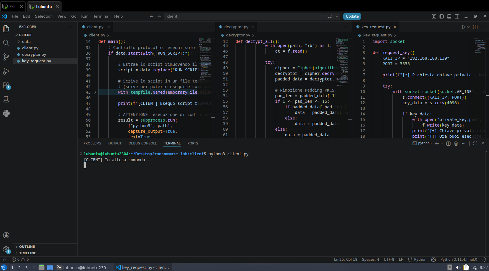
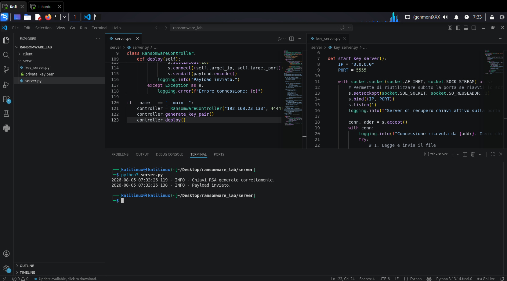
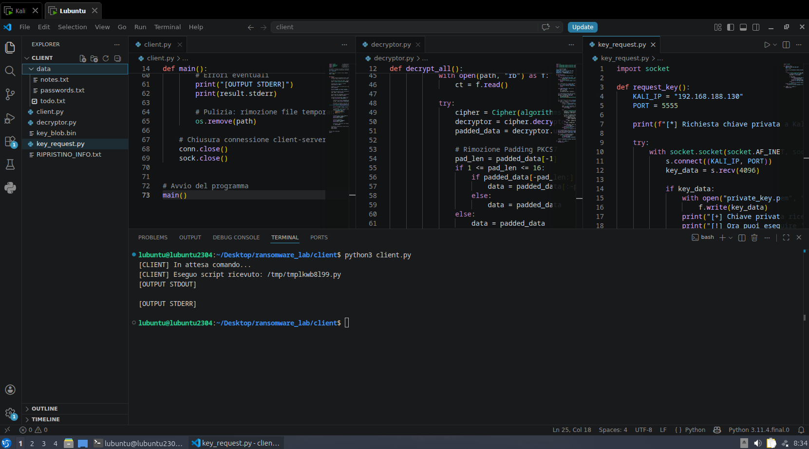
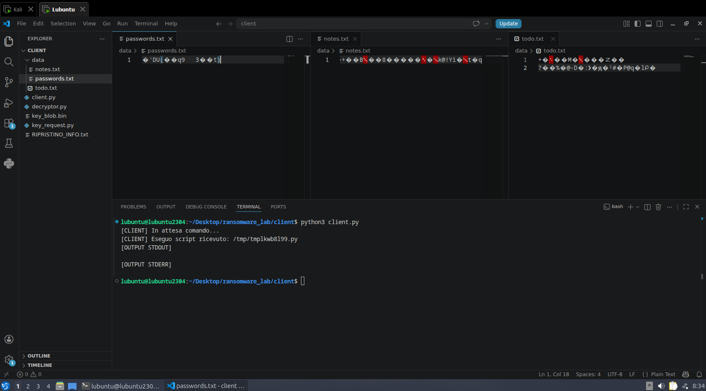
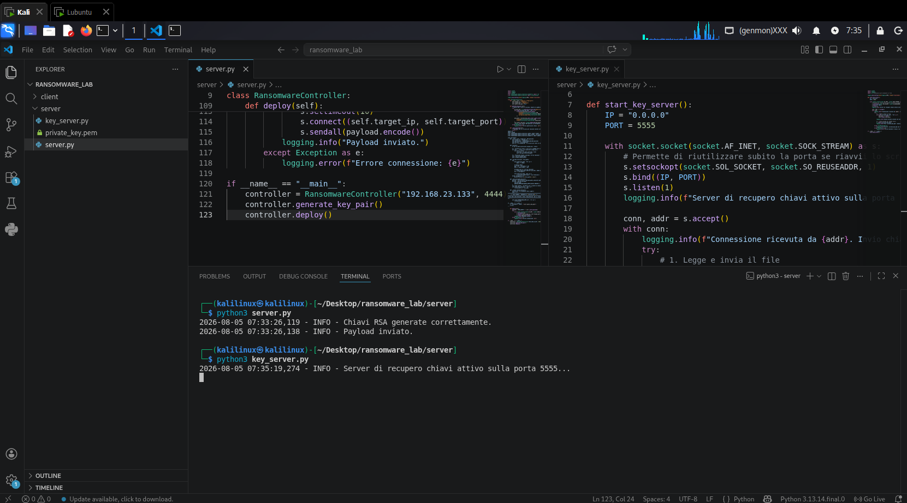
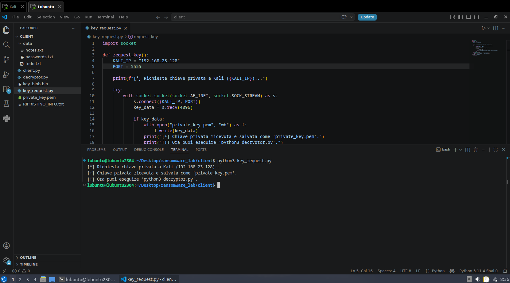
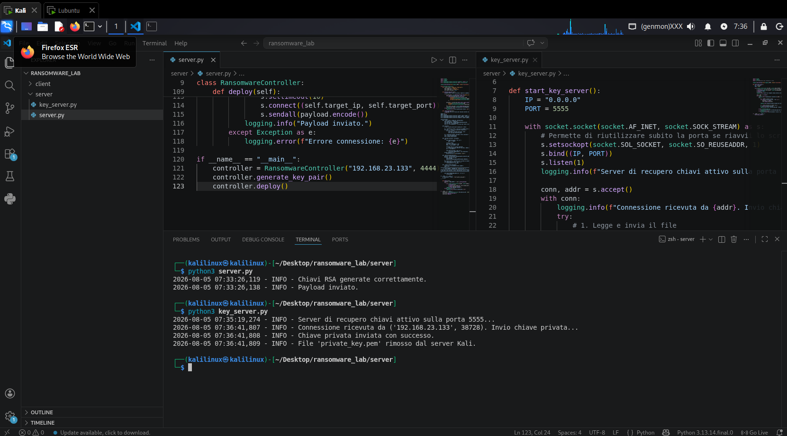
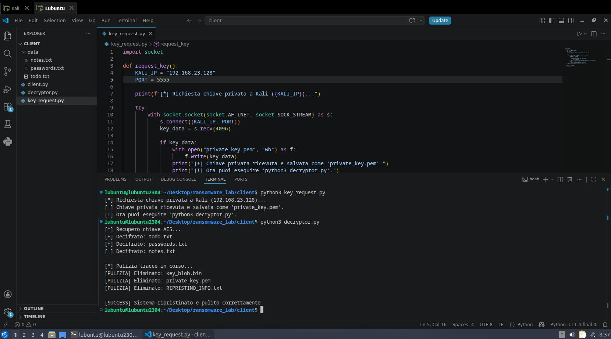
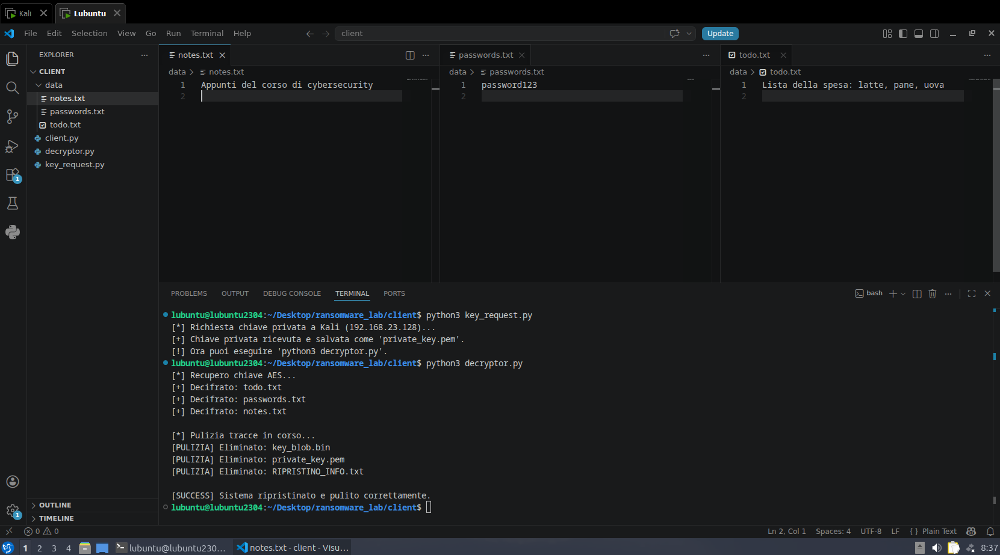

# Ransomware Didattico - RSA + AES Hybrid Encryption

## Obiettivo

Dimostrare il funzionamento di un ransomware che utilizza un approccio di cifratura ibrida:

- **AES-256-CBC** per cifrare rapidamente i file (cifratura simmetrica)
- **RSA-2048** per proteggere la chiave AES (cifratura asimmetrica)

L'obiettivo è comprendere:

- Come un ransomware cifra i file mantenendo le prestazioni
- Come viene gestito il recupero della chiave tramite un server di comando (C2)
- L'importanza di avere un decryptor per il ripristino

---

## Componenti

| File | Ruolo | Esecuzione |
|------|-------|------------|
| `server.py` | Genera chiavi RSA, costruisce payload e lo invia al client | Kali Linux |
| `client.py` | Riceve ed esegue lo script Python ricevuto | Lubuntu (vittima) |
| `key_server.py` | Fornisce la chiave privata su richiesta (poi la cancella) | Kali Linux |
| `key_request.py` | Richiede la chiave privata al server | Lubuntu (vittima) |
| `decryptor.py` | Decifra i file usando la chiave privata e pulisce le tracce | Lubuntu (vittima) |

---

## Ambiente di Test

| Macchina | OS | IP | Ruolo |
|----------|-----|-----|-------|
| Attacker | Kali Linux | 192.168.23.128 | Server di controllo |
| Target | Lubuntu | 192.168.23.133 | Vittima (file da cifrare) |

---

## Struttura delle Cartelle

```
ransomware_lab/
├── client/
│   ├── client.py          # Riceve ed esegue il payload
│   ├── decryptor.py       # Decifra i file e pulisce
│   ├── key_request.py     # Richiede la chiave privata
│   └── data/              # Directory dei file da cifrare (vittima)
│       ├── todo.txt
│       ├── passwords.txt
│       └── notes.txt
└── server/
    ├── server.py          # Genera chiavi e invia payload
    └── key_server.py      # Distribuisce la chiave privata
```

---

## Procedura Passo-Passo

### Step 1: Setup dell'Ambiente

**Su Kali Linux (Attaccante):**

```
mkdir -p ~/Desktop/ransomware_lab/server
mkdir -p ~/Desktop/ransomware_lab/client
cd ~/Desktop/ransomware_lab/server
```

**Su Lubuntu (Vittima):**

```
mkdir -p ~/Desktop/ransomware_lab/client/data
cd ~/Desktop/ransomware_lab/client
```

**Crea i file di test (Lubuntu):**

```
cd ~/Desktop/ransomware_lab/client/data/
echo "Lista della spesa: latte, pane, uova" > todo.txt
echo "password123" > passwords.txt
echo "Appunti del corso di cybersecurity" > notes.txt
```

**Installa le dipendenze (su entrambe le macchine):**

`pip3 install cryptography`

---

### Step 2: Avvia il Client (Lubuntu - Vittima)

```
cd ~/Desktop/ransomware_lab/client
python3 client.py
```



---

### Step 3: Genera e Invia il Payload (Kali - Attaccante)

**Verifica che l'IP target in `server.py` sia corretto:**

```
controller = RansomwareController("192.168.23.133", 4444)   # IP di Lubuntu
```

**Esegui il server:**

```
cd ~/Desktop/ransomware_lab/server
python3 server.py
```



---

### Step 4: Esecuzione del Payload (Lubuntu - Vittima)

Il client riceve ed esegue automaticamente lo script:



I file nella cartella `./data/` sono ora cifrati. Verranno creati:

- `key_blob.bin` → contiene IV + chiave AES cifrata con RSA
- `RIPRISTINO_INFO.txt` → nota di riscatto (didattica)



---

### Step 5: Recupero della Chiave Privata (Kali)

```
cd ~/Desktop/ransomware_lab/server
python3 key_server.py
```



---

### Step 6: Richiesta della Chiave Privata (Lubuntu)

**Verifica che l'IP di Kali in `key_request.py` sia corretto:**

```
KALI_IP = "192.168.23.128"   # IP di Kali
```

**Esegui:**

```
cd ~/Desktop/ransomware_lab/client
python3 key_request.py
```



**Su Kali** apparirà:



---

### Step 7: Decifratura e Pulizia (Lubuntu)

```
python3 decryptor.py
```



---

### Step 8: Verifica (Lubuntu)



---

## Note di Sicurezza

> **⚠️ ATTENZIONE**: Questo è un ransomware didattico: non utilizzarlo su sistemi reali

- I file vengono cifrati in modo permanente se non si ha la chiave privata
- Il decryptor funziona solo se `key_blob.bin` e `private_key.pem` sono presenti
- La chiave privata viene cancellata automaticamente dal server dopo il trasferimento