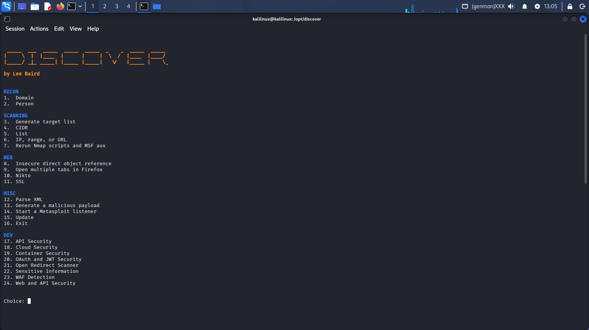
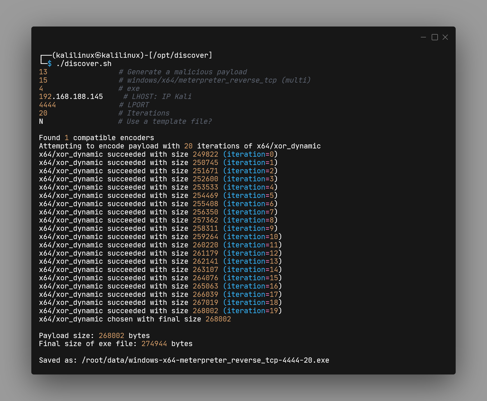
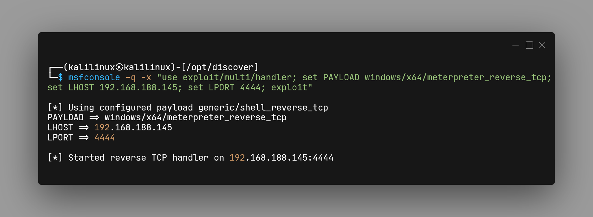
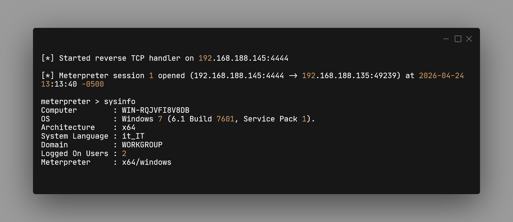

# Windows Payload Generation & Evasion (Discover Scripts)

<div align="center">

| Campo | Valore |
| :--- | :--- |
| **Target** | Windows 7 x64 |
| **Payload** | Meterpreter Reverse TCP |
| **Tecnica** | Encoding (20 Iterations) |
| **Trasferimento** | HTTP Server (Python) |
| **Strumenti** | Discover Scripts, Metasploit |

</div>

Questo progetto documenta l'utilizzo del framework Discover per automatizzare la creazione di un payload malevolo offuscato. L'obiettivo è analizzare come l'encoding iterativo possa tentare di eludere le firme degli antivirus per stabilire una connessione inversa (Reverse Shell) verso una macchina attaccante (Kali Linux).

---

## Preparazione Ambiente
L'attacco inizia con il setup del framework sulla macchina attaccante.

### Installazione e aggiornamento Discover Scripts
```bash
sudo git clone https://github.com/leebaird/discover /opt/discover/
cd /opt/discover/
sudo ./update.sh
sudo ./discover.sh
```



## Generazione del Payload

### Selezione parametri e offuscamento


Iterations: si riferisce a quante volte il payload viene ricodificato per cambiare la firma del file.
Template file: ci chiede se vogliamo iniettare il codice malevolo dentro un file esistente, scegliamo di no.

## Consegna del Malware (Delivery)
Per trasferire il file .exe sulla vittima, si utilizza un server HTTP temporaneo in Python.

### Avvio Server Web su Kali
```bash
cd /home/kalilinux/data
sudo python3 -m http.server 8001
```

Dalla macchina vittima, si naviga all'indirizzo http://192.168.188.145:8001 per scaricare l'eseguibile.

## Sfruttamento (Exploitation)
Sulla macchina Kali si prepara il modulo multi/handler per accogliere la connessione.

### Configurazione del Listener su Metasploit


Al lancio del file su Windows 7, si ottiene una sessione Meterpreter attiva.

