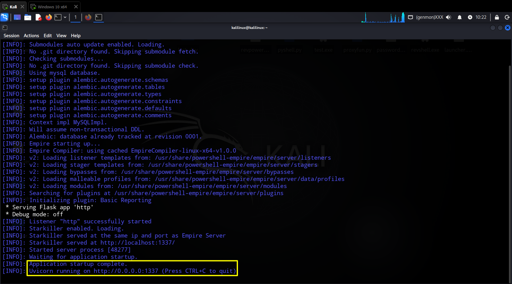
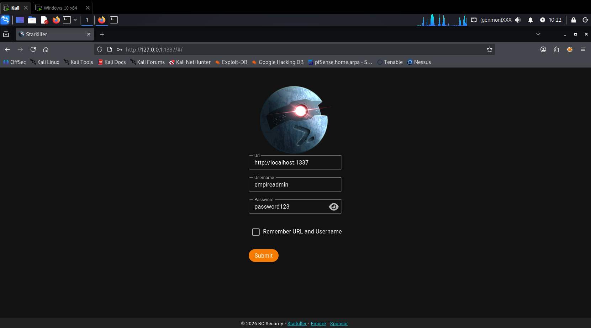
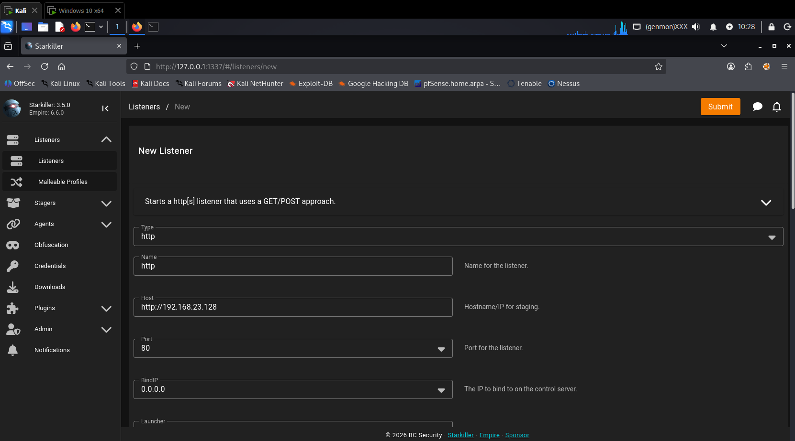
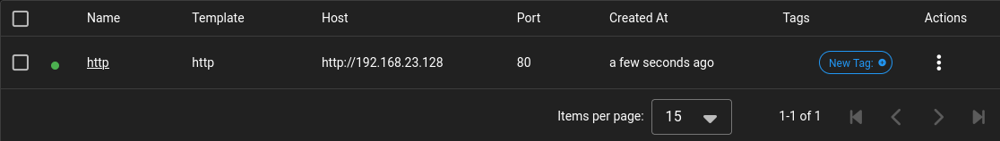
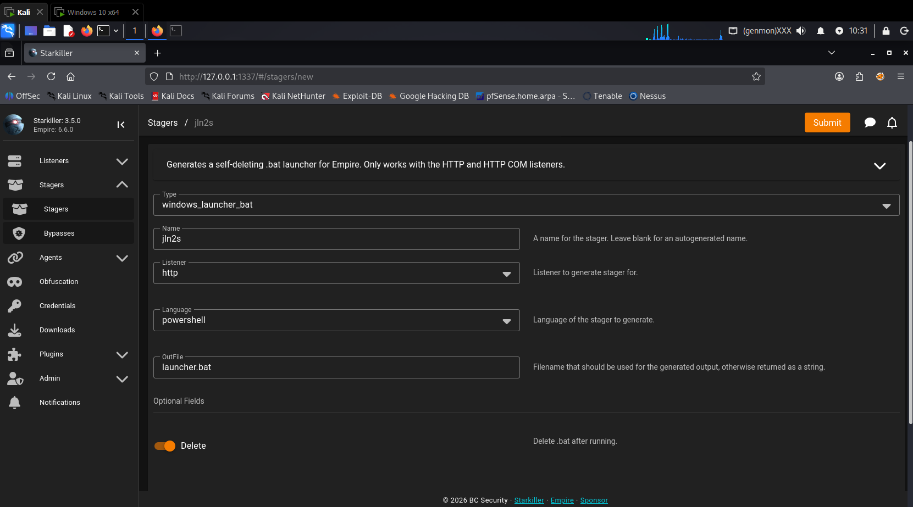
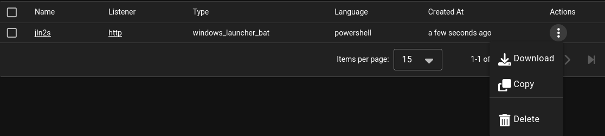
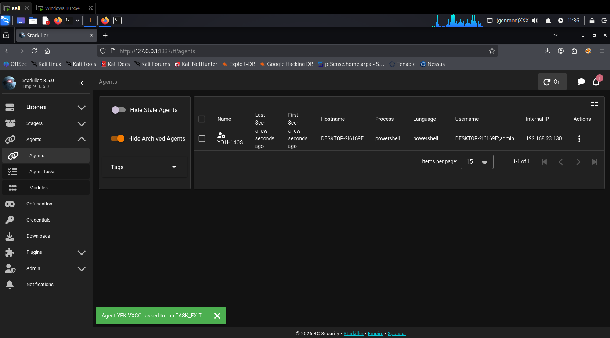
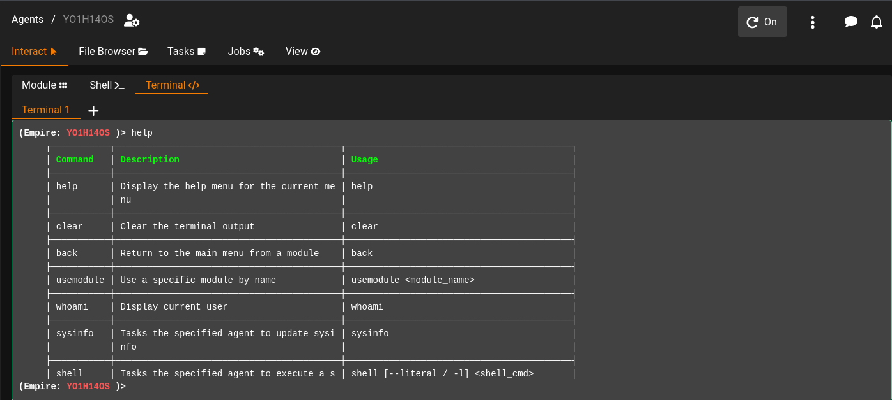
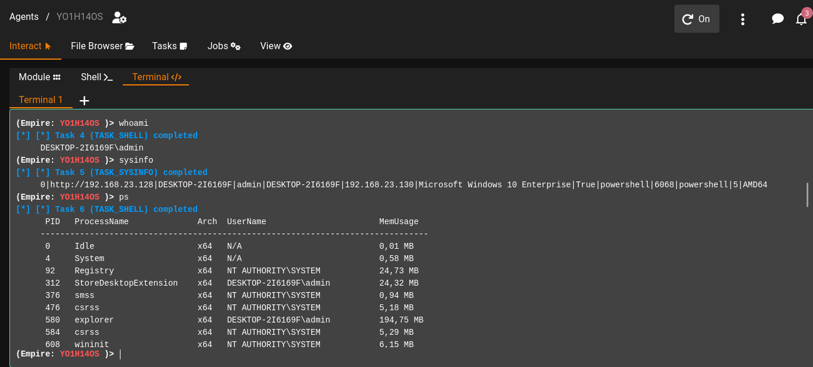
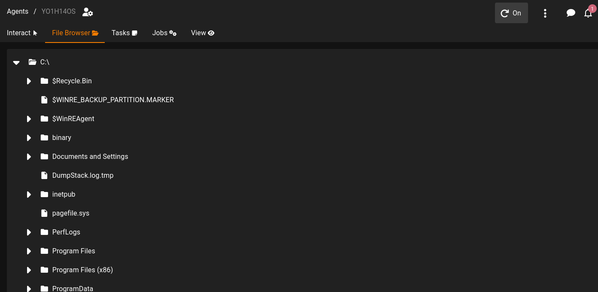

# PowerShell Empire & Starkiller - C2 Framework

## Obiettivo

Installare e utilizzare PowerShell Empire (con GUI Starkiller) per gestire agenti Windows/Linux.

## Cos'è PowerShell Empire

PowerShell Empire è un framework di Command & Control che:

- È basato su PowerShell per gli agenti Windows
- Supporta Python per gli agenti Linux
- Ha un'architettura modulare ed espandibile
- Include Starkiller come interfaccia grafica ufficiale (integrata nel server)

## Come Funziona

```
1. Server Empire (C2)
         |
         v
2. Listener HTTP/HTTPS/DNS
         |
         v
3. Agente (Launcher) sul target
         |
         v
4. Comunicazione bidirezionale
         |
         v
5. Moduli di post-exploitation
```

---

## Ambiente di Test

| Macchina | OS | IP | Ruolo |
|----------|----|----|-------|
| Attacker | Kali Linux | 192.168.23.128 | Server Empire + Starkiller |
| Target | Windows 10 | 192.168.23.130 | Agente (Launcher) |

---

## Prerequisiti

### Installazione su Kali Linux

```
sudo apt update
sudo apt install -y powershell-empire starkiller
```

---

## Procedura Passo-Passo

### Step 1: Avvia il Server Empire

**Terminale 1:**

`powershell-empire server`



**Lascia questo terminale aperto.**

---

### Step 2: Accedi a Starkiller

**Apri il browser e naviga su:**

`http://localhost:1337`

**Credenziali:**

| Campo | Valore |
|-------|--------|
| **Username** | `empireadmin` |
| **Password** | `password123` |



**Clicca su "Login".**

---

### Step 3: Crea un Listener HTTP

Nell'interfaccia di Starkiller:

1. Vai su **"Listeners"** → **"Create"**
2. Compila i campi come segue:



3. Clicca su **"Submit"**



---

### Step 4: Genera uno Stager (Launcher)

1. Vai su **"Stagers"** → **"Create"**
2. Compila i campi come segue:



3. Clicca su **"Submit"**

4. Clicca sui tre puntini verticali e seleziona **"Download"**
5. Salva il file `launcher.bat`



---

### Step 5: Esecuzione sul Target Windows

1. Disabilita Windows Defender (PowerShell come Admin)

2. Copia `launcher.bat` sul desktop del target Windows 10

3. Esegui il file (Prompt dei comandi come Admin):

```
cd C:\Users\admin\Desktop
launcher.bat
```

---

### Step 6: Verifica l'Agente

1. Torna su Starkiller
2. Vai su **"Agents"**



---

### Step 7: Interagisci con l'Agente

**Esempi:**







---

## Pulizia

### Su Windows 10

```
# Termina il processo PowerShell
taskkill /F /IM powershell.exe

# Riattiva Windows Defender
```

### Su Kali Linux

```
# Ferma il server Empire
CTRL+C
```

---

## Note di Sicurezza

> **⚠️ ATTENZIONE**: Questo è un tool didattico: utilizzalo solo in ambienti di test autorizzati

- Empire è usato da pentester professionisti
- I moderni EDR possono rilevare gli agenti Empire
- Usa sempre in ambienti isolati per i test