# Maltego - OSINT & Link Analysis

**Maltego** è una delle piattaforme più utilizzate in ambito **OSINT** (Open Source Intelligence) e **Threat Intelligence**. Permette di raccogliere dati da fonti pubbliche e visualizzare graficamente le relazioni tra entità di rete, domini, persone e infrastrutture.

---

### Concetti Fondamentali

* **Entities (Entità):** I nodi del grafico che rappresentano i dati (es. un dominio, un indirizzo IP, una mail, un netblock).
* **Transforms (Trasformazioni):** Script ed esecuzioni API che interrogano fonti esterne (WHOIS, DNS, motori di ricerca, Shodan, ecc.) per estrarre nuovi dati correlati a un'entità.
* **Graph (Grafico):** L'area di lavoro visiva dove le entità e i loro collegamenti prendono forma per l'analisi visiva.

---

### Installazione e Risoluzione Problemi (Fix Java su Kali Linux)

Se Maltego è già installato ma non si avvia correttamente o mostra errori di compatibilità legati alla versione di Java, segui questa procedura di ripristino e configurazione con **OpenJDK 21**:

#### 1. Pulizia completa delle installazioni precedenti

```
sudo apt purge maltego -y && sudo apt autoremove -y
rm -rf ~/.maltego ~/.cache/maltego
```

#### 2. Installazione aggiornata di Maltego e Java 21

```
sudo apt update
sudo apt install maltego -y
sudo apt install openjdk-21-jdk
```

#### 3. Selezione della versione Java di sistema

```
sudo update-alternatives --config java
```

*(Seleziona il numero corrispondente a **Java 21** dall`elenco a schermo).*

#### 4. Configurazione del file `maltego.conf`

> **Nota:** La cartella di configurazione dell'utente viene creata al primo avvio. Avvia Maltego una volta (anche se dovesse mostrare errori) e poi chiudilo per generare la directory.

Apri il file di configurazione con il tuo editor preferito (sostituisci il percorso utente se necessario):

```
nano /home/kalilinux/.maltego/v4.11.2/etc/maltego.conf
```

Scorri in fondo al file e aggiungi o modifica la riga definendo il percorso corretto del JDK:

```
jdkhome="/usr/lib/jvm/java-21-openjdk-amd64"
```

Salva e chiudi il file (`Ctrl+O`, `Invio`, `Ctrl+X`).

#### 5. Avvio

A questo punto puoi lanciare Maltego da terminale:

```
maltego
```

---

## Wizard di Attivazione

Al primo avvio della piattaforma, verrà mostrata la procedura guidata per la configurazione dell'account e l'installazione delle trasformazioni base.

### Step 1: Selezione del Metodo di Attivazione

Seleziona **MALTEGO ID** per accedere con le credenziali Community/Free e clicca su **Next**.

### Step 2: Modalità di Attivazione

Scegli **Online Activation (Default)** e prosegui cliccando su **Next**.

### Step 3: Licenza d'Uso

Spunta la casella **Accept** per accettare le condizioni del contratto di licenza e premi **Next >**.

### Step 4: Login via Browser

Clicca sul pulsante **Browser Login** per avviare il processo di autenticazione sul sito ufficiale.

### Step 5: Autenticazione Account

Nella pagina web aperta ('login.maltego.com'), inserisci le tue credenziali (Email/Username e Password) e clicca su **LOG IN TO MALTEGO**.

### Step 6: Conferma Login

Una volta completata l'autenticazione, la schermata mostrerà **Authentication complete**.

### Step 7: Dashboard Account (Opzionale)

Dalla dashboard web puoi verificare lo stato della licenza (es. piano Basic / CE attivo con i crediti mensili).

### Step 8: Sincronizzazione con l'Applicazione

Tornando su Maltego, la finestra di dialogo confermerà la buona riuscita con il messaggio **Browser login was successful**. Clicca su **Next >**.

### Step 9: Conferma Attivazione Licenza

Verrà mostrata la schermata di riepilogo **Activation Successful!**. Clicca su **Next >**.

### Step 10: Selezione delle Sorgenti Dati (Transforms)

Mantieni spuntata la voce **Utilities** per installare i pacchetti di trasformazioni base e clicca su **Next >**.

### Step 11: Download delle Sorgenti Dati
Il wizard scaricherà i componenti base (trasformazioni, entità, icone e server di applicazione). Al termine del download, clicca su **Next >**.

### Step 12: Termini e Condizioni delle Sorgenti Dati
Spunta la casella di controllo per accettare le condizioni d'uso dei provider di dati esterni e clicca su **Next >**.

### Step 13: Installazione delle Sorgenti Dati
Attendi la conferma dell'installazione di tutti gli elementi scaricati nel sistema e clicca su **Next >**.

### Step 14: Invio Report Errori (Opzionale)
Scegli se abilitare l'invio automatico dei report di errore anonimi a Maltego e clicca su **Next >**.

### Step 15: Configurazione Browser e Fine Setup
Seleziona il browser predefinito del sistema per l'apertura dei collegamenti esterni e clicca su **Finish** per completare la configurazione iniziale.

---

## Avvio di una Nuova Indagine

Una volta completato il setup, la piattaforma si aprirà sulla schermata principale del **Data Hub**.

### 1. Creazione di un Nuovo Grafico
Clicca sul pulsante **New** (l'icona **+** nell'angolo in alto a sinistra della barra degli strumenti) per aprire una nuova area di lavoro vuota.

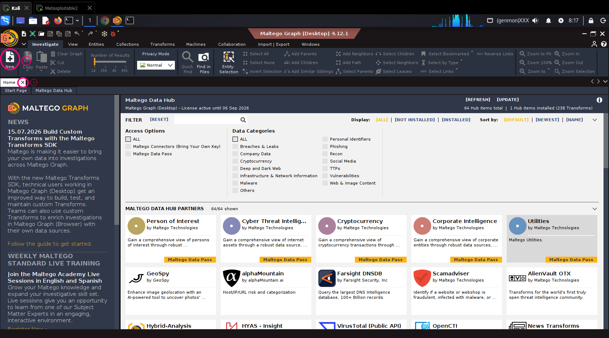

### 2. Panoramica dell'Interfaccia di Lavoro
L'interfaccia di analisi si divide in quattro aree principali:
* **Entity Palette (Sinistra):** Catalogo di tutte le entità disponibili da trascinare sul grafico.
* **Graph Canvas (Centro):** L'area di lavoro visiva su cui disporre e collegare i nodi.
* **Overview & Detail View (Destra):** Pannelli per la navigazione globale del grafico e l'ispezione dei dettagli dell'entità selezionata.
* **Run View & Output (In basso):** Area per monitorare l'esecuzione delle trasformazioni e consultare i log.

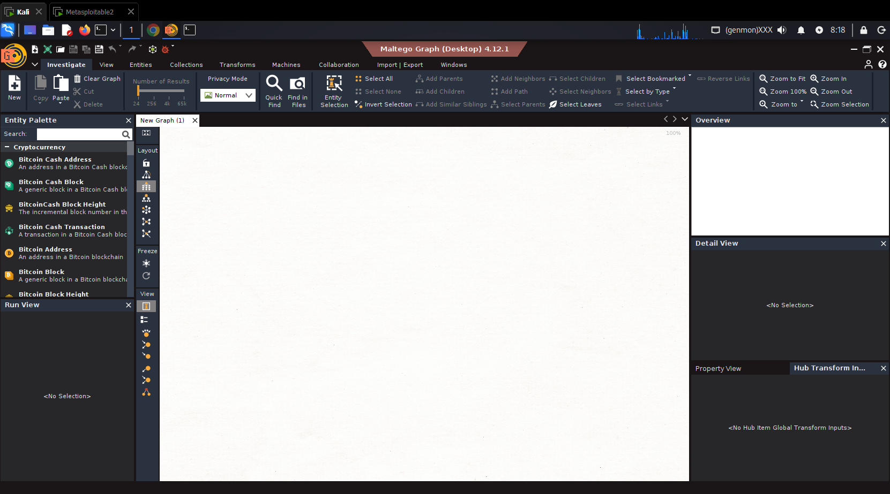

---

##Esecuzione della Prima Analisi OSINT (Domain Recon)

Vediamo come effettuare un'indagine base sulle infrastrutture DNS a partire da un dominio target (es. `owasp.org`).

### Step 1: Inserimento dell'Entità Dominio
1. Cerca `Domain` nel campo di ricerca della **Entity Palette** a sinistra.
2. Trascina l'entità **Domain** al centro del grafico.
3. Seleziona l'entità appena inserita, premi `F2` sulla tastiera e rinominala inserendo il dominio target (es. `owasp.org`).
4. Clicca con il **tasto destro del mouse** sul nodo creato per aprire il menu delle trasformazioni.

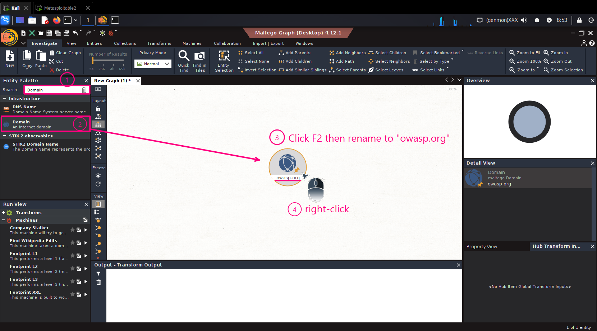

### Step 2: Selezione del Gruppo di Trasformazioni DNS
Nel menu contestuale **Run Transforms**, scorri fino alla sezione **DNS from Domain** e clicca per espandere le opzioni disponibili.

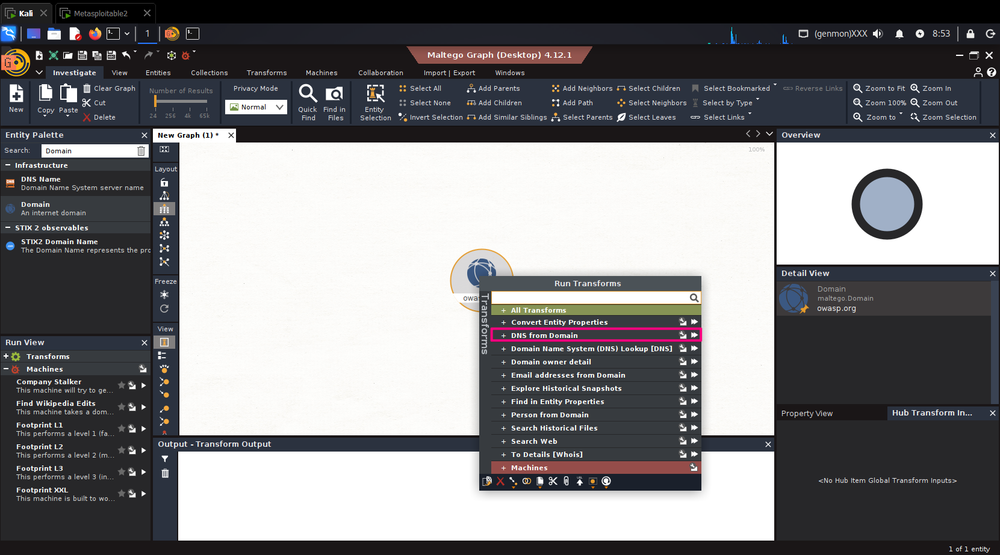

### Step 3: Identificazione dei Server Mail (MX Record)
All'interno del gruppo, individua la trasformazione **[Utilities] To DNS Name - MX (mail server)** e clicca sull'icona di esecuzione (▶️) per avviare la ricerca dei server di posta associati al dominio.

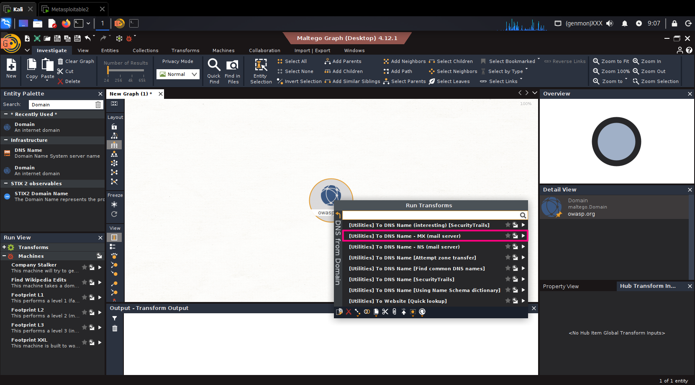

### Step 4: Risultati della Ricerca Server MX
I record MX trovati verranno disposti automaticamente sotto il dominio principale. Nell'esempio, sono stati identificati i server di posta gestiti da Google Workspace (es. `aspmx.l.google.com`).

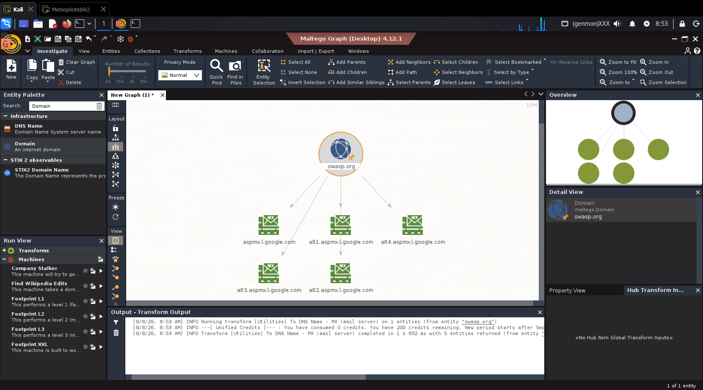

### Step 5: Ricerca dei Name Server (NS Record)
Riapri il menu delle trasformazioni sul dominio principale (`owasp.org`) -> **DNS from Domain** e seleziona **[Utilities] To DNS Name - NS (mail server)** per individuare i Name Server autorevoli.

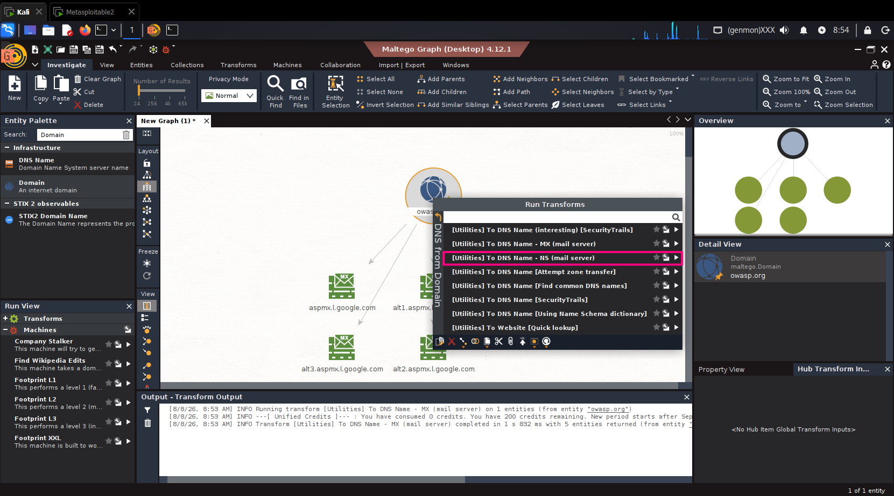

### Step 6: Risultati dei Name Server
I nodi relativi ai Name Server (es. `fay.ns.cloudflare.com` e `west.ns.cloudflare.com`) si aggiungeranno al grafico, evidenziando l'uso dell'infrastruttura Cloudflare.

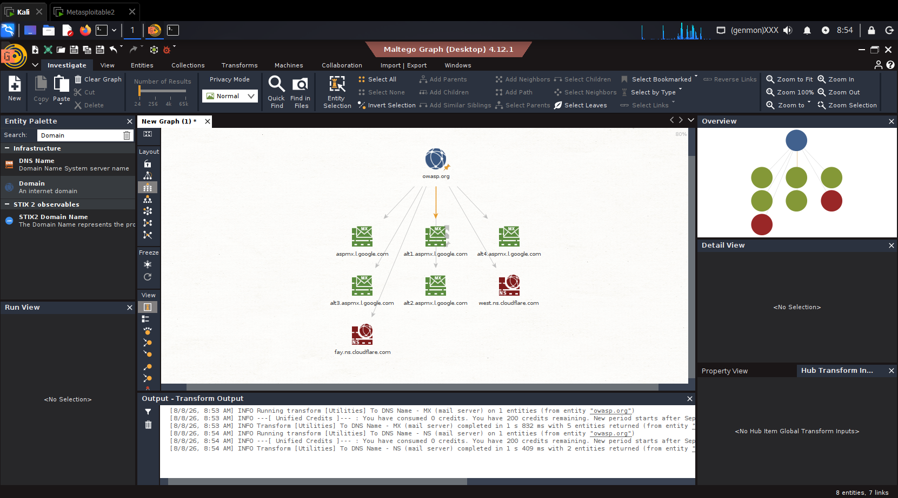

### Step 7: Enumerazione dei Sottodomini (Bruteforce Dictionary)
Per scoprire ulteriori sottodomini associati, seleziona la trasformazione **[Utilities] To DNS Name [Find common DNS names]**.

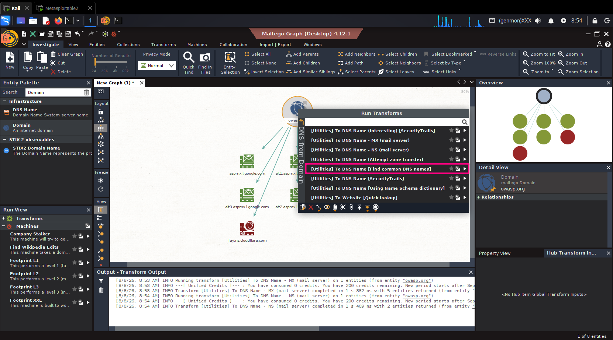

### Step 8: Configurazione dell'Input di Ricerca
Si aprirà la finestra **Required inputs** contenente un dizionario di prefissi standard (`mail`, `admin`, `web`, `ns`, `ftp`, ecc.). Lascia i valori predefiniti e clicca su **Run!**.

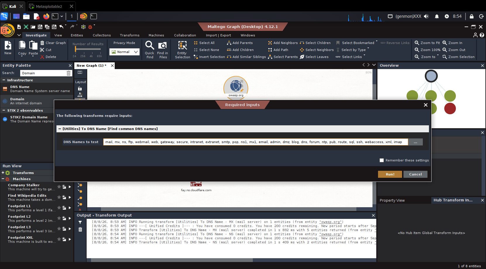

### Step 9: Analisi dei Sottodomini Trovati
Il grafico si arricchirà con i sottodomini scoperti tramite dizionario (es. `admin.owasp.org` e `mail.owasp.org`).

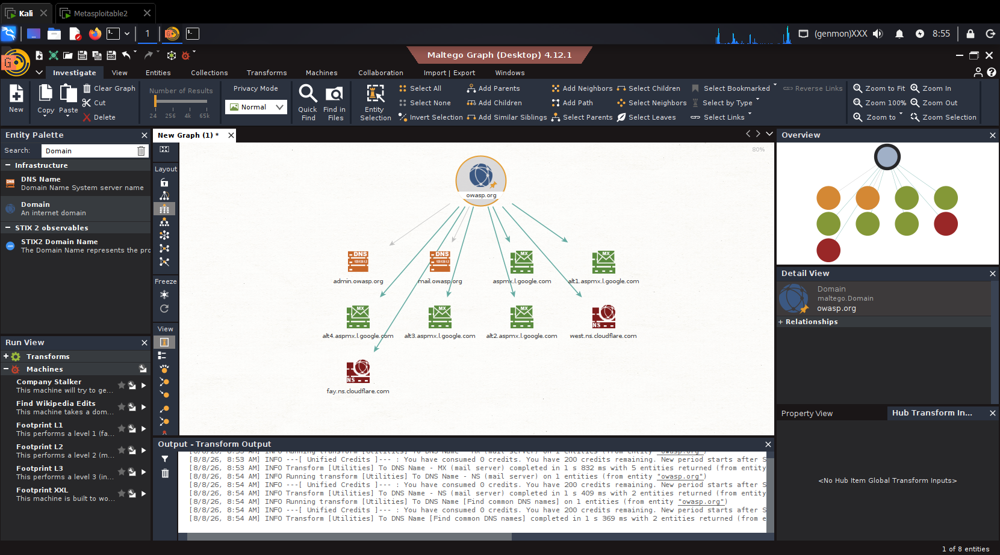

### Step 10: Lookup del Sito Web
Per identificare la presenza della risorsa Web principale, esegui dal menu **DNS from Domain** la trasformazione **[Utilities] To Website [Quick lookup]**.

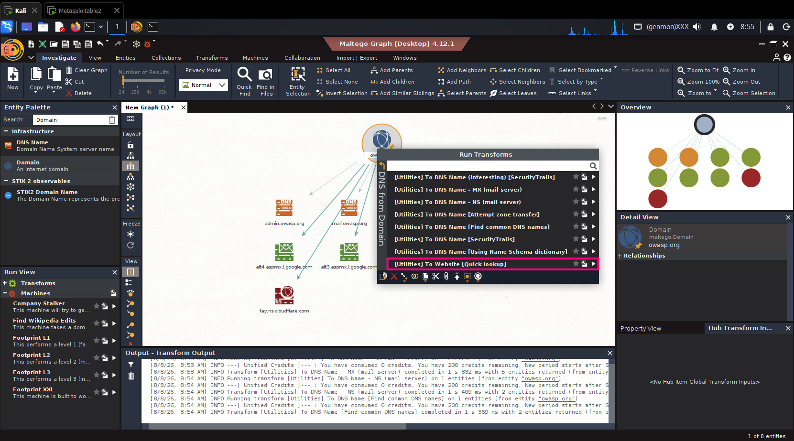

### Step 11: Selezione Massiva dei Nodi Foglia (Select Leaves)
Una volta generata l'entità Web (`www.owasp.org`), è possibile selezionare contemporaneamente tutti i nodi terminali (foglie) del grafico:
1. Vai nella barra superiore del menu **Investigate**.
2. Clicca sul pulsante in alto **Select Leaves**.

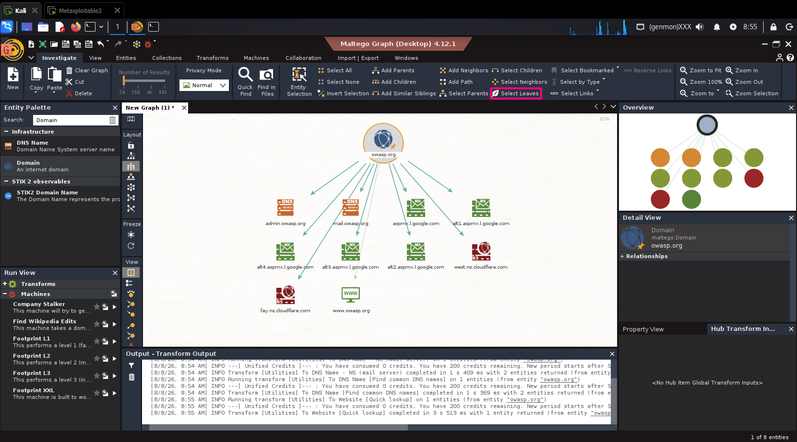

### Step 12: Risoluzione Massiva degli Indirizzi IP (Resolve to IP)
Con tutti i nodi foglia selezionati, fai clic con il tasto destro su uno di essi e seleziona la trasformazione **Resolve to IP** per convertire tutti i nomi di dominio nei rispettivi indirizzi IP di destinazione.

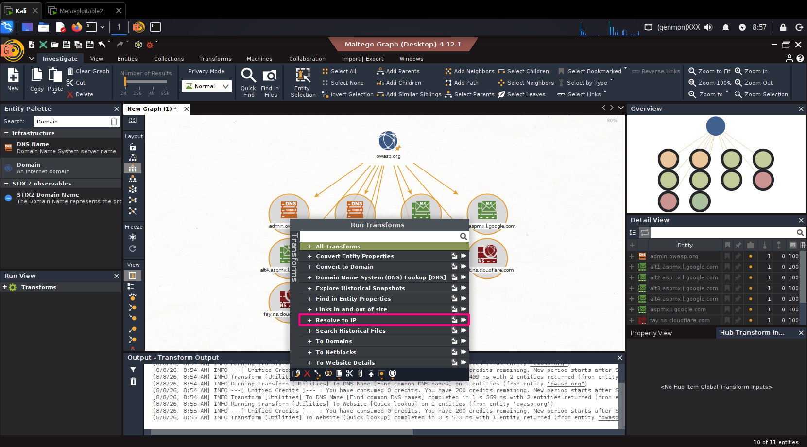

### Step 13: Mappa Completa dell'Infrastruttura e Gestione Vista
Maltego genererà la mappa completa delle correlazioni mostrando tutti gli indirizzi IPv4 e IPv6 associati ai vari servizi.

Per ottimizzare la navigazione del grafico:
* Clicca su **Zoom to Fit** nella barra degli strumenti in alto a destra per adattare la vista all'intero grafico.
* Utilizza la scheda **Import | Export** nella barra principale per salvare, esportare la mappa visuale o generare report dettagliati della tua indagine OSINT.

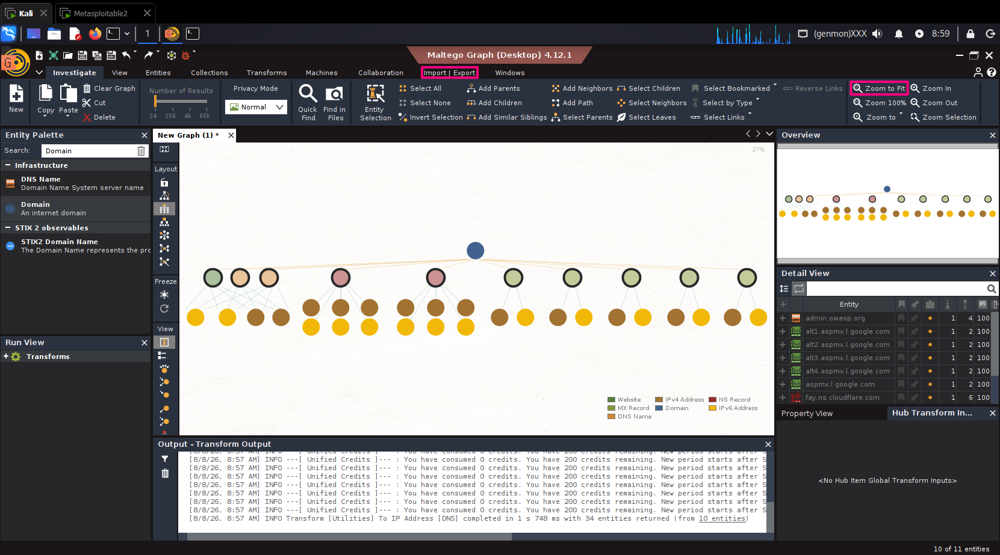

#### 🌳 Struttura Visiva del Grafico Generato
L'esportazione del grafico mostra chiaramente la gerarchia completa dell'infrastruttura emersa durante l'analisi OSINT:

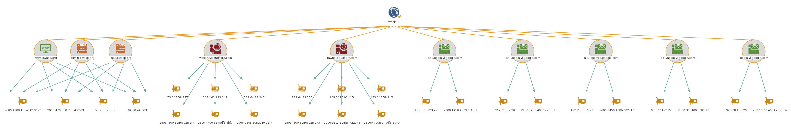

* **Livello Radice (Top):** Il punto di partenza dell'indagine, l'entità dominio (`owasp.org`).
* **Livello Intermedio:** La separazione delle risorse individuate tra sottodomini Web (`www`, `admin`, `mail`), Name Server autorevoli (Cloudflare) e mail server dedicati (Google Workspace).
* **Livello Terminale (Base):** La risoluzione dettagliata di ciascun servizio nei rispettivi indirizzi **IPv4** e **IPv6**, fornendo un quadro completo dei server fisici/cloud che ospitano i servizi del target.

---

### 📌 Summary dei Comandi Rapidi e Utility

| Azione | Tasto / Percorso |
| :--- | :--- |
| **Rinomina Entità** | Seleziona l'entità + `F2` |
| **Menu Trasformazioni** | Clic destro sull'entità selezionata |
| **Seleziona Nodi Foglia** | Menu `Investigate` -> `Select Leaves` |
| **Adatta Vista Grafico** | Toolbar in alto a destra -> `Zoom to Fit` |
| **Esporta / Salva Grafo** | Scheda ribbon -> `Import | Export` |

---

### Conclusione
La prima fase di footprinting e ricognizione infrastrutturale con **Maltego** è conclusa con successo! Ora disponi di una mappa di correlazione completa e pronta per essere integrata in report di analisi o approfondita con trasformazioni avanzate (es. integrando chiavi API per Shodan, VirusTotal o SecurityTrails).