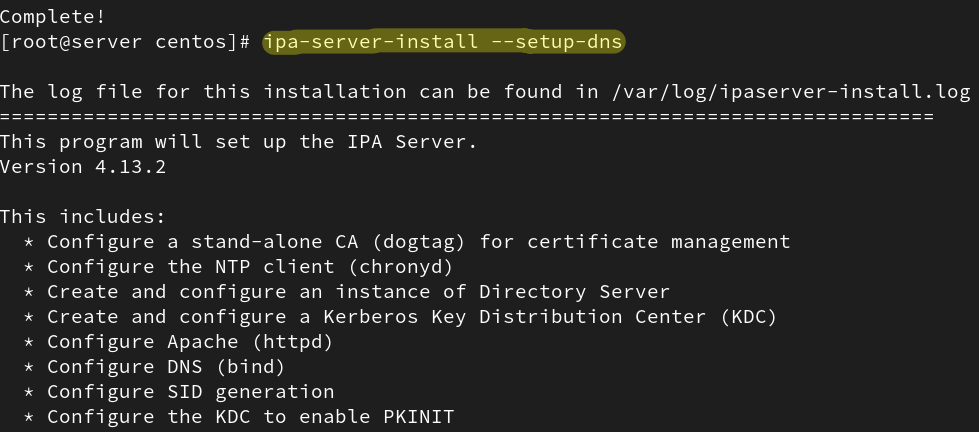
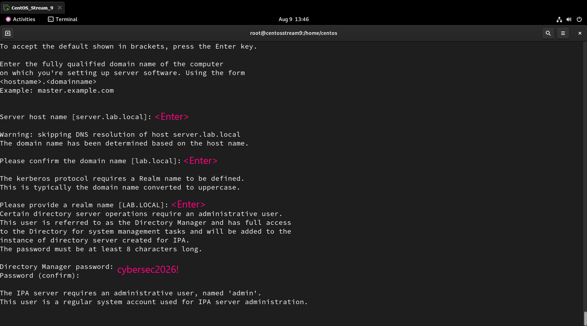
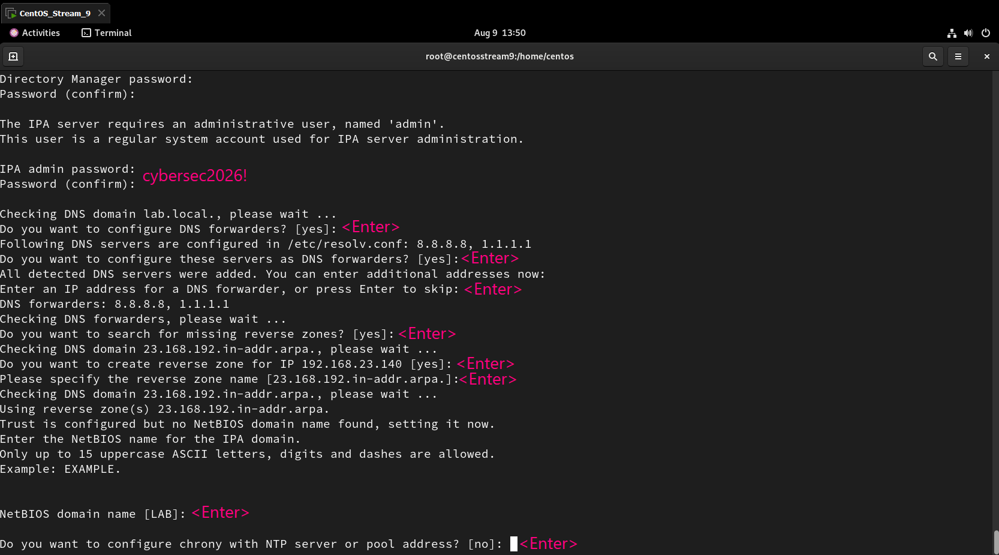
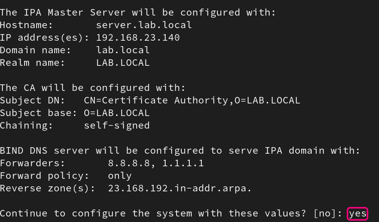
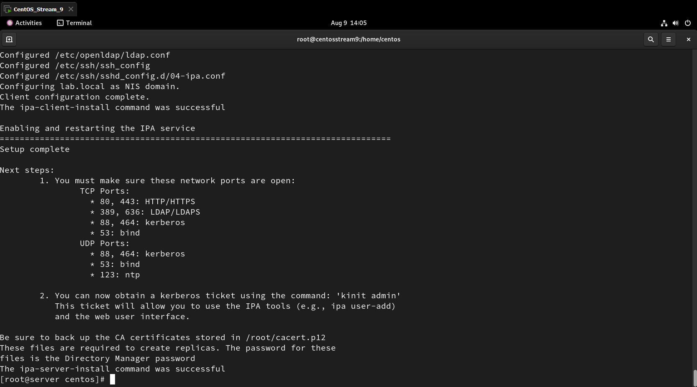
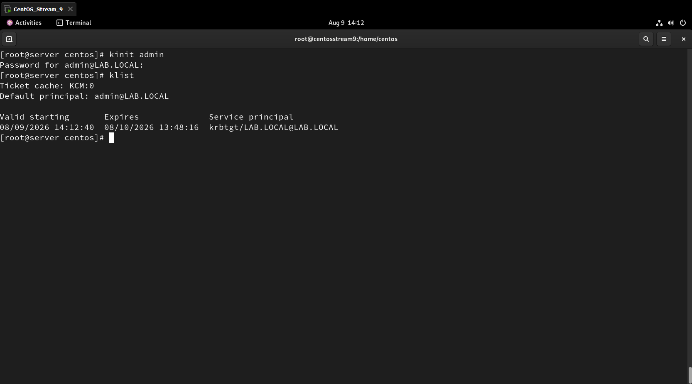
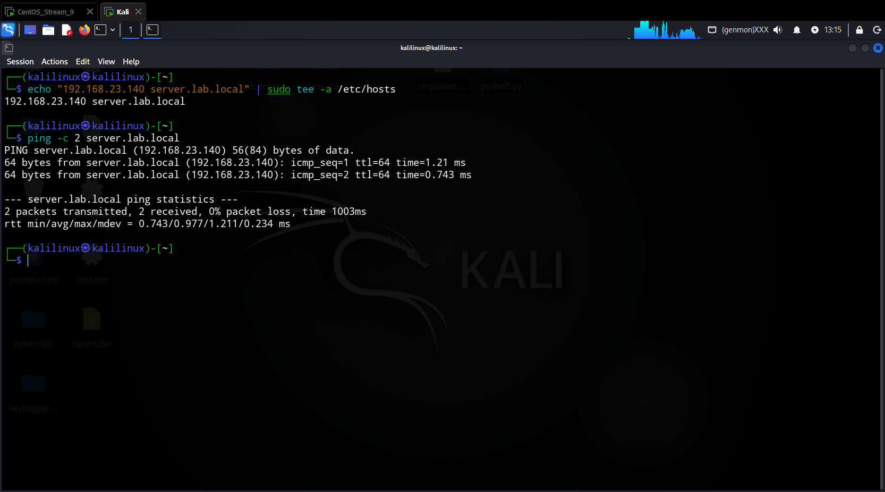
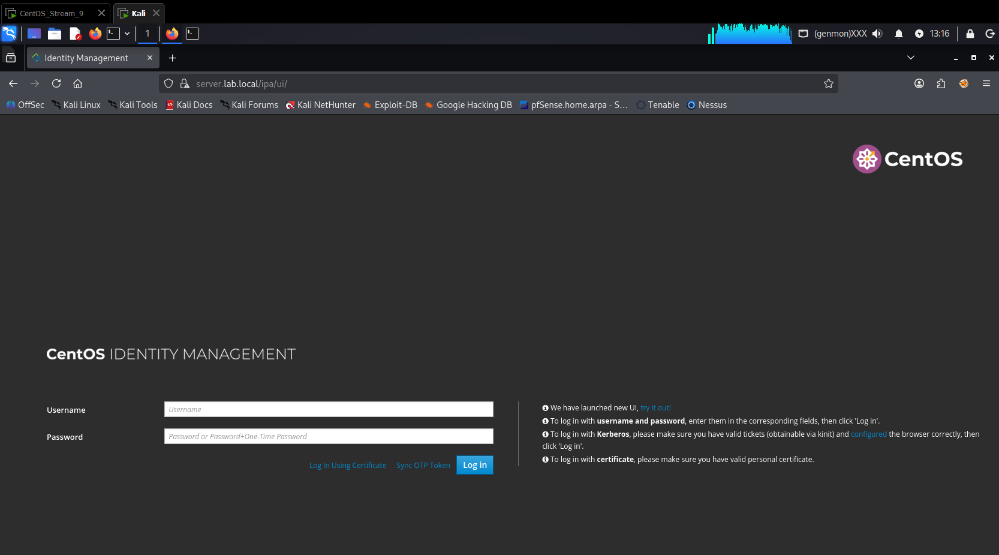
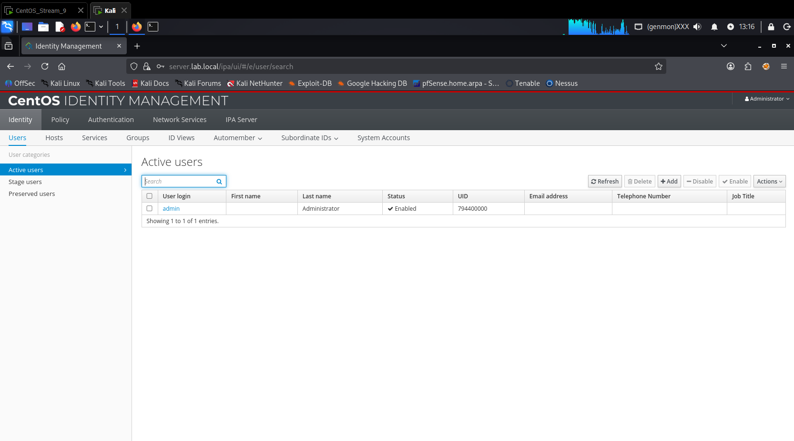

# Installazione FreeIPA Server su CentOS Stream 9 ed Accesso da Kali Linux

Guida passo-passo per la configurazione del server FreeIPA (Identity Management) su CentOS Stream 9 e la successiva connessione da un client Kali Linux.

## 1. Dati dell'Ambiente

| Parametro | Valore |
|-----------|--------|
| **Server** | CentOS Stream 9 (`192.168.23.140`) |
| **Client** | Kali Linux (`192.168.23.128`) |
| **FQDN Server** | `server.lab.local` |
| **Dominio** | `lab.local` |
| **Realm Kerberos** | `LAB.LOCAL` |
| **Utente Admin** | `admin` / `cybersec2026!` |

---

## 2. Configurazione Preliminare del Server (CentOS Stream 9)

Accesso con privilegi di root e configurazione dell'hostname e della risoluzione locale:

```
sudo su

# 1. Imposta l'hostname
hostnamectl set-hostname server.lab.local

# 2. Aggiungi l'IP corretto nel file /etc/hosts
echo "192.168.23.140 server.lab.local server" >> /etc/hosts
```

---

## 3. Installazione e Configurazione di FreeIPA

Installazione dei pacchetti necessari ed avvio della procedura guidata:

```
# 1. Installazione pacchetti
dnf install freeipa-server freeipa-server-dns -y

# 2. Avvio configurazione
ipa-server-install --setup-dns
```



### Valori selezionati durante l`installer:

| Parametro | Valore |
|-----------|--------|
| Server hostname | `server.lab.local` |
| Domain name | `lab.local` |
| Realm name | `LAB.LOCAL` |
| DNS Forwarders | `8.8.8.8`, `1.1.1.1` |
| Reverse zone | Creata per la subnet `192.168.23.0/24` (`23.168.192.in-addr.arpa.`) |
| NetBIOS domain name | `LAB` |
| NTP (Chrony) | Configurazione saltata (`no`) |
| Conferma finale | `yes` |









---

## 4. Configurazione del Firewall

Abilitazione del traffico di rete per i servizi di FreeIPA e BIND DNS:

```
firewall-cmd --add-service=http --add-service=https --add-service=ldap --add-service=ldaps --add-service=kerberos --add-service=kpasswd --add-service=dns --permanent
firewall-cmd --reload
```

---

## 5. Verifica Autenticazione Kerberos (Server)

Generazione e verifica del ticket Kerberos per l'amministratore:

```
kinit admin
# Inserire la password: cybersec2026!

klist
```



---

## 6. Configurazione ed Accesso dal Client (Kali Linux)

Operazioni eseguite sulla macchina Kali Linux (`192.168.23.128`) per la verifica e l'accesso web.

### 6.1 Mappatura dell`hostname e test di rete

```
echo "192.168.23.140 server.lab.local" | sudo tee -a /etc/hosts

ping -c 2 server.lab.local
```



### 6.2 Accesso Web UI

1. Apertura del browser Firefox.
2. Navigazione all'indirizzo: `https://server.lab.local`
3. Accettazione dell`avviso del certificato SSL auto-firmato.
4. Login effettuato con le credenziali:



| Campo | Valore |
|-------|--------|
| **Username** | `admin` |
| **Password** | `cybersec2026!` |

