# Browser Exploitation Framework (BeEF) Execution & Analysis

Questo progetto documenta l'installazione, la configurazione e l'esecuzione di test di sicurezza tramite BeEF (The Browser Exploitation Framework). L'obiettivo è analizzare la vulnerabilità dei browser moderni ad attacchi di tipo Client-Side e Social Engineering.

[!WARNING]
Disclaimer: Questa documentazione è a scopo puramente didattico. L'utilizzo di BeEF su sistemi senza autorizzazione esplicita è illegale.

## 1. Setup dell'Ambiente

Per questa simulazione utilizzeremo Kali Linux come macchina attaccante e LUbuntu come target.

### Configurazione Attaccante (Kali)

Installiamo il framework BeEF direttamente dai repository ufficiali:

```bash
sudo apt-get install beef-xss
```

### Configurazione Target (LUbuntu)

Per rendere il test realistico, installiamo Google Chrome sulla macchina target:

```bash
wget https://dl.google.com/linux/direct/google-chrome-stable_current_amd64.deb
sudo dpkg -i google-chrome-stable_current_amd64.deb
```

## 2. Avvio e Autenticazione

Inizializziamo il servizio su Kali:

```bash
beef-xss-start
```

Una volta avviato, il framework aprirà automaticamente l'interfaccia web di amministrazione.

### Credenziali di accesso

- Username: `beef`
- Password: `kalilinux` (o quella configurata durante il primo avvio)

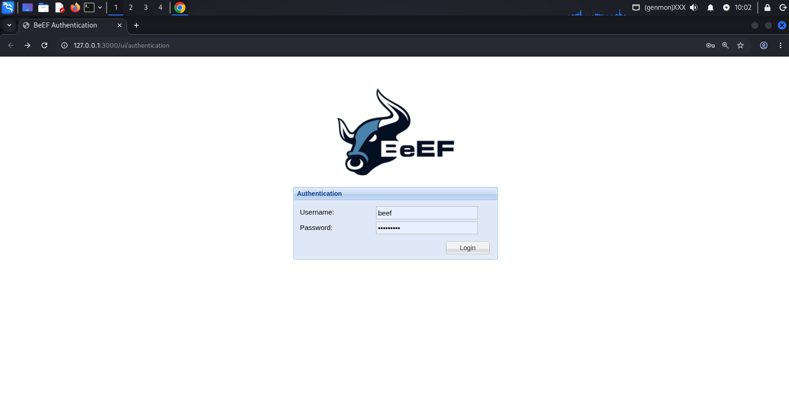

### Interfaccia di Login e Dashboard

Verifichiamo che il pannello di controllo sia operativo.

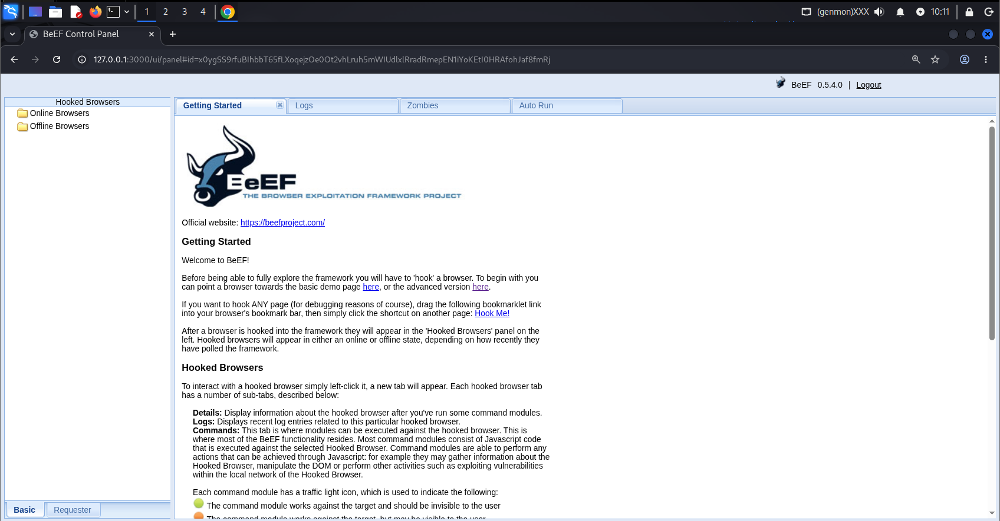

## 3. Hooking del Target

L'attacco ha inizio quando la vittima visita una pagina contenente l'Hook JavaScript di BeEF. In questo scenario, utilizziamo una pagina demo ospitata sul server dell'attaccante.

Sulla macchina LUbuntu, apriamo Chrome e navighiamo verso:
`http://192.168.23.128:3000/demos/butcher/index.html`

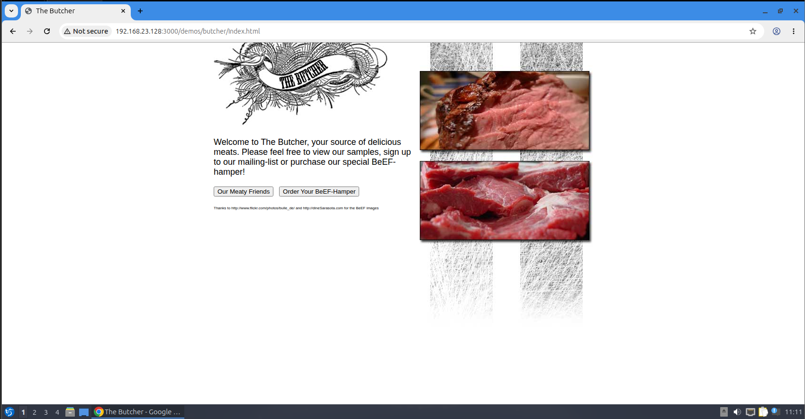

## 4. Analisi e Comandi Remoti

Una volta che il browser è nel nostro raggio d'azione, appare nel pannello Online Browsers di BeEF.

### Identificazione del Browser

Possiamo ottenere dettagli granulari sul sistema target (OS, versione del browser, plugin installati).

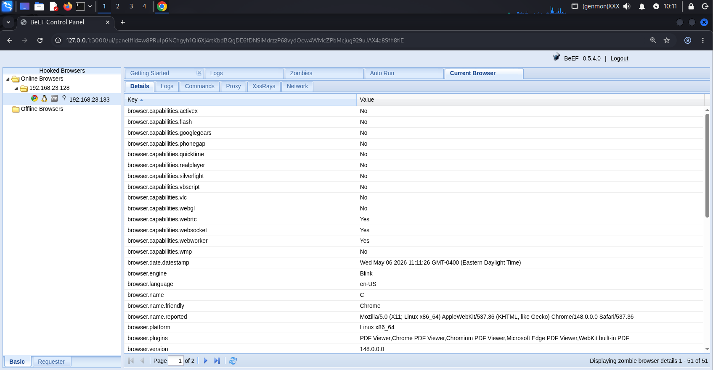

### Test di Esecuzione: Alert Box

Per verificare la comunicazione bidirezionale, inviamo un semplice comando di pop-up.
1. Selezioniamo il modulo `Create Alert Dialog`.
2. Inseriamo il testo desiderato e premiamo Execute.

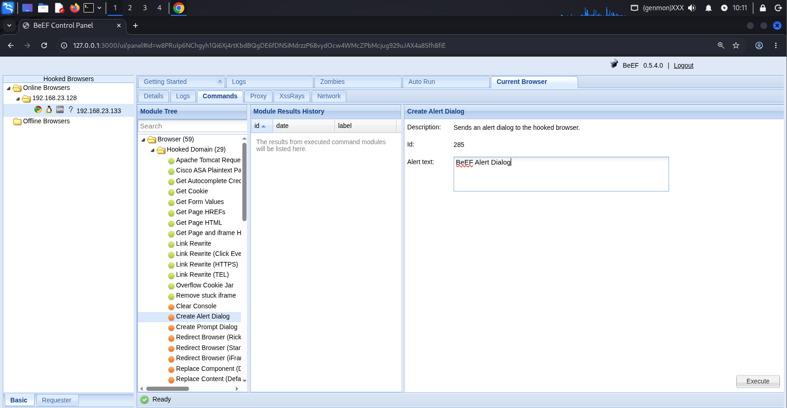

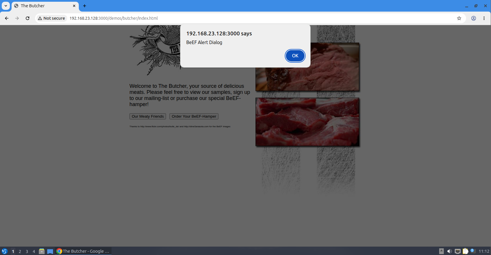

## 5. Social Engineering: Google Phishing

Passiamo a un attacco più avanzato utilizzando tecniche di Phishing per sottrarre credenziali reali.

### Configurazione del Modulo

Utilizziamo il modulo `Google Phishing` presente nella sezione Social Engineering. Questo modulo reindirizzerà l'utente a una falsa pagina di login di Gmail.

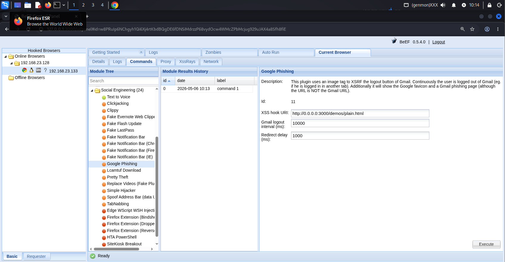

### L'Esperienza della Vittima

Il browser della vittima viene reindirizzato a una pagina di login identica a quella originale di Google. Qualsiasi dato inserito verrà inviato direttamente al nostro pannello di controllo.

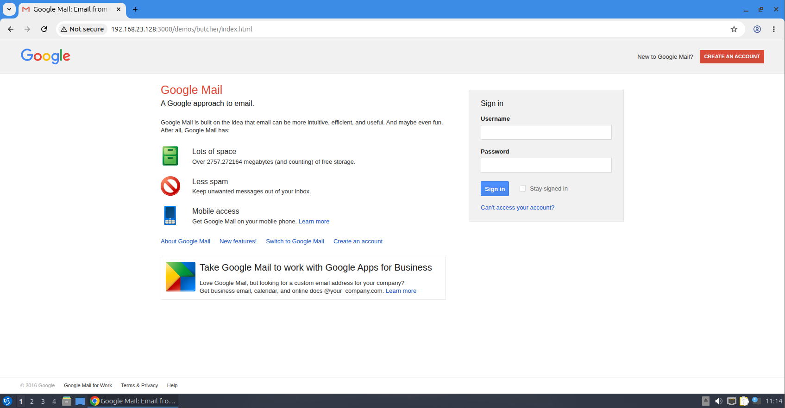

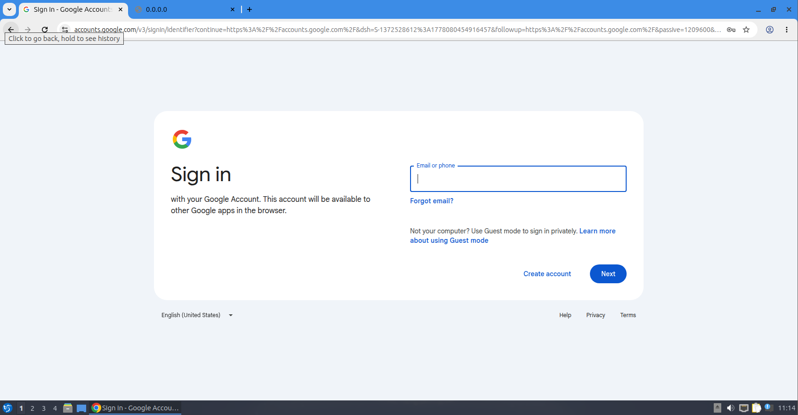

## 6. Esfiltrazione Dati

Il risultato finale dell'attacco è visibile nella tab Command Results. BeEF cattura i dati in chiaro inseriti dalla vittima nei campi `Username` e `Password`.

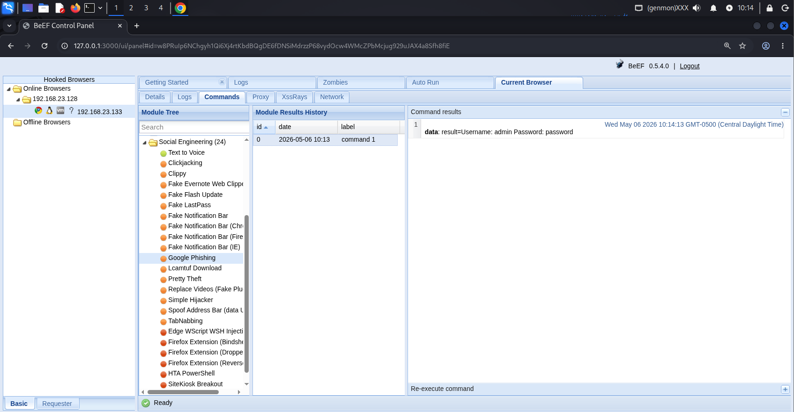

## 7. Phishing di Componenti Browser: Fake LastPass

BeEF non si limita a simulare pagine web; può iniettare finti elementi dell'interfaccia del browser o di estensioni famose. In questo test, simuliamo la scadenza della sessione di LastPass per rubare la Master Password dell'utente.


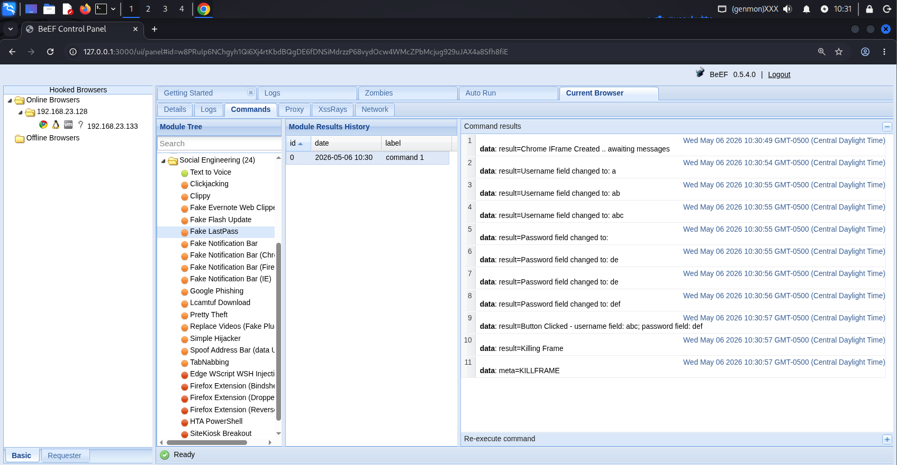

## 8. Network Auditing: Discovery della LAN

Una delle funzionalità più pericolose di BeEF è la capacità di trasformare il browser della vittima in un pivot. L'attaccante può usare il browser "agganciato" per scansionare la rete locale (LAN) a cui la vittima è connessa, superando eventuali firewall esterni.

### Identificazione delle Subnet

Utilizzando il modulo Identify LAN Subnets, il browser invia richieste silenziose ai gateway più comuni per mappare la rete interna.

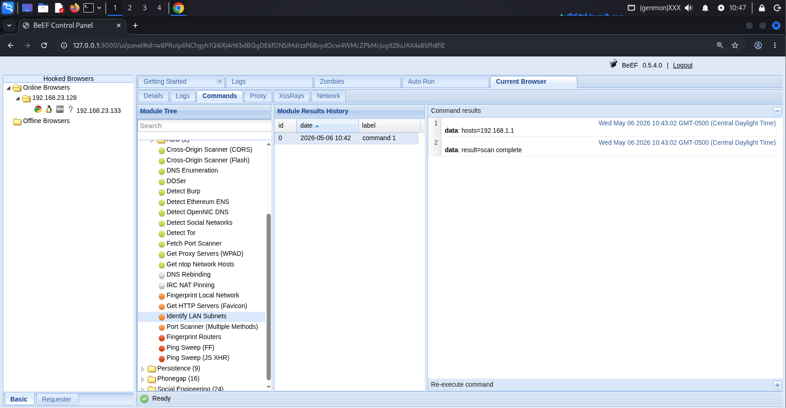

## Conclusioni Finali

L'analisi condotta dimostra che il browser è oggi uno dei vettori d'attacco più critici. Attraverso BeEF, abbiamo visto come sia possibile:
1. Manipolare l'esperienza utente (Alert, Reindirizzamenti).
2. Sottrarre credenziali sensibili tramite tecniche di Social Engineering mirate.
3. Esplorare reti private altrimenti protette, utilizzando il browser come testa di ponte.

### Misure di Mitigazione Consigliate
- Security Awareness: Istruire gli utenti a non inserire mai credenziali in pop-up sospetti che appaiono su siti non correlati.
- Content Security Policy (CSP): Implementare policy robuste per impedire l'esecuzione di script JavaScript provenienti da domini non autorizzati.
- Estensioni di Sicurezza: Utilizzare strumenti che bloccano script cross-site (come NoScript) o che analizzano il comportamento del browser.