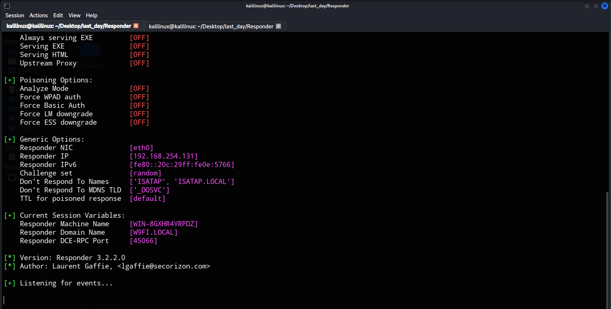
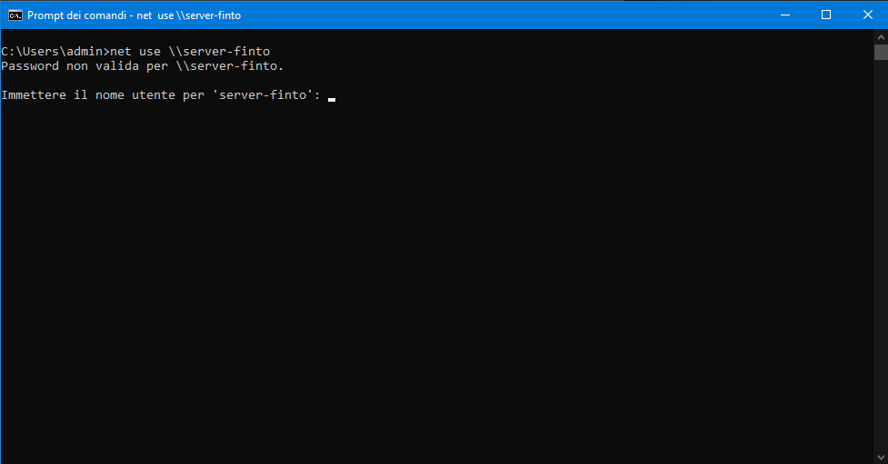
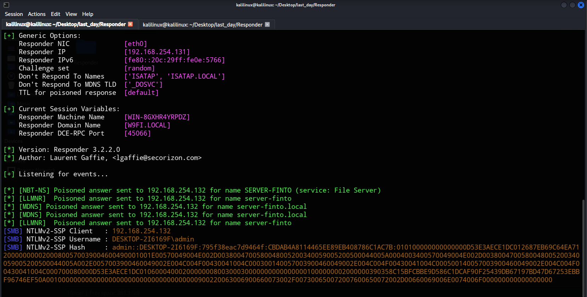
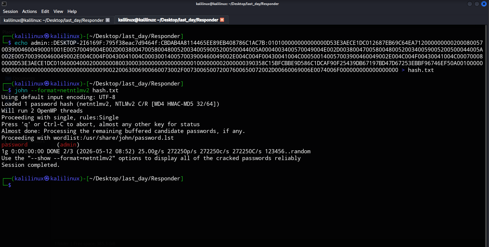

# Analisi e Simulazione dell'Attacco di Avvelenamento LLMNR/NBT-NS

Questo documento descrive la simulazione di un attacco di rete volto all'intercettazione e alla compromissione delle credenziali Windows (Hash NTLMv2) sfruttando protocolli di risoluzione dei nomi legacy.

### Protocolli Coinvolti

- LLMNR / NBT-NS / mDNS: Protocolli usati da Windows per cercare nomi di computer nella rete locale quando il server DNS non risponde. Funzionano inviando una richiesta a tutti i dispositivi della rete.
- NTLMv2: Protocollo di autenticazione "challenge-response". Invece di inviare la password in chiaro, Windows invia un hash crittografato.

### Scenario di Attacco

1. Attaccante: Kali Linux con il tool Responder.
2. Vittima: Windows 10 (nello stesso segmento di rete "Host-Only").

# Fasi dell'Attacco

## 1. Avvelenamento della Rete (Poisoning)

L'attaccante avvia Responder in modalità ascolto:

```bash
sudo python3 Responder.py -I eth0 -v
```



Quando la vittima cerca una risorsa inesistente (es: `\\server-finto`), Responder intercetta la richiesta e risponde fingendo di essere il server cercato.



## 2. Intercettazione delle Credenziali

Il sistema Windows della vittima, credendo di aver trovato il server, invia automaticamente l'Hash NTLMv2 dell'utente loggato per autenticarsi.
Risultato: Responder cattura l'hash dell'utente admin.



## 3. Password Cracking

L'hash catturato viene salvato in un file (hash.txt) e analizzato con John the Ripper:

```bash
john --format=netntlmv2 hash.txt
```

John confronta l'hash con milioni di parole comuni. Se la password è debole (nel nostro test era password), il tool la scopre in pochi secondi.



## Risultati Ottenuti
- Utente Identificato: `DESKTOP-2I6169F\admin`
- Hash Catturato: `NTLMv2`
- Password Decifrata: `password`

## Misure di Mitigazione

Per prevenire questo attacco in una rete reale, è necessario:

1. Disabilitare LLMNR tramite Group Policy (GPO).
2. Disabilitare NBT-NS nelle impostazioni della scheda di rete (TCP/IPv4).
3. Imporre Password Complesse: Una password lunga e alfanumerica rende il cracking computazionalmente impossibile in tempi brevi.
4. Usare Kerberos: Assicurarsi che l'autenticazione di dominio sia configurata correttamente per preferire Kerberos a NTLM.