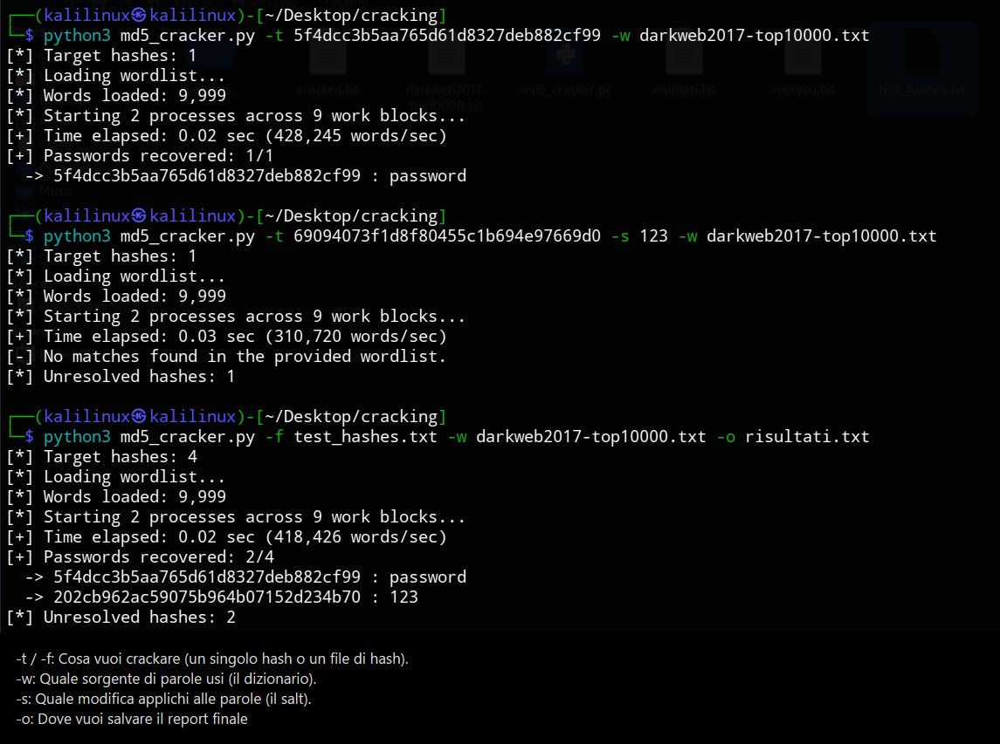
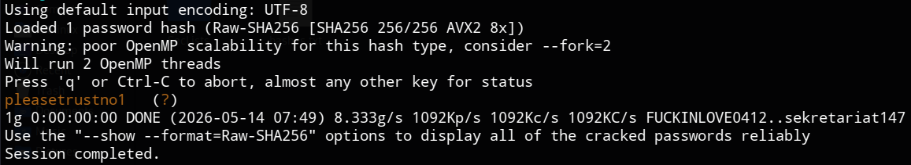
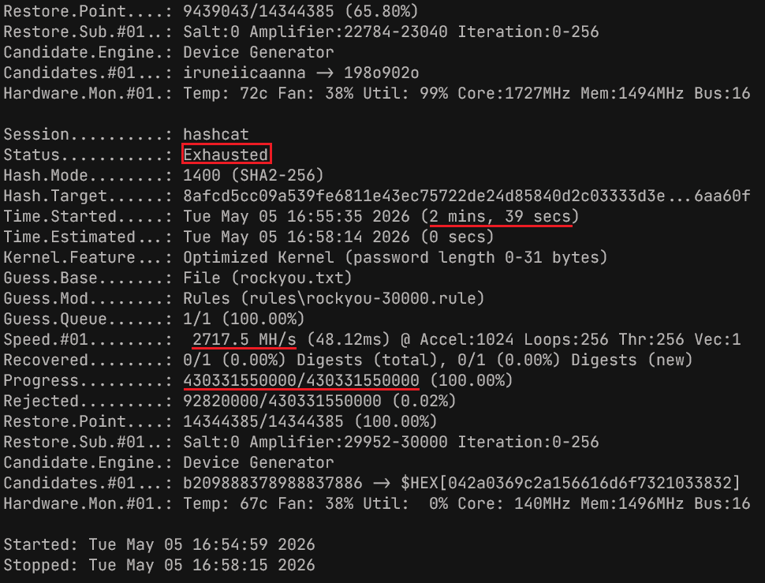
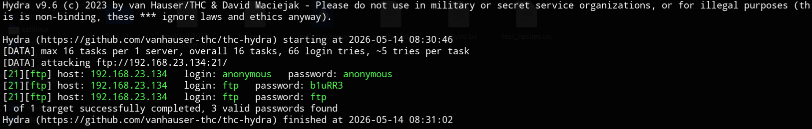

# Password Cracking e Network Auditing

Questo progetto documenta le procedure di analisi e i risultati ottenuti durante i test di recupero credenziali e network auditing. L'attività si è concentrata sull'efficacia di diversi approcci: custom scripting in Python, cracking basato su CPU (John the Ripper), ottimizzazione tramite GPU (Hashcat) e auditing di rete (Hydra).

## Disclaimer

Attenzione: Questo progetto ha scopi puramente didattici e di auditing autorizzato. L'uso di queste tecniche verso sistemi senza esplicito consenso è illegale.

## 1. Custom Scripting: MD5 Cracking con Salt

Per questa analisi è stato sviluppato uno script Python ottimizzato per la violazione di hash MD5 con salt.

- Target Hash: `c94201dbba5cb49dc3a6876a04f15f75`
- Salt: `d6a6bc0db10694a2d90e3a69648f3a03`
- Wordlist: `darkweb2017-top10000.txt`

A partire da una semplice versione procedurale, ne ho sviluppata una con le seguenti caratteristiche:
- Parallelismo: Utilizzo del modulo `multiprocessing` per distribuire il carico su tutti i core della CPU.
- Flessibilità: Supporto per il posizionamento del salt (prefisso/suffisso) e input via CLI.

```bash
python3 md5_cracker.py -t c94201dbba5cb49dc3a6876a04f15f75 -s d6a6bc0db10694a2d90e3a69648f3a03 -w darkweb2017-top10000.txt

# output
[*] Target hashes: 1
[*] Loading wordlist...
[*] Words loaded: 9,999
[*] Starting 2 processes across 9 work blocks...
[+] Time elapsed: 0.03 sec (312,201 words/sec)
[+] Passwords recovered: 1/1
  -> c94201dbba5cb49dc3a6876a04f15f75 : trustno1
```

Altri esempi:



## 2. Cracking SHA256 (Ambiente Linux)

Test di cracking su hash SHA2-256 standard utilizzando la suite SecLists e John the Ripper.

SecLists è una raccolta di diversi tipi di liste utilizzate durante i test di sicurezza, che includono nomi utente, password, URL, sensitive data pattern e altro ancora.

John the Ripper è uno dei software di cracking più versatili al mondo. È in grado di identificare automaticamente il tipo di hash e supporta centinaia di algoritmi diversi.

```bash
# Scaricare la suite SecLists
git clone https://github.com/danielmiessler/SecLists.git

# Installare John the Ripper
sudo apt update && sudo apt install john -y
```

- Hash target: `8afcd5cc09a539fe6811e43ec75722de24d85840d2c03333d3e489f56e6aa60f`
- Dizionario: `000webhost.txt` (SecLists)

```bash
john --format=raw-sha256 --wordlist=SecLists/Passwords/Leaked-Databases/000webhost.txt hashes.txt
```



## 3. Ottimizzazione su Windows 10 (Hashcat GPU)

Hashcat è considerato il password cracker più veloce al mondo. A differenza di John the Ripper, nasce per massimizzare le prestazioni sfruttando il calcolo parallelo delle schede video (GPU) tramite i framework OpenCL o CUDA. Questo permette di testare miliardi di combinazioni al secondo, rendendolo lo standard per attacchi a forza bruta su algoritmi moderni.

Installazione e Setup:
1. Download: I file binari sono disponibili sul sito ufficiale hashcat.net.
2. Driver: È necessario che i driver della GPU (NVIDIA/AMD) siano aggiornati per supportare l'accelerazione hardware.
3. Esecuzione: Estratto l'archivio, il software si esegue direttamente da PowerShell o Prompt dei Comandi senza installazione.

Per simulare un attacco su larga scala, l'analisi SHA256 è stata spostata su ambiente Windows 10 per sfruttare l'accelerazione hardware, calcolando milioni di hash al secondo. In questo test, utilizziamo il dizionario `rockyou.txt` e un set di regole avanzate.

```powershell
.\hashcat.exe -a 0 -m 1400 -w 4 -O hashes.txt rockyou.txt -r rules\rockyou-30000.rule
```



- Status: Exhausted: Indica che Hashcat ha testato l'intero spazio di combinazioni previsto (wordlist + regole) senza trovare una corrispondenza per l'hash target.
- Hash.Mode: Conferma l'utilizzo dell'algoritmo SHA2-256 (Mode 1400).
- Speed.#01: La velocità di calcolo raggiunge i 2717.5 MH/s (oltre 2,7 miliardi di hash al secondo), dimostrando l'enorme efficienza della GPU rispetto ai test su CPU.
- Progress: Sono state elaborate oltre 430 miliardi di combinazioni (430.331.550.000) in soli 2 minuti e 39 secondi.
- Guess.Mod: L'utilizzo del file rockyou-30000.rule indica l'applicazione di trasformazioni dinamiche (es. aggiunta di caratteri, sostituzioni leet) sulla wordlist base rockyou.txt.
- Hardware Monitoring: Viene monitorato lo stato termico della scheda video (Core a 1727MHz con temperatura stabilizzata a 72°C), parametro critico durante carichi di lavoro così intensivi.

## 4. Network Auditing (Hydra - FTP)

Hydra è un software per il cracking delle credenziali di accesso a servizi di rete (login cracker). A differenza dei tool offline che lavorano su hash, Hydra lavora "online": tenta attivamente di autenticarsi presso un server (come FTP, SSH, HTTP) simulando l'inserimento ripetuto di username e password.

Installazione:
1. Kali Linux: Preinstallato (altrimenti sudo apt install hydra).
2. Ubuntu/Debian: sudo apt update && sudo apt install hydra -y.

Fase di verifica della robustezza delle password sui servizi attivi. È stato testato il protocollo FTP (File Transfer Protocol), utilizzato per il trasferimento di file ma insicuro poiché trasmette le credenziali in chiaro. L'audit è stato eseguito sull'host target `192.168.23.134` (Metasploitable).

```bash
hydra -C SecLists/Passwords/Default-Credentials/ftp-betterdefaultpasslist.txt 192.168.23.134 ftp
```



Durante l'audit sono state rilevate tre combinazioni valide, evidenziando una configurazione di sicurezza critica:

```bash
[21][ftp] host: 192.168.23.134   login: anonymous   password: anonymous
[21][ftp] host: 192.168.23.134   login: ftp   password: b1uRR3
[21][ftp] host: 192.168.23.134   login: ftp   password: ftp
```

## Conclusioni

I test hanno dimostrato che:
- L'uso di Salt complessi è essenziale, ma insufficiente se la password originale è presente in leak comuni.
- L'ottimizzazione GPU riduce drasticamente i tempi di calcolo rispetto agli script CPU single-thread.
- La presenza di credenziali default/anonymous sui servizi di rete rimane uno dei vettori di attacco più semplici da sfruttare.