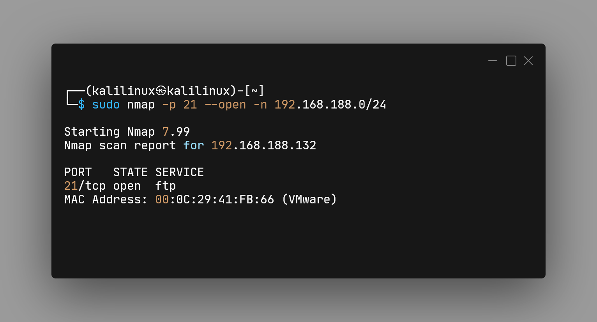
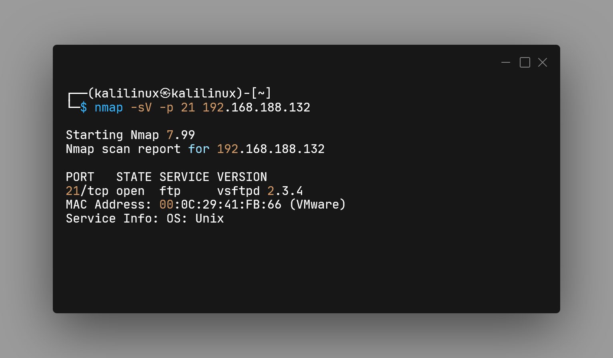
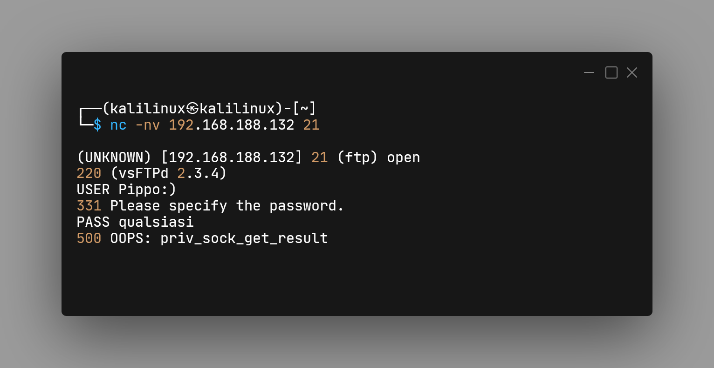
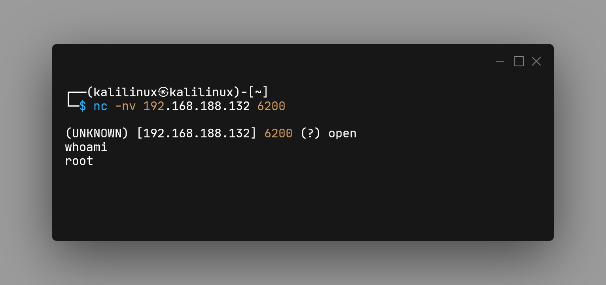
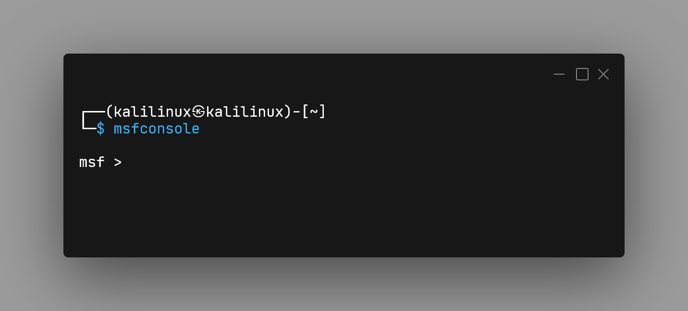
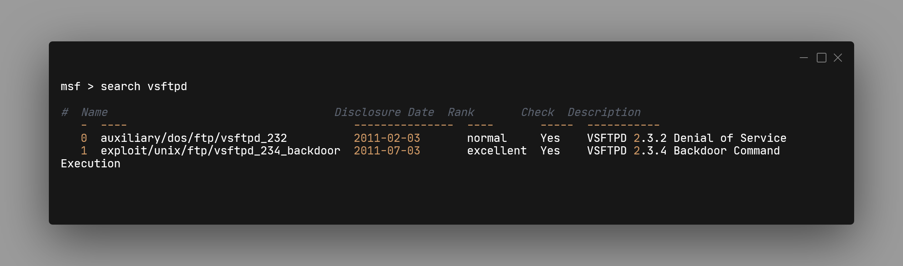
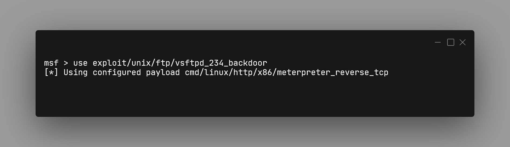
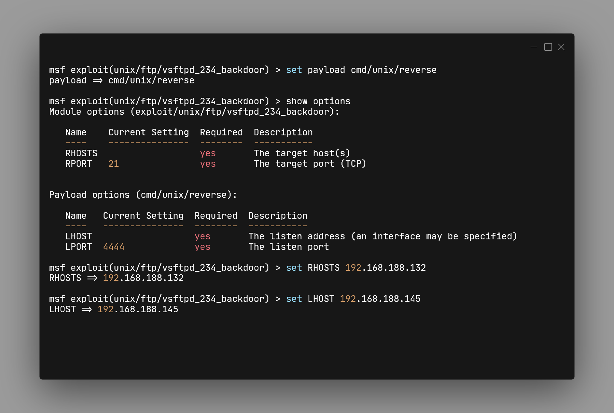
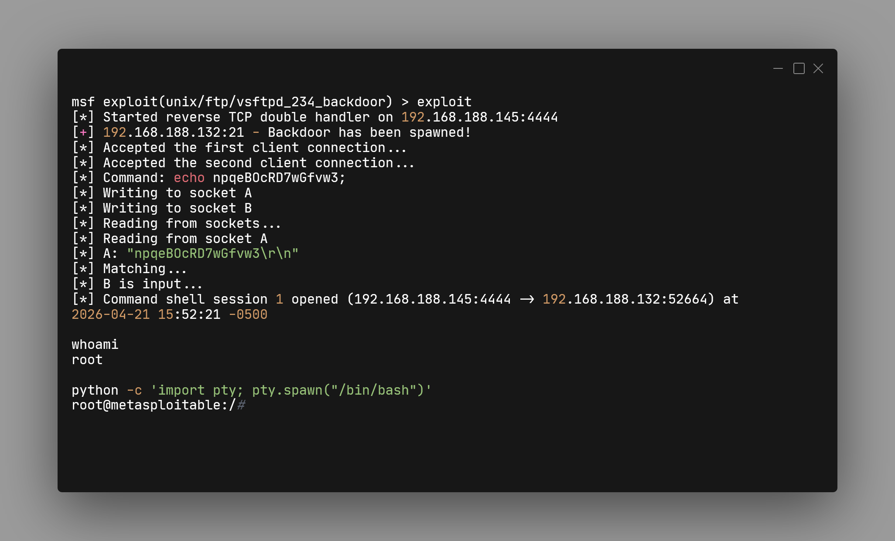

# Exploit vsftpd 2.3.4 Backdoor (Netcat && Metasploit)

| Campo | Valore |
| :--- | :--- |
| Vulnerabilità | [CVE-2011-2523](https://cve.mitre.org/cgi-bin/cvename.cgi?name=CVE-2011-2523) |
| Target | Metasploitable 2 |
| Servizio | FTP (vsftpd 2.3.4) |
| Tipo | Backdoor → RCE (root) |
| Strumenti | Nmap, Netcat, Metasploit |

Questa versione di vsftpd è stata distribuita con una backdoor.  
Durante il login FTP, se lo username contiene `:)`, viene aperta una bind shell sulla porta **6200/TCP** con privilegi **root**.

---

## Metodo Manuale (Netcat)

### 1. Scansione della rete

### 2. Identificazione servizio

### 3. Connessione FTP + trigger backdoor

### 4. Accesso alla shell

---

## Metodo Automatico (Metasploit)

### Avvio console

### Ricerca exploit

### Selezione exploit

### Configurazione parametri

### Esecuzione exploit
