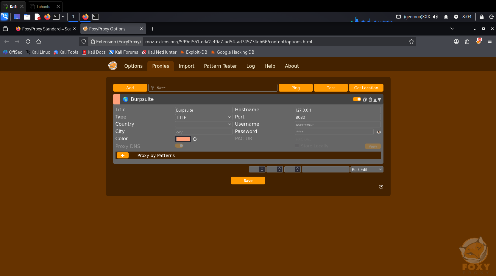
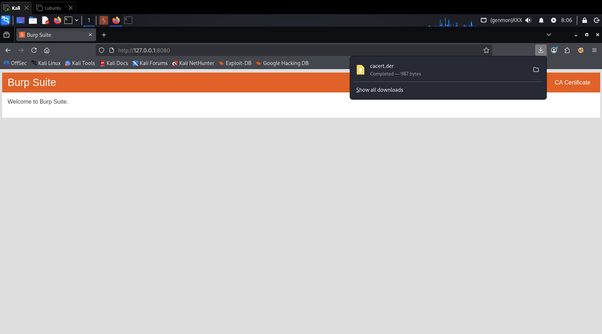
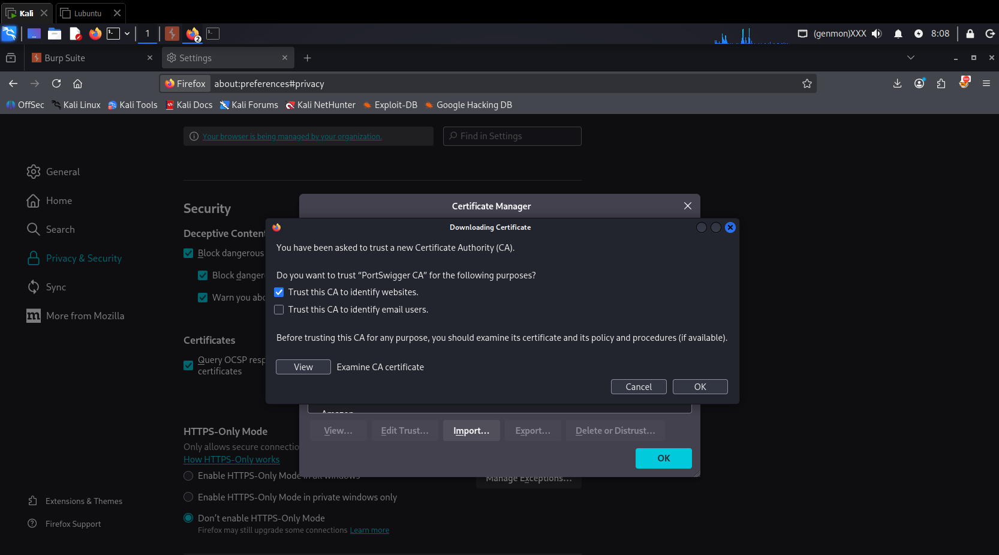
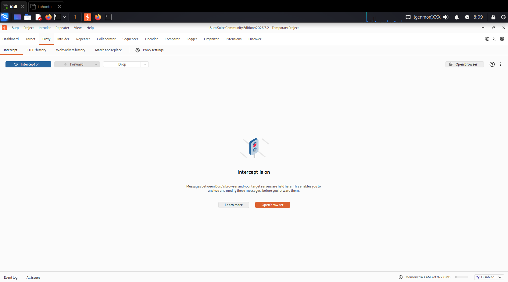
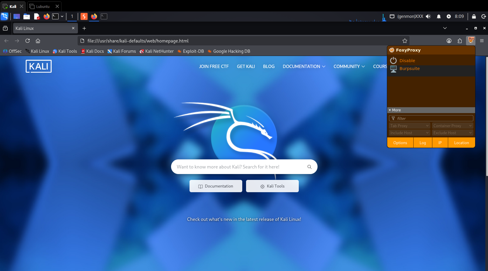
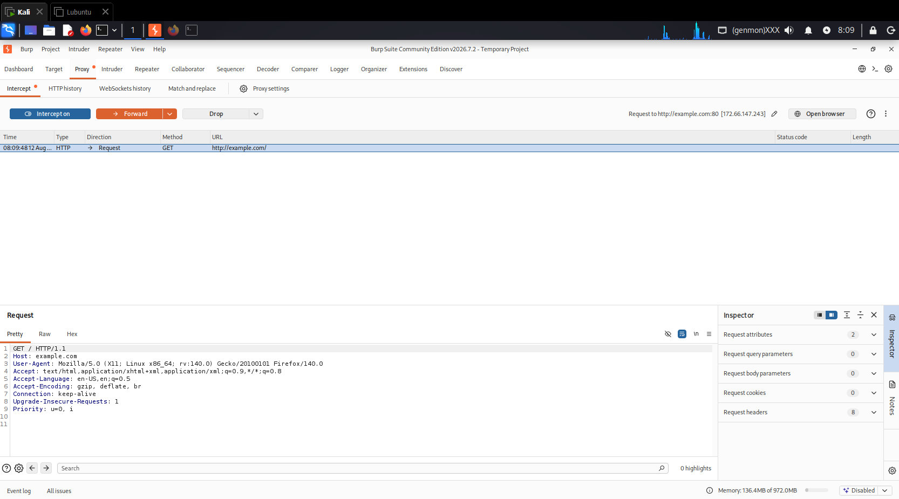
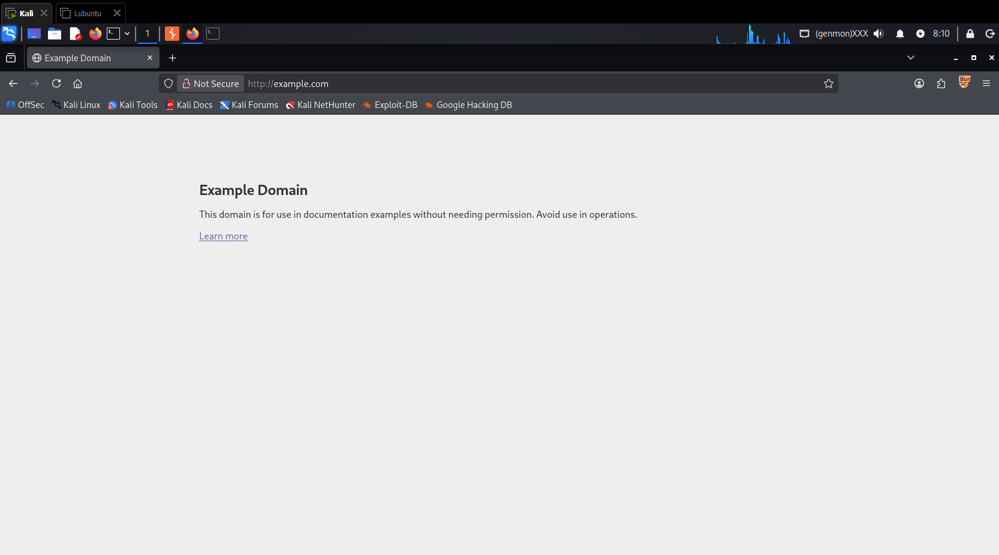
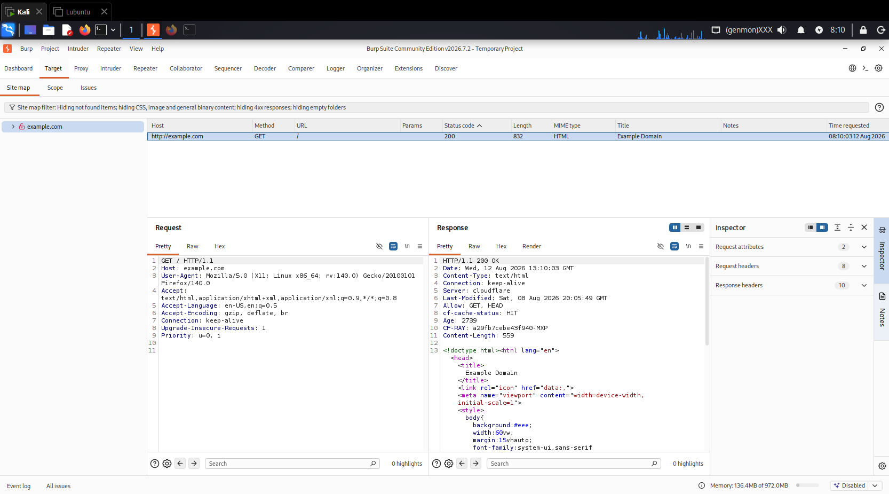

# Configurazione di Burp Suite con FoxyProxy e Certificato SSL

## Perché questo setup? (Concetti Chiave)

Quando si fa testing di sicurezza su un'applicazione web, si ha la necessità di **intercettare, analizzare e modificare** le richieste HTTP/HTTPS inviate dal browser prima che arrivino al server.

Burp Suite agisce come un proxy **Man-In-The-Middle (MITM)**:
1. **FoxyProxy** devia il traffico del browser verso Burp Suite solo quando vuoi tu.
2. Il **Certificato CA di Burp** permette al proxy di decifrare il traffico HTTPS senza che il browser mostri errori di sicurezza.
3. **Burp Intercept** ti permette di mettere in "pausa" una richiesta web, alterare i parametri (es. cookie, form, header) e inviare la richiesta modificata al target per scovare vulnerabilità (SQLi, XSS, IDOR, ecc.).

## Obiettivo

Configurare **Burp Suite Community Edition** come proxy di intercettazione, utilizzando **FoxyProxy** su Firefox, e installare il certificato CA di Burp per poter intercettare anche traffico HTTPS.

---

## Prerequisiti

- **Kali Linux** (o qualsiasi distribuzione Linux)
- **Firefox** (versione recente)
- **Burp Suite Community** (installato)

---

## Procedura

### 1. Reset del profilo Firefox (opzionale)

Per evitare conflitti con estensioni o certificati precedenti, crea un nuovo profilo Firefox:

```
firefox --ProfileManager
```

Crea un nuovo profilo (es. `burp-test`) e avvia Firefox con esso.

### 2. Installazione di Burp Suite

Se non hai Burp, installalo con:

```
sudo apt install burpsuite -y
```

Oppure scarica l'ultima versione da PortSwigger e segui l'installer.

### 3. Installazione di FoxyProxy in Firefox

1. Apri Firefox e vai su [FoxyProxy Standard](https://addons.mozilla.org/it/firefox/addon/foxyproxy-standard/).
2. Clicca su **Aggiungi a Firefox**.
3. Una volta installato, clicca sull'icona di FoxyProxy e scegli **Opzioni**.
4. Vai su **Proxies** → **Aggiungi**.
5. Inserisci:

| Campo | Valore |
|-------|--------|
| **Titolo** | 'Burpsuite' |
| **Tipo proxy** | 'HTTP' |
| **Hostname** | '127.0.0.1' |
| **Porta** | '8080' |

6. Salva.



---

### 4. Installazione del certificato CA di Burp

1. Avvia Burp Suite (se non è già in esecuzione).
2. In Firefox, con FoxyProxy disattivato, visita http://127.0.0.1:8080
3. Nella pagina di benvenuto, clicca su **CA Certificate** per scaricare il certificato (file `.der`).



4. In Firefox, vai su **Impostazioni** → **Privacy e Sicurezza** → **Certificati** → **Visualizza certificati**.
5. Nella scheda **Autorità**, clicca **Importa** e seleziona il file `.der` scaricato.
6. Spunta **Questa autorità di certificazione può identificare siti web** e conferma.



7. Riavvia Firefox.

---

### 5. Configurazione del proxy in Burp

1. In Burp, vai su **Proxy** → **Options**.
2. Verifica che il listener sia attivo su '127.0.0.1:8080' (se non c'è, aggiungilo).
3. Torna su **Proxy** → **Intercept** e attiva **Intercept is on**.



---

### 6. Test

1. In Firefox, attiva FoxyProxy selezionando il profilo **Burpsuite**.



2. Naviga su un sito HTTP (es. http://neverssl.com).
3. La richiesta apparirà in Burp in attesa di essere inoltrata (Forward) o scartata (Drop).







---

## Note di sicurezza

> **⚠️ AVVERTENZA:** Questa configurazione è esclusivamente per ambienti di test autorizzati. L'intercettazione di traffico HTTPS richiede l'installazione di un certificato non trustato: non farlo su browser personali o su reti non controllate.

---

## Riferimenti

- [Documentazione ufficiale di Burp Suite](https://portswigger.net/burp/documentation)
- [FoxyProxy Standard](https://addons.mozilla.org/it/firefox/addon/foxyproxy-standard/)