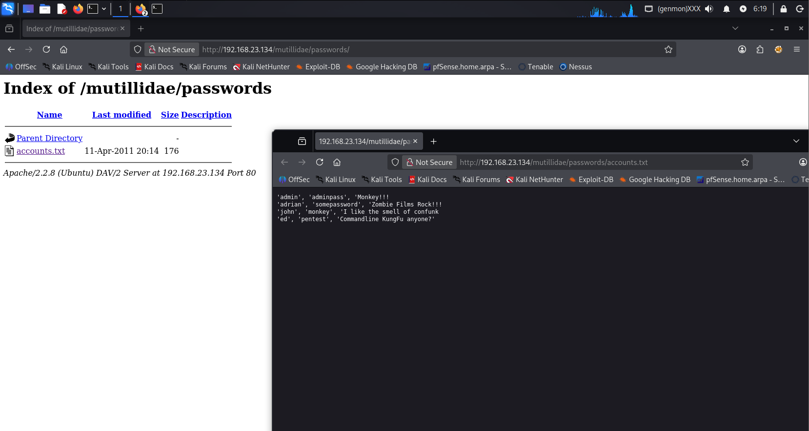
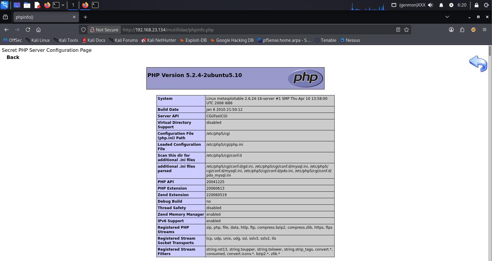
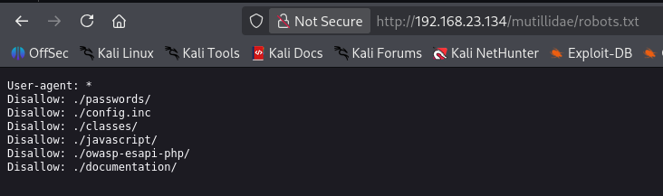
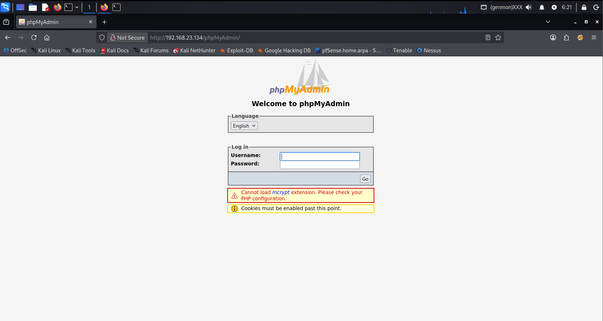

# Web Content Discovery & Enumeration: DIRB

Laboratorio di scouting su Mutillidae II (Metasploitable 2) per l'identificazione di entry-point, file sensibili e misconfiguration del web server.

### Target & Environment

- Target OS: Metasploitable 2
- Application: Mutillidae II (PHP/MySQL)
- Tool: DIRB v2.22
- Wordlist: common.txt (4612 parole generate)

## 1. Scan Execution

Il comando eseguito avvia una scansione ricorsiva sulla directory principale dell'applicazione:

```bash
dirb http://<IP_METASPLOITABLE>/mutillidae/
```

Il tool ha rilevato diverse directory con accesso diretto e file di configurazione esposti:

```bash
---- Scanning URL: http://192.168.23.134/mutillidae/ ----
==> DIRECTORY: http://192.168.23.134/mutillidae/classes/
==> DIRECTORY: http://192.168.23.134/mutillidae/documentation/
==> DIRECTORY: http://192.168.23.134/mutillidae/images/
==> DIRECTORY: http://192.168.23.134/mutillidae/passwords/
+ http://192.168.23.134/mutillidae/phpinfo.php (CODE:200|SIZE:48915)
+ http://192.168.23.134/mutillidae/robots.txt (CODE:200|SIZE:160)
```

## Analisi dei Risultati

### 1. Directory Listing (Sensitive Data)

Il server ha l'indicizzazione attiva. La directory `/passwords/` è accessibile direttamente dal browser e contiene file potenzialmente critici.

Target: `http://192.168.23.134/mutillidae/passwords/`



### 2. Information Leakage (phpinfo)

Il file `phpinfo.php` è pubblico. Questo espone l'intera configurazione del backend, inclusi i path assoluti del sistema, le versioni dei moduli caricati e i dettagli del kernel Linux. Informazioni fondamentali per customizzare un eventuale exploit.

Target: `http://192.168.23.134/mutillidae/phpinfo.php`



### 3. Robots.txt & Entry Points

L'analisi del file `robots.txt` e il crawling hanno rivelato l'accesso a `phpMyAdmin`, un target primario per tentativi di bypass autenticazione o brute force sul database.

Targets: `http://192.168.23.134/mutillidae/robots.txt` e `http://192.168.23.134/phpMyAdmin/`



