# Web Vulnerability Assessment con OWASP ZAP

OWASP ZAP (Zed Attack Proxy) è uno strumento di sicurezza open-source che agisce come un proxy tra il browser e il server target. Questo modulo documenta l'analisi di un'applicazione vulnerabile (Mutillidae II su Metasploitable 2).

> [!TIP]
> Consulta la [Guida Ufficiale di ZAP](https://www.zaproxy.org/pdf/ZAPGettingStartedGuide-2.9.pdf) per approfondimenti avanzati.

## Installazione e avvio

Su sistemi basati su Debian/Kali Linux:

```bash
sudo apt install zaproxy
zaproxy
```

All'avvio, seleziona: “Yes, I want to persist this session but I want to specify the name and location” per salvare i progressi.

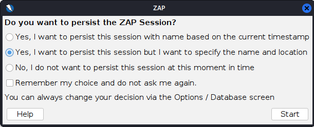

File Name: `mutillidae_ZAP_Scan`

---

## Anatomia dell'interfaccia

L'interfaccia di ZAP è divisa in quattro aree principali che seguono il flusso di lavoro di un'analisi.

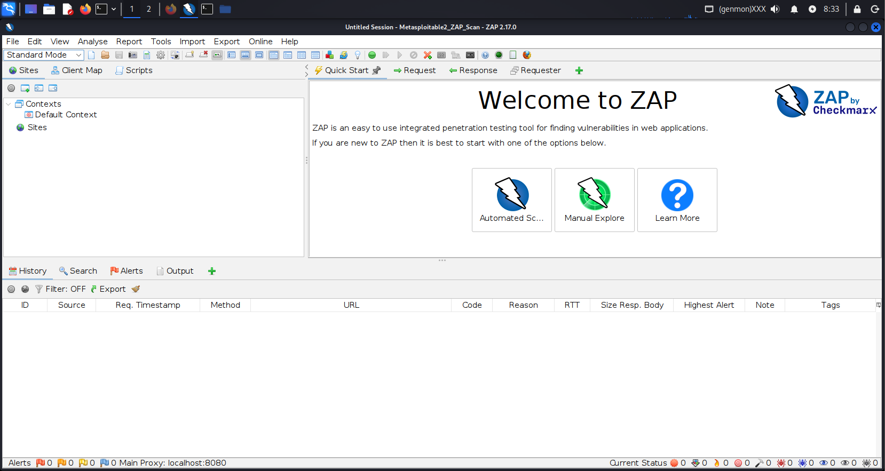

### Modalità di Scansione (Area 1)

Determina l'aggressività del tool:
- Safe Mode: Nessuna azione pericolosa permessa.
- Protected Mode: Azioni pericolose permesse solo su target nel "Context" (Scope).
- Standard Mode: Modalità predefinita per analisi complete.
- ATTACK Mode: Scansiona attivamente ogni nuova risorsa scoperta in tempo reale.

### Albero dei Siti (Area 2)

Rappresenta la mappa gerarchica del target. Ogni nodo indica una risorsa (URL) e il relativo metodo HTTP (GET/POST).

### Finestra di Lavoro (Area 3)

Qui si analizzano le singole Request e Response. È il cuore dell'analisi manuale per identificare anomalie nei messaggi del server.

### Pannello Informativo (Area 4)

- History: Log cronologico di tutti i pacchetti.
- Alerts: Elenco delle vulnerabilità trovate, classificate per gravità (Bandiera Rossa = Alta).

---

## Workflow: Dalla Ricognizione al Report

### Fase 1: Configurazione e Scope

1. Nell’Area 3, clicchiamo su `Manual Explore` e inseriamo `http://192.168.23.129/mutillidae/`, poi `Launch Browser`.
2. Chiudiamo il browser dopo che la pagina si è caricata.
3. Nell'Area 2, clicchiamo col tasto destro sulla cartella `mutillidae` e selezioniamo: `Include in Context` > `Default Context` > OK.

### Fase 2: Mapping & Enumeration (Spidering)

L'obiettivo è scoprire tutte le pagine, anche quelle non linkate direttamente.

1. Tasto destro sulla cartella `mutillidae` > `Attack` > `Spider`.

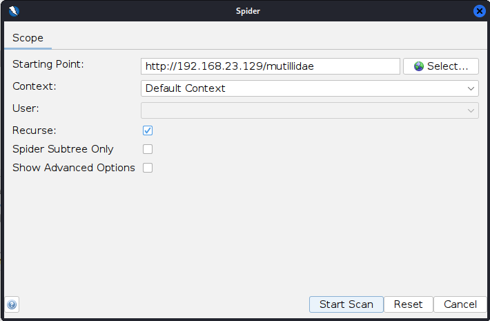

> Start Scan

2. Tasto destro su `mutillidae` > `Attack` > `AJAX Spider`.

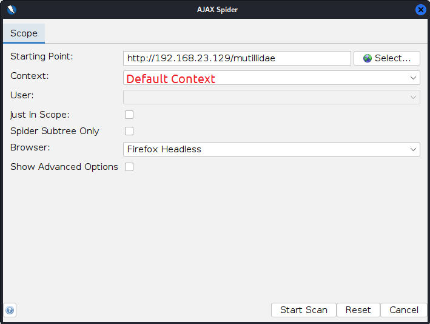

> Start Scan

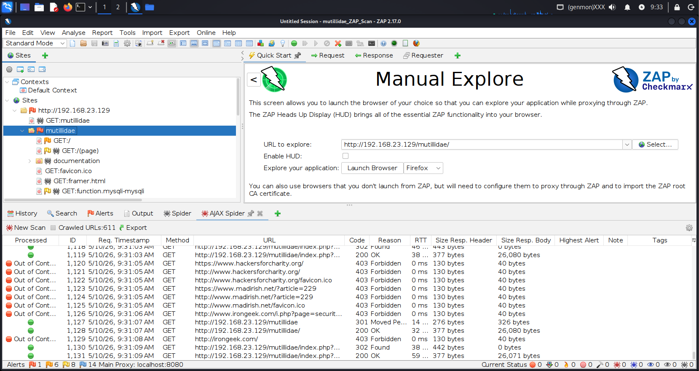

### Fase 3: Active Scan

ZAP invia payload malevoli per testare attivamente le vulnerabilità.

1. Tasto destro sulla cartella `mutillidae` > `Attack` > `Active Scan`.

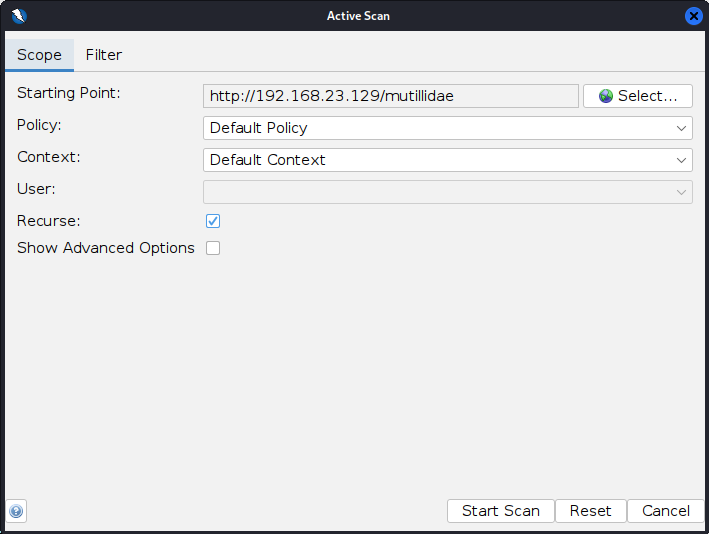

> Start Scan

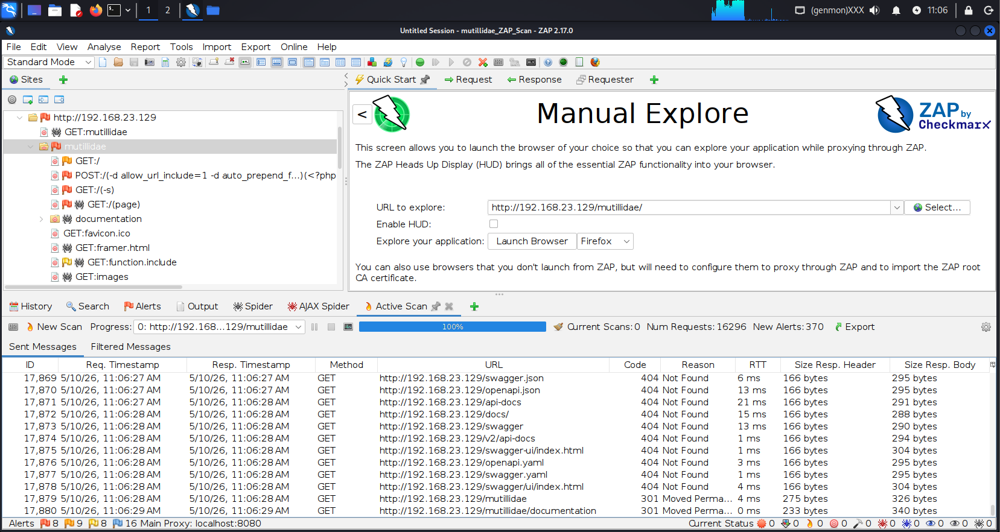

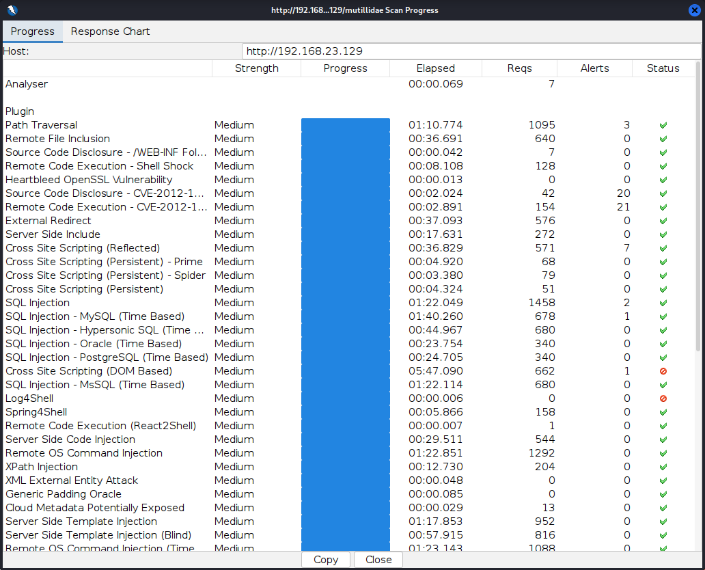

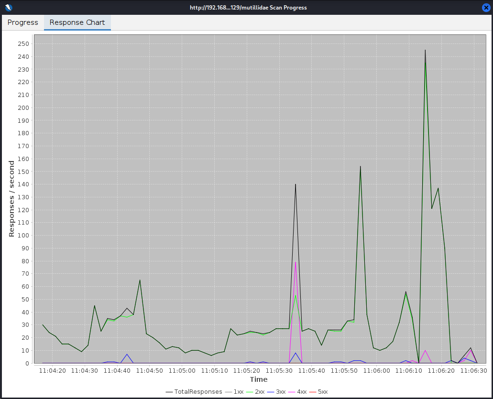

### Fase 4: Analisi degli Alerts

Esamina le vulnerabilità trovate nella tab Alerts.

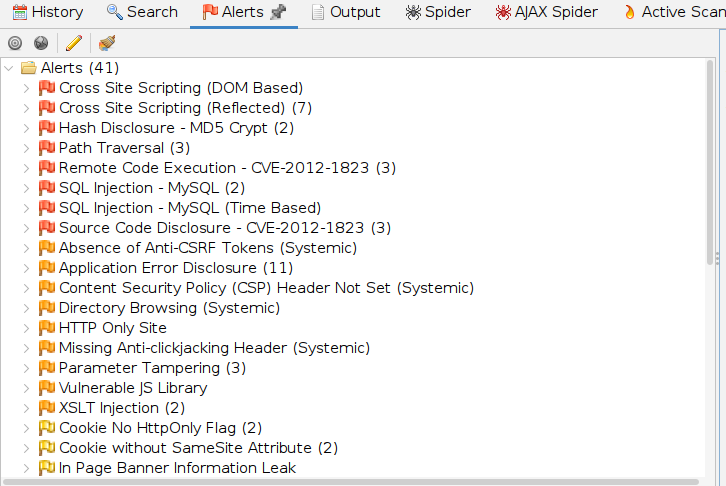

Espandiamo l'elenco e clicchiamo su una vulnerabilità critica.

- Description: Analisi della falla.
- Solution: Suggerimenti per la mitigazione (es. "Use prepared statements" per SQLi).

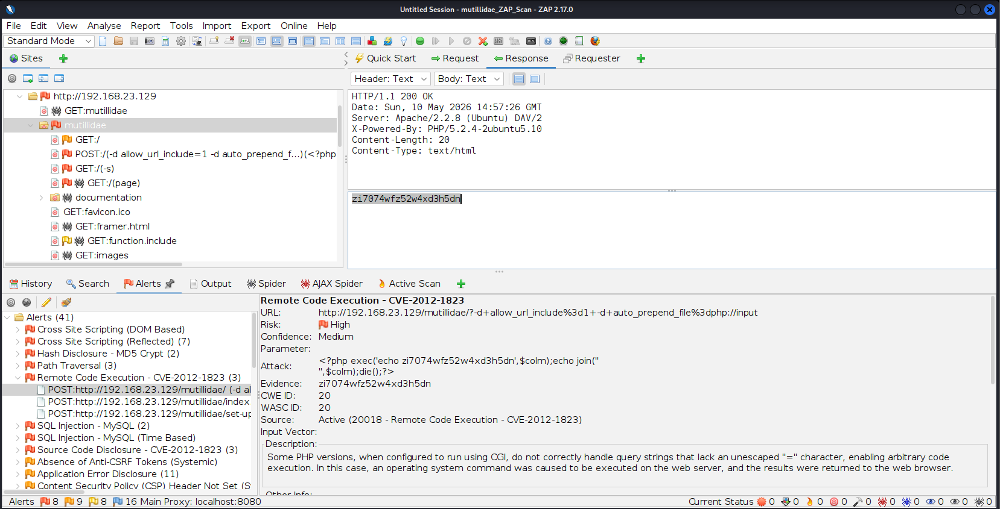

---

## Caso di Studio: Remote Code Execution (CVE-2012-1823)

**Descrizione**

Alcune versioni di PHP configurate come CGI permettono di passare argomenti direttamente all'eseguibile PHP tramite query string non caricate correttamente.

**Analisi Tecnica (PoC)**

ZAP ha identificato la vulnerabilità inviando il seguente vettore di attacco:

`POST http://192.168.23.129/mutillidae/?-d+allow_url_include%3d1+-d+auto_prepend_file%3dphp://input`

**Evidenza dell'Exploit**

Il server ha risposto con `200 OK` eseguendo il comando PHP `exec` iniettato da ZAP, restituendo nel corpo della pagina una stringa casuale generata dal tool. Questo conferma il pieno controllo remoto (RCE) sul server.

**Remediation**
- Aggiornamento: Passare a una versione stabile di PHP (>= 5.4.3).
 Filtri: Usare mod_rewrite in Apache per bloccare parametri di configurazione (-d) nell'URL.
- Configurazione: Preferire PHP-FPM rispetto al vecchio CGI puro.

---

### Generazione del Report Finali

Per esportare i risultati:

Nella barra dei menu in alto, clicca su: `Report` > `Generate Report`

-> Seleziona il template "Modern HTML Report".